# create-ai-native-sdlc

A lightweight interactive initializer for an AI-native software delivery workflow.

It keeps one canonical Markdown source for each role, then installs one client-native Agent set in a target project. It is designed for solo builders and small teams that want clear role boundaries and handoffs without adding an orchestration platform.

## Project goal

The project helps one person work through a complete product delivery cycle with six explicit roles:

- PM / BA turns product intent into a PRD and testable user stories.
- Designer turns confirmed stories into validated design behavior.
- Architect compares options and prepares a human-approved architecture pack.
- Software Engineer implements the confirmed product, design, and architecture.
- Tester verifies acceptance criteria and important risks.
- DevOps prepares a repeatable, observable, and reversible release path.

The workflow is controlled by `ai-native.yaml`. Markdown remains the source format for role content and working documents. The initializer installs the selected client's native Agent files; it does not run the Agents or approve workflow gates for you.

## Core model

```mermaid
flowchart LR
  Intent["Human intent"] --> PMBA["PM / BA"]
  PMBA -->|"PRD and stories"| Designer["Designer"]
  Designer -->|"Validated design"| Architect["Architect"]
  Architect -->|"Accepted architecture"| Engineer["Software Engineer"]
  Engineer -->|"Implementation evidence"| Tester["Tester"]
  Tester -->|"Test evidence"| DevOps["DevOps"]
  DevOps -->|"Release runbook"| Human["Human release decision"]
```



Each arrow is a handoff. A later role reads the registered artifacts from the earlier roles. Human decisions stay human-owned, especially product scope, architecture selection and acceptance, risk acceptance, and release approval.

## Quick start

Requirements: Node.js 20 or later.

The npm package is not published yet. Run the current repository version with:

```bash
npx --yes --package=github:davych/my-sdlc-workflow \
  create-ai-native-sdlc init .
```

After the first npm release, the command will be:

```bash
npx create-ai-native-sdlc@latest init .
```

The CLI asks for the project name, project summary, target AI client, optional Designer Markdown inputs, and an optional component catalog module. The client choice decides the Agent directory and file format. It does not take the project name or summary as command flags.

See [Getting Started](guidelines/getting-started/README.md) for the full setup and first-run guide.

## What is installed

```text
ai-native.yaml
.ai-sdlc/
  roles/        # optional role workflows, configs, rules, and scripts
  workflows/    # the shared execution order and artifact rules
  templates/    # templates for AI-produced artifacts
  guides/       # initialized usage guidance
  tasks/        # task workspace

# Exactly one native Agent set is installed:
.github/agents/*.agent.md   # GitHub Copilot
.claude/agents/*.md         # Claude Code
.codex/agents/*.toml        # Codex
```

The repository keeps only six canonical Markdown Agent sources. Initialization asks for GitHub Copilot, Claude Code, or Codex and installs only that client's files. Codex TOML files are generated from the same Markdown sources during initialization; they are not a second source to maintain.

AI-produced artifacts are written under `docs/` by default. Change `paths.outputs` in `ai-native.yaml` to use another output root.

Each Agent defines one role's identity, rules, boundaries, and handoff. PM / BA, Designer, and Architect also reference an ordinary `workflow.md` file for their longer step-by-step procedure. Role workflows under `.ai-sdlc/roles/` are shared supporting documents, not client-native Skills or duplicate Agent definitions.

## Documentation

| Guide | What it explains |
|---|---|
| [Getting Started](guidelines/getting-started/README.md) | Installation, interactive setup, generated files, and the first task |
| [Configuration](guidelines/configuration/README.md) | `ai-native.yaml`, role configs, artifact paths, and safe customization |
| [End-to-End Workflow](guidelines/workflow/README.md) | Phase order, gates, feedback loops, artifacts, and human decisions |
| [Role Relationships](guidelines/roles/README.md) | How the six roles depend on and hand work to one another |
| [PM / BA](guidelines/roles/pm-ba/README.md) | Product discovery, PRD, stories, acceptance criteria, and handoff |
| [Designer](guidelines/roles/designer/README.md) | Design evidence, components, design spec, validation, and engineering handoff |
| [Architect](guidelines/roles/architect/README.md) | Context, options, human selection, C4, ADRs, NFRs, and premortem |
| [Software Engineer](guidelines/roles/software-engineer/README.md) | Implementation preconditions, traceability, checks, and notes |
| [Tester](guidelines/roles/tester/README.md) | Risk-based verification, evidence, defects, and test report |
| [DevOps](guidelines/roles/devops/README.md) | Release preparation, monitoring, rollback, and runbook |

## Local validation

```bash
npm test
npm pack --dry-run
```

The repository includes a small CI workflow and an npm publish workflow. A future release needs an `NPM_TOKEN` repository secret and a matching package version.

## License

MIT
