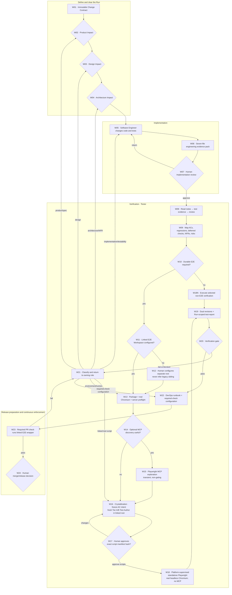

# create-ai-native-sdlc

A lightweight interactive initializer for an AI-native software delivery workflow.

It keeps one canonical Markdown source for each role, then installs one client-native Agent set in a target project. It is designed for solo builders and small teams that want clear role boundaries and handoffs without adding an orchestration platform.

## Project goal

The project helps one person work through a complete product delivery cycle with six explicit roles:

- Every Run starts with an immutable Change Contract and an evidence-backed Product Impact route.
- PM / BA runs only for partial or full product work; a new Run does not automatically rewrite the PRD.
- Designer can skip, reuse, partially update, or fully design work according to real UI/UX impact.
- Architect compares options and prepares a human-approved architecture pack.
- Software Engineer implements the confirmed product, design, and architecture, then packages independently verifiable engineering evidence for the Run.
- Tester verifies acceptance criteria and important risks.
- DevOps prepares a repeatable, observable, and reversible release path.

The workflow is controlled by `ai-native.yaml`. Markdown remains the source format for role content and working documents. The initializer installs the selected client's native Agent files; it does not run the Agents or approve workflow gates for you.

## Core model

```mermaid
flowchart LR
  Intent["Immutable Change Contract"] --> Product["Product Impact"]
  Product --> Design["Design Impact"]
  Design --> Architect["Architecture Impact<br/>skip / reuse / partial / full"]
  Architect --> Engineer["Software Engineer"]
  Engineer -->|"Run-scoped engineering evidence pack"| Tester["Tester"]
  Tester -->|"Test evidence"| DevOps["DevOps"]
  DevOps -->|"Release runbook"| Human["Human release decision"]
```



Each arrow is a handoff. `direct`, `skip`, and `reuse` can avoid a role execution while preserving evidence and provenance; `partial` updates only affected outputs. A bounded bug may therefore use Product `direct`, Design `skip`, and Architecture `skip` to reach Software Engineer without running those Agents, but it still needs acceptance and targeted regression evidence in Verification. Human decisions stay human-owned, especially product scope, architecture selection and acceptance, risk acceptance, and release approval.

## What to do after Software Engineer

The seven engineering Markdown files are one automatically generated evidence pack for one code change. They are not seven forms for you to complete, and they never replace the real source diff and repository tests.

Use this review order:

| Order | Artifact ID / default Markdown | Decision to make |
|---|---|---|
| 1 | `implementation-notes` / `implementation-notes.md` | Is the implementation `Ready for verification`, what code changed, and what is still limited or blocked? This is the pack index. |
| 2 | The real source/test diff / not a Markdown artifact | Does the claimed implementation actually exist in the repository and stay inside the approved scope? |
| 3 | `engineering-test-evidence` / `independent-test-evidence.md` | Does every AC/regression map to an executable test, did real commands pass, and is the Tier A/B independence claim credible? |
| 4 | `engineering-review` / `review.md` | Are all seven lenses and both adversarial passes complete, with no unresolved high/security finding? |
| 5 | `engineering-provenance` / `pr-provenance.md` | Do the spec, session, tests, review, limitations, and human boundaries link to real evidence? PR-ready text is not a published or merged PR. |

The platform prefixes those default basenames with the safe task title and full Run ID. Use the artifact ID shown in the Web UI as the stable identity; do not assume the physical filename is unprefixed.

Use `implementation-plan`, `implementation-tasks`, and `engineering-session-log` when you need to audit scope, unfinished work, command history, or a disagreement. Then choose one branch:

- If any primary file says `Failed`, `Blocked`, contains an unresolved finding, reports an unrun required check, or contradicts the real diff, do not approve. Return the named problem to Product, Design, Architecture, or Software Engineer, rerun the affected work, and review the refreshed pack.
- If the code and evidence are complete and current, approve the Implementation gate. That unlocks Tester; it does not merge a PR or approve release.
- Tester independently maps risk and writes `test-report`. When E2E applies, a human explicitly links a separate E2E workspace; a fresh spec-only Test Author writes there, a human approves the exact generated-script manifest hash, and the platform runs standalone Playwright with a real headless Chromium. Playwright MCP remains optional non-gating exploration. When E2E does not apply, Tester records the stronger applicable unit, integration, contract, or declared observation evidence instead.
- DevOps or the authorized repository owner turns the applicable repository suite into a required PR check; for E2E, it reuses the standalone command. A human still decides merge and release.

There are also two Markdown namespaces in this repository:

| Location | Meaning | What you do next |
|---|---|---|
| Initialized project `docs/ai-native/engineering/` or platform Run-scoped engineering paths | Delivery evidence produced for the product change | Review the pack above, approve or return it, then run Tester. |
| This initializer repository's `changes/`, `sessions/`, and `reviews/` | Maintainer evidence for changes to the workflow project itself | Use it to review this repository change or prepare a PR; it is not an initialized project's next-phase input. |

## Complete workflow and E2E lifecycle



The Playwright steps are three E2E stages plus readiness and script-review checkpoints inside Verification, not extra global phases. The Linked E2E Workspace is an explicit separate, non-nested local project and is never inferred from a sibling or legacy folder. Tester owns its scripts; Software Engineer continues to own product source, product-repository tests, and testability interfaces. A change to those product assets returns through Implementation reapproval, while a linked-script bug stays in the fresh-author/hash-review loop. Script approval permits only the exact current bytes to execute; it does not approve Verification, CI, merge, or release.

## Workflow node details

| Node | Owner | Input | Action | Output or gate | Failure route |
|---|---|---|---|---|---|
| W01 | Human/platform | Request and evidence | Freeze scope, expected behavior, ACs, regressions, and non-goals | Immutable Change Contract | New outcome requires a new Run |
| W02 | Human + PM / BA | W01 | Choose direct/reuse/partial/full; run PM / BA only when needed | Product clearance and applicable product evidence | Unclear scope or policy stays here |
| W03 | Human + Designer | Product clearance | Choose skip/reuse/partial/full; define observable UI and deferred runtime checks | Design clearance and applicable spec | Missing interaction/accessibility decision returns here |
| W04 | Human + Architect | Product/design clearance | Choose skip/reuse/partial/full; accept boundaries, ADRs, risks, and NFRs | Architecture clearance | Boundary, security, or NFR decision returns here |
| W05 | Software Engineer | W01-W04 | Implement the smallest complete change and repository tests | Real source/test diff and check results | Implementation defect stays with Engineer |
| W06 | Software Engineer | W05 | Index plan, tasks, session, independent tests, review, and provenance | Seven Run-scoped evidence files | Missing/stale record blocks W07 |
| W07 | Human reviewer | W05-W06 | Inspect notes, real diff, test evidence, review, and provenance | Approve Implementation or request changes | Return to W05; no merge occurs |
| W08 | Tester | Approved W07 | Read `implementation-notes`, then test evidence and review | Verified intake and known-risk list | Stale/blocked evidence returns to Engineer |
| W09 | Tester | Contract, design/NFR, W08 | Map every AC, regression, deferred validation, and material risk to an evidence level | Verification strategy | Ambiguity routes to its upstream owner |
| W10 | Tester | W09 | Decide whether risk requires durable E2E | E2E or stronger non-E2E disposition | Missing rationale blocks strategy |
| W11 | Human/platform | E2E-required W10 | Use one explicitly configured Linked E2E Workspace | Trusted separate binding | Never infer a sibling/legacy root |
| W12 | Human/platform | Missing W11 | Configure or initialize an allowed separate, non-nested root | Explicit binding | Unsafe/unmanaged path stays blocked |
| W13 | Platform | Current binding | Check Playwright package, validated scripts, real Chromium launch, product server, and loopback target | Structured readiness | Missing dependency/browser/server is actionable, not pass |
| W14 | Tester | Ready W13 | Decide whether optional UI path discovery adds value | Explore or proceed | MCP absence does not block a known path |
| W15 | Tester | Runnable non-production app | Operate Playwright MCP for diagnosis without passing its transcript to authoring | Transient session/screenshot notes | Never repeatable pass alone |
| W16 | Platform + fresh Test Author | Approved spec, frozen intent, linked harness only | Write allowlisted tests/fixtures without product implementation or exploration context | Exact file/hash manifest | Product root stays read-only; Tier C/Limited blocks |
| W17 | Human reviewer | W16 manifest and bound revisions | Approve or reject the exact aggregate manifest hash | Script execution authorization only | Any byte/revision/binding change invalidates approval |
| W18 | Platform runner | Current W17 approval and readiness | Supervise product server and run fixed-argv standalone Playwright with real headless Chromium | Exit plus report/trace/screenshot/log hashes | No browser, timeout, nonzero, or cleanup failure stays non-passing |
| W18N | Tester/runner | W09 non-E2E evidence map | Execute selected unit, integration, contract, or declared observation checks | Current non-E2E result and durable evidence | Classify at W21 |
| W19 | Tester | W09-W18 | Record exploration, authoring, manifest approval, dual revisions, exact execution, gaps, and risk | Run-scoped `test-report` | Missing/mismatched provenance blocks |
| W20 | Human/workflow gate | W19 and declared obligations | Check all evidence is current and blockers are resolved | Verification pass or return | Failure goes to W21 |
| W21 | Tester + owning role | Reproduction and failure evidence | Classify implementation/test/spec/design/architecture/environment cause | Named owner and next action | Product assets → W05; linked test → W16; environment → W13 |
| W22 | DevOps/authorized owner | Passing Verification or CI-policy failure | Prepare release/rollback and configure real CI, secrets, browser, retention, and check name | Runbook and enforced CI contract | Retry W23 after CI repair |
| W23 | CI | Every relevant PR revision | Execute the linked standalone wrapper autonomously; MCP is absent | Required-check result and durable report | Failure goes to W21 |
| W24 | Human | Current CI, test report, runbook, residual risk | Decide merge timing and release | Explicit human decision | No Agent self-approves |

See the [Tester guide](guidelines/roles/tester/README.md) for the operating procedure and the [End-to-End Workflow](guidelines/workflow/README.md) for phase contracts and feedback rules.

## Quick start

Requirements: Node.js 20 or later.

The npm package is not published yet. Run the current repository version with:

```bash
npx --yes --package=github:davych/my-sdlc-workflow \
  create-ai-native-sdlc init .
```

After the first npm release, the command will be:

```bash
npx create-ai-native-sdlc@latest init .
```

The CLI asks for the project name, project summary, target AI client, optional Designer Markdown inputs, and an optional component catalog module. The client choice decides the Agent directory and file format. It does not take the project name or summary as command flags.

See [Getting Started](guidelines/getting-started/README.md) for the full setup and first-run guide.

## What is installed

```text
ai-native.yaml
.ai-sdlc/
  roles/        # optional role workflows, configs, rules, and scripts
  workflows/    # the shared execution order and artifact rules
  templates/    # templates for AI-produced artifacts
  guides/       # initialized usage guidance
  tasks/        # task workspace

# Exactly one native Agent set is installed:
.github/agents/*.agent.md   # GitHub Copilot
.claude/agents/*.md         # Claude Code
.codex/agents/*.toml        # Codex
```

The repository keeps only six canonical Markdown Agent sources. Initialization asks for GitHub Copilot, Claude Code, or Codex and installs only that client's files. Codex TOML files are generated from the same Markdown sources during initialization; they are not a second source to maintain.

AI-produced artifacts are written under `docs/` by default. Change `paths.outputs` in `ai-native.yaml` to use another output root.

Each Agent defines one role's identity, rules, boundaries, and handoff. PM / BA, Designer, Architect, Software Engineer, and Tester also have role packs under `.ai-sdlc/roles/` for longer procedures, configuration, and references. Their `workflow.md` and `references/*.md` files are ordinary Markdown read explicitly by the canonical Agent; they are not client-native Skills, second Agents, or alternate sources of role identity.

The Software Engineer phase creates a working repository change plus seven registered, Run-scoped Web outputs: `implementation-notes` as the pack index, `implementation-plan`, `implementation-tasks`, `engineering-session-log`, `engineering-test-evidence`, `engineering-review`, and `engineering-provenance`. The pack records layered context, Greenfield or Brownfield planning, independent-test isolation, seven-lens and adversarial review, and PR-ready provenance. It prepares evidence for review but does not publish or merge a pull request.

## Documentation

| Guide | What it explains |
|---|---|
| [Getting Started](guidelines/getting-started/README.md) | Installation, interactive setup, generated files, and the first task |
| [Configuration](guidelines/configuration/README.md) | `ai-native.yaml`, role configs, artifact paths, and safe customization |
| [End-to-End Workflow](guidelines/workflow/README.md) | Phase order, gates, feedback loops, artifacts, and human decisions |
| [Role Relationships](guidelines/roles/README.md) | How the six roles depend on and hand work to one another |
| [PM / BA](guidelines/roles/pm-ba/README.md) | Change Contract routing, Product Impact, PRD/story deltas, acceptance criteria, and handoff |
| [Designer](guidelines/roles/designer/README.md) | Design Impact, skip/reuse/partial/full paths, project baseline, task spec, and handoff |
| [Architect](guidelines/roles/architect/README.md) | Context, options, human selection, C4, ADRs, NFRs, and premortem |
| [Software Engineer](guidelines/roles/software-engineer/README.md) | Layered context, contract-driven implementation, independent tests, seven-lens review, and provenance |
| [Tester](guidelines/roles/tester/README.md) | Optional MCP exploration, linked-workspace spec-only authoring, script-hash review, standalone real-browser execution, defects, and test report |
| [DevOps](guidelines/roles/devops/README.md) | Release preparation, monitoring, rollback, and runbook |

## Local validation

```bash
npm test
npm pack --dry-run
```

The repository includes a small CI workflow and an npm publish workflow. A future release needs an `NPM_TOKEN` repository secret and a matching package version.

## License

MIT
