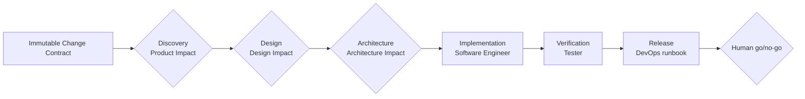

# create-ai-native-sdlc

`create-ai-native-sdlc` installs one canonical AI-native delivery workflow into a target project. The optional local [AI SDLC Platform](platform/README.md) operates initialized projects through a React/Fastify web application.

| Entry | Use it for | What it does not do |
|---|---|---|
| Initializer | Install `ai-native.yaml`, six client-native Agents, shared role procedures, references, and artifact templates | Run Agents, approve gates, or upgrade an initialized project in place |
| Web Platform | Create Runs, record impact decisions, execute local Codex jobs, review revisions, and enforce platform semantic gates | Provide safe remote or multi-user execution, merge code, or release software |

> **Platform safety:** the current Web platform has no authentication, and its real Codex runner is not isolated by an OS sandbox. Use it only with local, trusted, disposable or otherwise recoverable projects. Do not expose it remotely or register untrusted repositories. See the [security model](platform/docs/security-model.md).

The npm tarball contains the initializer only. Running the Web platform requires a repository checkout.

## Workflow at a glance

Every Run starts from an immutable Change Contract and moves through six fixed phases with one owner each:



Product, Design, and Architecture use evidence-backed impact dispositions so a role runs only when new work is necessary. `direct`, `skip`, and `reuse` may omit an Agent execution; they never omit evidence or the phase gate. Humans retain product scope, architecture selection and acceptance, risk acceptance, merge, deployment, rollback, and final release authority.

Software Engineer changes the real repository and produces one reviewable engineering evidence pack. Tester independently verifies the accepted contract. When durable E2E is required, the platform authors scripts in an ephemeral staging copy, validates the allowlisted changes, promotes only those files to an explicitly linked separate E2E root, re-hashes the complete promoted executable suite, obtains human approval of that exact baseline, and runs standalone Playwright from the linked root with a real headless Chromium. Playwright MCP remains optional, non-gating exploration.

DevOps prepares an evidence-bound release runbook. It may record the expected required-check contract and missing provider evidence, but only an authorized human or repository/provider system configures CI or required checks and performs release actions.

See [End-to-End Workflow](guidelines/workflow/README.md) for phase contracts, impact routes, handoffs, and feedback loops.

## Choose your starting point

| Goal | Start here |
|---|---|
| Install the workflow in a project | [Getting Started](guidelines/getting-started/README.md) |
| Run the local Web application | [Platform README](platform/README.md) |
| Understand the six phases and gates | [End-to-End Workflow](guidelines/workflow/README.md) |
| Understand role ownership and Prompt layers | [Role Relationships](guidelines/roles/README.md) |
| Configure artifacts and paths | [Configuration Guide](guidelines/configuration/README.md) |
| Learn the repository in Chinese | [AI-SDLC 学习手册](guidelines/learning/README.md) |

## Initialize a project

Requirements: Node.js 20 or later.

The package is not published on npm yet. Run the current repository version with:

```bash
npx --yes --package=github:davych/my-sdlc-workflow \
  create-ai-native-sdlc init .
```

The initializer asks for the project name, project summary, target AI client, and optional Designer inputs. It installs exactly one native Agent set for GitHub Copilot, Claude Code, or Codex.

Initialization is create-only and fail-closed: it does not merge into or overwrite an initialized project. Adopt future workflow changes through an explicit, reviewed incremental backfill that preserves project-owned content. The [Getting Started guide](guidelines/getting-started/README.md) explains the interactive questions, write safety, generated layout, and first Run.

## Start the local Platform

From a repository checkout:

```bash
cd platform
corepack enable
cp .env.example .env
yarn install
yarn db:up
yarn dev
```

Before registering a project, set `AI_SDLC_ALLOWED_PROJECT_ROOTS` in `platform/.env` to the narrowest trusted parent directory. The Web app runs at <http://localhost:5174> and the API at <http://localhost:4100>.

See the [Platform operator guide](platform/README.md) for setup and the [runtime contract](platform/docs/runtime-contract.md) for execution, revision, E2E, and semantic-gate behavior.

## Installed contract

```text
ai-native.yaml
.ai-sdlc/
  workflows/    # shared phase order and artifact resolution
  roles/        # role procedures, configs, and focused references
  templates/    # output schemas

# Exactly one native Agent set:
.github/agents/*.agent.md   # GitHub Copilot
.claude/agents/*.md         # Claude Code
.codex/agents/*.toml        # Codex
```

The repository keeps six canonical role sources in `templates/agents/`. The initializer renders the selected client's native files from those sources; client files are not separate role definitions. Detailed role procedures live under `templates/shared/.ai-sdlc/roles/<role>/`, and output schemas live under `templates/shared/.ai-sdlc/templates/`.

Artifact IDs in `ai-native.yaml` are the stable interface. The platform gives Run-specific artifacts a task-and-Run-namespaced physical path, so consumers resolve an artifact through its registered owner instead of guessing a filename. See [Configuration](guidelines/configuration/README.md).

## Role guides

| Role | Human-facing overview |
|---|---|
| PM / BA | [Product impact and product evidence](guidelines/roles/pm-ba/README.md) |
| Designer | [Design impact and engineering handoff](guidelines/roles/designer/README.md) |
| Architect | [Options, decisions, NFRs, and acceptance](guidelines/roles/architect/README.md) |
| Software Engineer | [Implementation and engineering evidence](guidelines/roles/software-engineer/README.md) |
| Tester | [Independent Verification and E2E](guidelines/roles/tester/README.md) |
| DevOps | [Release preparation and human boundary](guidelines/roles/devops/README.md) |

## Validate this repository

```bash
npm test
npm pack --dry-run

cd platform
yarn typecheck
yarn test
yarn build
```

## License

MIT
