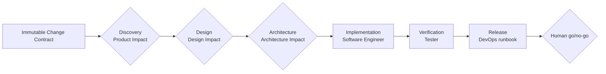

# AI SDLC Cloud + create-ai-native-sdlc

这个仓库包含一个可自托管的 Chat-first Cloud SDLC Agent，以及同源的可选项目初始化器。Cloud 产品只要求浏览器、远程 Git HTTPS 仓库和授权：绑定后直接进入持久对话，用白话或 `@repo` 下任务。服务端固定源码 revision，按需生成 DeepWiki，启动 Session Sandbox，再把 PM/BA、Designer、Architect、Software Engineer、Tester、DevOps 六个角色及其产物串成一条可审阅的交付链。远程仓库不必先安装 `CLAUDE.md`、`AGENTS.md` 或其他客户端 Prompt 文件。

`create-ai-native-sdlc` 仍可把同一套角色、流程和产物合同安装进项目，供 Codex、Claude Code 或 GitHub Copilot 直接使用。它是可选入口，不是 Cloud 使用前提。

| Entry | Use it for | What it does not do |
|---|---|---|
| Initializer | Install `ai-native.yaml`, six client-native Agents, shared role procedures, references, and artifact templates | Run Agents, approve gates, or upgrade an initialized project in place |
| Cloud Platform | Bind a remote Git repository, work in one conversation, let the Agent choose activated read-only MCP tools, run the fixed six-role chain in a Session Sandbox, review each role's artifacts, and download a Patch | Pretend to be a production multi-tenant sandbox, auto-merge, deploy, or release software |

> **真实边界：**Cloud MVP 是带部署级 Bearer Token 的单租户自托管产品，不是多租户 SaaS。远程真实阶段在受限 Docker Worker 中执行，但可信 API 持有数据库、Git Broker 和 Docker socket 权限。它适合同一信任域内的团队与可恢复项目；面对互不信任租户仍需要 microVM、身份、配额、审计和网络出口控制。见[安全模型](platform/docs/security-model.md)。

它与 Devin 的区别不是换一个聊天界面，而是把“轻对话入口 + 强 SDLC 内核”做成产品主线：对话 Provider 可按消息切换，MCP 由 Agent 从项目已激活能力中选择，角色只消费上游已批准产物，关键决定仍由人掌握。npm tarball 仍只包含轻量初始化器；运行 Cloud Platform 需要仓库 checkout 或容器镜像。

Cloud 默认主路径是：**绑定仓库 → 进入 Agent Session → 发一条工作消息 → 在对话里查看并批准各角色产物 → 下载 Diff / Patch**。Jira、Linear 或其他 Issue 通过管理员安装并由项目激活的 MCP 进入同一个消息入口；LLM DeepWiki 在绑定后手工生成，不会在导入时自动花模型额度。

先看产品怎样运转，可以读[业务流程 README 与思维导图](platform/docs/business-flow/README.md)；要了解服务、数据、执行与安全边界，可以读[项目技术设计与架构图](platform/docs/technical-design/README.md)。

每个 Session 只有一个可写主仓库。消息中明确提到的额外 `@repo` 固定 revision 后，只把受限、可验证的 Repository Manifest 路径线索交给 Planner 和六角色；不会挂载成第二个写仓，也不会把整仓正文塞进 Prompt。`involve` 只标记角色关注点，六角色仍全部按固定顺序运行。

## Workflow at a glance

Every Run starts from an immutable Change Contract and moves through six fixed phases with one owner each:



Product, Design, and Architecture use evidence-backed impact dispositions so a role runs only when new work is necessary. `direct`, `skip`, and `reuse` may omit an Agent execution; they never omit evidence or the phase gate. Humans retain product scope, architecture selection and acceptance, risk acceptance, merge, deployment, rollback, and final release authority.

Software Engineer changes the Run Workspace and produces one reviewable engineering evidence pack. Tester independently verifies the accepted contract. Cloud Verification can run tests that already exist in the remote repository inside the Worker; it does not yet provide a managed browser, author a new browser suite, or claim durable browser evidence. If the Change Contract requires that evidence and the repository cannot produce it, Verification must report a blocker. The separate Linked E2E staging/promotion/Playwright flow remains a legacy-local capability for initialized projects, not a Cloud MVP promise.

DevOps prepares an evidence-bound release runbook. It may record the expected required-check contract and missing provider evidence, but only an authorized human or repository/provider system configures CI or required checks and performs release actions.

See [End-to-End Workflow](guidelines/workflow/README.md) for phase contracts, impact routes, handoffs, and feedback loops.

## Choose your starting point

| Goal | Start here |
|---|---|
| 自托管 Cloud SDLC Agent | [Cloud Platform 安装与配置](platform/README.md) |
| 理解用户业务流程 | [业务流程 README 与思维导图](platform/docs/business-flow/README.md) |
| 理解系统技术设计 | [项目技术设计与架构图](platform/docs/technical-design/README.md) |
| Install the workflow in a project | [Getting Started](guidelines/getting-started/README.md) |
| 开发 Web/API | [Platform 本地开发](platform/README.md#本地开发) |
| Understand the six phases and gates | [End-to-End Workflow](guidelines/workflow/README.md) |
| Understand role ownership and Prompt layers | [Role Relationships](guidelines/roles/README.md) |
| Configure artifacts and paths | [Configuration Guide](guidelines/configuration/README.md) |
| Learn the repository in Chinese | [AI-SDLC 学习手册](guidelines/learning/README.md) |

## Initialize a project

Requirements: Node.js 20 or later.

The package is not published on npm yet. Run the current repository version with:

```bash
npx --yes --package=github:davych/my-sdlc-workflow \
  create-ai-native-sdlc init .
```

The initializer asks for the project name, project summary, target AI client, and optional Designer inputs. It installs exactly one native Agent set for GitHub Copilot, Claude Code, or Codex.

Initialization is create-only and fail-closed: it does not merge into or overwrite an initialized project. Adopt future workflow changes through an explicit, reviewed incremental backfill that preserves project-owned content. The [Getting Started guide](guidelines/getting-started/README.md) explains the interactive questions, write safety, generated layout, and first Run.

## 启动 Cloud Platform

从仓库 checkout 的 `platform/` 目录开始：

```bash
cd platform
corepack enable
yarn install
cp .env.cloud.example .env.cloud
# 生成并填写不同的数据库密码与访问 Token；再填写专用绝对 Workspace Root
openssl rand -hex 32
openssl rand -hex 32
docker compose --env-file .env.cloud -f docker-compose.cloud.yml \
  --profile worker-image build
docker compose --env-file .env.cloud -f docker-compose.cloud.yml up -d postgres api web
```

浏览器默认打开 <http://localhost:8080>。完整步骤包含 Token、Origin、Workspace 权限、Docker preflight、Git Credential Profile、MCP，以及 OpenAI / LM Studio / Ollama / 自定义对话 Provider 配置，见 [Platform operator guide](platform/README.md)。

需要本地热更新开发时，再按 Platform README 的“本地开发”使用 `.env.example`、`yarn db:up` 和 `yarn dev`。运行时合同见 [runtime contract](platform/docs/runtime-contract.md)。

## Installed contract

```text
ai-native.yaml
.ai-sdlc/
  workflows/    # shared phase order and artifact resolution
  roles/        # role procedures, configs, and focused references
  templates/    # output schemas

# Exactly one native Agent set:
.github/agents/*.agent.md   # GitHub Copilot
.claude/agents/*.md         # Claude Code
.codex/agents/*.toml        # Codex
```

The repository keeps six canonical role sources in `templates/agents/`. The initializer renders the selected client's native files from those sources; client files are not separate role definitions. Cloud remote projects instead receive the same material as an external, versioned Control Pack, so it does not enter the user repository or Patch. Detailed role procedures live under `templates/shared/.ai-sdlc/roles/<role>/`, and output schemas live under `templates/shared/.ai-sdlc/templates/`.

Artifact IDs in `ai-native.yaml` are the stable interface. The platform gives Run-specific artifacts a task-and-Run-namespaced physical path, so consumers resolve an artifact through its registered owner instead of guessing a filename. See [Configuration](guidelines/configuration/README.md).

## Role guides

| Role | Human-facing overview |
|---|---|
| PM / BA | [Product impact and product evidence](guidelines/roles/pm-ba/README.md) |
| Designer | [Design impact and engineering handoff](guidelines/roles/designer/README.md) |
| Architect | [Options, decisions, NFRs, and acceptance](guidelines/roles/architect/README.md) |
| Software Engineer | [Implementation and engineering evidence](guidelines/roles/software-engineer/README.md) |
| Tester | [Independent Verification and E2E](guidelines/roles/tester/README.md) |
| DevOps | [Release preparation and human boundary](guidelines/roles/devops/README.md) |

## Validate this repository

```bash
npm test
npm pack --dry-run

cd platform
yarn typecheck
yarn test
yarn build
```

## Contribute and report security issues

欢迎提交可复现的 Bug、范围清楚的功能建议和小型 Pull Request。开始前请阅读 [CONTRIBUTING.md](CONTRIBUTING.md)；安全问题不要发公开 Issue，请按 [SECURITY.md](SECURITY.md) 使用私密报告渠道。

## License

MIT
