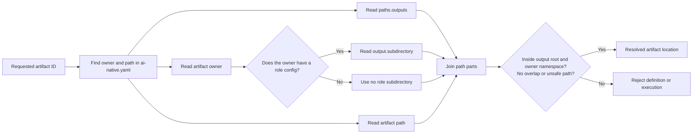

# Configuration Guide

`ai-native.yaml` is the global source of truth for the initialized workflow. Role configs add role-specific inputs and a child output directory. They do not replace the global workflow.

## Global YAML

The root `ai-native.yaml` has seven main sections:

| Section | Purpose |
|---|---|
| `project` | Project name, short summary, and content locale |
| `agent` | The AI client selected during initialization |
| `paths` | The selected client's native Agent directory and the global AI-output root |
| `roles` | Role IDs, missions, and responsibilities |
| `workflow.phases` | Phase owners, declared inputs, outputs, and completion gates |
| `artifacts` | Stable artifact IDs, owners, and paths |
| `capabilities` | Explicit, versioned opt-ins for platform semantic contracts such as `release_evidence: v1` |

Example:

```yaml
agent:
  client: "codex"

paths:
  agents: ".codex/agents"
  outputs: docs

capabilities:
  release_evidence: v1
```

`agent.client` records `github-copilot`, `claude-code`, or `codex`. `paths.agents` records the native Agent directory selected by the initializer. `paths.outputs` controls the root for later AI-produced artifacts. All three native Agent sets are rendered from the same six canonical Markdown sources.

`capabilities.release_evidence: v1` is a fail-closed declaration: the loader also requires the complete, marked DevOps V1 config, workflow, and runbook template. A true legacy project with neither the declaration nor a V1 marker keeps legacy behavior; a partial or malformed claimed pack is rejected instead of silently downgrading the gate.

The client choice controls native IDE discovery, including when it is selected in the Web new-project form. It does not select the Web execution engine: Web jobs still run through the local Codex runner. Direct IDE and Web use the same role, phase-owner, and artifact contracts, but only the Web platform can produce its persisted clearances, semantic-gate results, Linked E2E bindings, and trusted runner events.

Do not move the installed Agent files or edit `agent.client` or `paths.agents` by hand. Native discovery depends on the selected client's project directory. Run the initializer in a new target project to choose another client.

## Artifact path resolution

Never guess an artifact path. Resolve it from its artifact ID and owner.



The diagram means:

1. Find the artifact record in `ai-native.yaml`.
2. Start with the global `paths.outputs` value.
3. Read the artifact owner.
4. If that owner has `.ai-sdlc/roles/<owner>/config.yaml`, append its `output.subdirectory`.
5. Append the artifact `path` from the global YAML.
6. Reject paths that escape the output root or owner namespace, target project-control or native Agent files, collide after case/Unicode normalization, or overlap another artifact as a file/directory ancestor.

Always use the artifact owner's config, not the active role's config.

For the default Change Contract, `change-contract.md` is a configured basename. The platform creates one immutable human artifact for every Run and resolves it to a stable task-specific filename:

```text
docs + ai-native/product + change-contract.md
+ current task "修复结算舍入" + run 550e8400-e29b-41d4-a716-446655440000
= docs/ai-native/product/修复结算舍入--550e8400-e29b-41d4-a716-446655440000-change-contract.md
```

Its logical ID remains `change-contract`. Although its registry owner is `pm-ba`, every Agent consumes it read-only. Changing the requested outcome requires a new Run and Change Contract, not an Agent edit.

For the default Designer spec, `design-spec.md` is a configured basename. A platform-managed task resolves it to a stable task-specific filename:

```text
docs + ai-native/design + design-spec.md
+ current task "登录改版" + run 550e8400-e29b-41d4-a716-446655440000
= docs/ai-native/design/登录改版--550e8400-e29b-41d4-a716-446655440000-design-spec.md
```

The logical artifact ID remains `design-spec`, so downstream dependencies do not depend on a filename. Every re-run of that task resolves the same path; another task, including one with the same title, resolves a different path because its run ID differs. The active execution contract is authoritative for every task-scoped artifact in that Run.

The phase input arrays declare the full evidence vocabulary for compatible clients. In a platform-managed Run, Product, Design, and Architecture dispositions resolve the concrete alternatives. For example, Product `direct` does not require a fake PRD and Design `skip` does not require a fake design spec. Release declares `change-contract`, `implementation-notes`, and `engineering-provenance` alongside the applicable architecture and verification evidence. The definition loader extends older initialized projects with these contract additions in memory rather than rewriting project-owned YAML. Fresh definitions also declare `capabilities.release_evidence: v1`; the DevOps config, workflow, and runbook template each carry the matching `ai-sdlc:release-evidence-v1` marker and semantic shape. A claimed but missing, symlinked, wrong-version, or malformed pack fails as `CONFIG_INVALID` instead of silently downgrading the Release gate. A truly legacy definition with no marker keeps its original review contract until an explicit incremental backfill.

Software Engineer has a role config with `output.subdirectory: ai-native/engineering`. Its seven artifact paths are registered as basenames in `ai-native.yaml`, so normal owner-aware resolution produces paths such as:

```text
docs + ai-native/engineering + implementation-notes.md
= docs/ai-native/engineering/implementation-notes.md
```

In a platform-managed Run, all seven engineering artifacts are task-scoped after that normal resolution. The platform derives a stable task-and-Run namespace without rewriting the project-owned registry:

```text
docs/ai-native/engineering/implementation-notes.md
+ current task "修复结算舍入" + run 550e8400-e29b-41d4-a716-446655440000
= docs/ai-native/engineering/修复结算舍入--550e8400-e29b-41d4-a716-446655440000-implementation-notes.md
```

The same namespace applies to `implementation-plan`, `implementation-tasks`, `engineering-session-log`, `engineering-test-evidence`, `engineering-review`, and `engineering-provenance`. `implementation-notes` is the pack index. Tester consumes that index plus the independently reviewable `engineering-test-evidence` and `engineering-review` heads from the same Run.

The platform also task-scopes `test-report` after its normal direct registry resolution, so different Runs do not overwrite one shared verification report:

```text
docs/ai-native/testing/test-report.md
+ current task "修复结算舍入" + run 550e8400-e29b-41d4-a716-446655440000
= docs/ai-native/testing/修复结算舍入--550e8400-e29b-41d4-a716-446655440000-test-report.md
```

When a Run already has a persisted artifact revision, that stored path remains pinned across reruns even if the live project configuration later changes.

Legacy compatibility is intentionally non-destructive: an older Run whose persisted `test-report` still uses the former shared basename keeps that path. If two pre-upgrade Runs already point to the same physical report, they remain shared until an authorized operator performs an explicit per-Run backfill. Do not rerun Verification for either shared Run, sequentially or concurrently: either order can overwrite evidence before the platform can prove Run ownership. Resume only after each Run has its own pinned report path; never assume the platform silently moved project-owned evidence. New Runs always receive distinct Run-scoped paths.

DevOps has `output.subdirectory: ai-native/operations`. The registered `release-runbook` path is a basename, and a platform-managed Release resolves it to a stable task-specific filename:

```text
docs + ai-native/operations + release-runbook.md
+ current task "修复结算舍入" + run 550e8400-e29b-41d4-a716-446655440000
= docs/ai-native/operations/修复结算舍入--550e8400-e29b-41d4-a716-446655440000-release-runbook.md
```

The Run-scoped path pins the evidence reviewed by the Release semantic gate. Approval binds the exact current Run and every selected upstream artifact ID, path, and platform-recorded content hash; a fake or legacy runner execution cannot be promoted to readiness. A ready runbook only prepares a human go/no-go decision; it does not prove or execute deployment, CI configuration, secret use, merge, publication, or rollback.

An artifact path may name one file or one directory. For example, `user-stories` and `architecture-adrs` are directory artifacts.

## Role configs

Five roles have their own config:

| Role | Config | What it may control |
|---|---|---|
| PM / BA | `.ai-sdlc/roles/pm-ba/config.yaml` | Business Markdown inputs and `output.subdirectory` |
| Designer | `.ai-sdlc/roles/designer/config.yaml` | Role resources, upstream artifacts, extra Markdown, component query/validation paths, and `output.subdirectory` |
| Architect | `.ai-sdlc/roles/architect/config.yaml` | Upstream artifacts, evidence Markdown, confirmed context, review floors, and `output.subdirectory` |
| Software Engineer | `.ai-sdlc/roles/software-engineer/config.yaml` | Upstream artifact and Markdown inputs, evidence IDs, quality floors, and `output.subdirectory` |
| DevOps | `.ai-sdlc/roles/devops/config.yaml` | Release evidence vocabulary, optional project release/operations Markdown, and `output.subdirectory` |

A role config may:

- name project-relative input Markdown;
- name registered upstream artifact IDs;
- choose that role's child output directory;
- hold role-specific settings that do not redefine the global workflow.

A role config must not:

- replace `paths.outputs`;
- redefine artifact file names;
- write outside the target project;
- store credentials or private tokens;
- make an unknown project fact look confirmed.

Tester has no role config; its artifact path is registered directly in `ai-native.yaml`. DevOps has both a config and a supporting `workflow.md`. These files constrain runbook preparation and validation; they do not grant deployment, CI, credential, branch-policy, merge, publication, rollback, or go/no-go authority.

The Software Engineer config does not redefine the role. The selected client's native Agent remains the one role definition, while `.ai-sdlc/roles/software-engineer/workflow.md` and its `references/*.md` files are ordinary supporting Markdown. They are not Skills or additional Agents. The config may declare Tier A/B as normally passing verification tiers and seven review lenses as a quality floor; it cannot let the Agent approve its own Tier C/Limited exception, architecture choice, risk acceptance, PR publication, or merge.

## Change the output root

To move all later AI artifacts from `docs/` to `product-docs/`, edit only the global root:

```yaml
paths:
  outputs: product-docs
```

The role child directories remain the same:

```text
product-docs/ai-native/product/
product-docs/ai-native/design/
product-docs/ai-native/architecture/
product-docs/ai-native/engineering/
product-docs/ai-native/testing/
product-docs/ai-native/operations/
```

## Change a role child directory

To move only PM / BA outputs inside the global root:

```yaml
output:
  subdirectory: product
```

The final PRD becomes:

```text
<paths.outputs>/product/prd.md
```

Do not repeat the global root in a role subdirectory.

## Add role input Markdown

Use project-relative paths:

```yaml
inputs:
  markdown:
    - docs/research/interviews.md
    - docs/business-rules.md
```

The role should report a missing or conflicting source. It must not silently invent its contents.

## Global workflow changes

The six global phases and their owners are fixed in this V1. Changing their order, adding a phase, or transferring ownership is an architecture and scope decision, not routine configuration. For compatible artifact evolution inside that boundary, keep these rules true:

- every phase has one owner;
- every declared input points to a registered artifact;
- every declared output is owned by the phase owner;
- later phases do not use an output before it is produced;
- artifact IDs stay stable when existing documents depend on them;
- human-owned decisions remain explicit gates.

See [End-to-End Workflow](../workflow/README.md) before changing phase dependencies. The [Platform runtime contract](../../platform/docs/runtime-contract.md) explains how a Web-managed Run pins resolved paths and selected outputs.

The platform and its real runner are currently suitable only for local, trusted, disposable or otherwise recoverable projects. Path validation limits project-output targets; it is not an OS sandbox. The unauthenticated API and unsandboxed Codex process remain explicit security-architecture blockers for remote, multi-user, or untrusted-repository use. See the [Platform security model](../../platform/docs/security-model.md).
