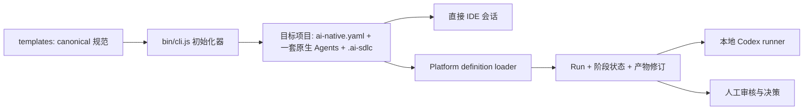

# AI-SDLC 项目学习手册

这是一份面向本仓库学习者和维护者的中文路线图。它不替代各角色的详细规范，而是帮助你先建立整体模型，再按真实源码、测试和一次练习 Run 把知识串起来。

## 背景：我在做什么

AI 编程工具已经很擅长完成局部任务：生成代码、解释错误、补测试、修改页面，甚至在一次会话中实现完整功能。但“会写代码”不等于“能够稳定交付软件”。当 AI 真正进入日常研发后，问题往往从编码速度转移到交付控制：

- 需求、假设和关键决定只留在聊天记录中，换一个会话就丢失上下文；
- PM、设计、架构、开发、测试和运维的责任混在一起，AI 容易替人做本应由人批准的决定；
- 简单 bug 被迫走完整流程，而复杂变更又可能因为一句“没有影响”跳过必要分析；
- 代码、设计、架构、测试和发布说明各自更新，却缺少一条能证明它们属于同一次变更的证据链；
- 实现者在同一上下文中给自己设计测试，容易得到“证明实现正确”的测试，而不是独立挑战外部合同；
- Agent 可以声称“测试通过”“可以发布”，但真实命令、版本、输入、风险和人工授权未必存在；
- Copilot、Claude Code、Codex 各维护一套角色提示后，很快会发生职责和规则漂移；
- 已初始化项目随着工作流演进需要升级，但整体覆盖又会破坏项目自己积累的规则与内容。

我正在做的，是一个轻量、可安装、可审计的 AI-native 软件交付工作流。它不是一组彼此独立的 Prompt，也不是让六个 Agent 无人监管地串行工作，而是把一次软件变更组织成四个相互配合的部分：

1. **一份不可变的变更合同**：先固定本次 Run 的目标、验收条件、回归义务和非目标，防止执行过程中悄悄改变题目。
2. **六个固定责任域**：PM / BA、Designer、Architect、Software Engineer、Tester、DevOps 各自拥有清晰的输入、输出、边界和交接条件。
3. **一张持久化证据图**：角色通过注册 artifact、revision、hash 和 provenance 交接事实，不依赖聊天记忆，也不依赖含糊的“最新版文件”。
4. **明确的人工门禁**：AI 负责调查、实现、验证和准备建议；人保留产品范围、架构选型、风险接受、合并和最终发布授权。

仓库因此同时提供两个互补入口：根目录的初始化器把同一套 canonical 工作流安全安装到任意目标项目；`platform/` 则用本地 Web 应用持久化 Run、影响处置、执行、产物修订、审核和语义门禁。项目从“一个人也能有纪律地完成一整条交付链”出发，但保留了未来扩展到团队协作和受控自动化的结构。

## 理想状态：这个项目最终可以达到什么程度

理想状态不是“AI 自动把需求发布到生产”，而是：**从想法到发布决定的每一步都可以更快，但没有任何关键步骤因为更快而变得不可解释、不可验证或不可追责。**

理想中的一次交付应该是这样的：

1. 人提出一个问题、bug 或产品目标，系统协助整理成可观察、可验收、不可被 Agent 改写的 Change Contract。
2. 系统根据真实影响提出 Product、Design、Architecture 路由建议，由人确认后只运行必要角色；小改动不背负无意义流程，大改动不能逃过必要门禁。
3. 每个角色读取当前 Run 已批准的精确输入，生成自己拥有的结构化产物；下一个角色读取 artifact，而不是依赖上一段聊天。
4. Software Engineer 完成真实代码和仓库测试，同时给出可独立审核的计划、任务、会话、测试、审查和 provenance 证据包。
5. Tester 从合同和风险出发独立验证。需要 E2E 时，脚本先在临时 staging workspace 中创作，再把允许的测试变更提升到与产品仓库分离、非嵌套的 Linked E2E Workspace；脚本字节经过人工 hash 审核后，才由受监督的真实浏览器 runner 执行。
6. 任何上游产物、代码、脚本或绑定发生相关变化，旧批准自动失效，系统把工作准确退回真正的 owner，而不是继续使用过期证据。
7. DevOps 把已批准输入、制品、监控、回滚和事故响应绑定成可执行 runbook；授权的人完成 go/no-go，外部受控系统才执行合并、部署或回滚。
8. 最终可以从一个生产结果反向追到：谁批准了什么、使用了哪个版本、执行了哪些命令、哪些风险被接受，以及为什么当时允许前进。

从能力成熟度看，理想目标可以概括为：

| 维度 | 理想状态 |
|---|---|
| 初始化 | 一个命令把版本化的 canonical 工作流安装到不同技术栈和 AI 客户端，不复制三套角色源，也不破坏项目自有内容。 |
| 任务入口 | 自然语言请求被整理为高质量 Change Contract；相同 outcome 在一个 Run 内稳定，新的 outcome 创建新 Run。 |
| 流程路由 | AI 提供影响分析和证据，人确认 `direct`、`skip`、`reuse`、`partial`、`full`；系统执行最小充分流程。 |
| Agent 协作 | 多个专业角色通过 artifact graph 协作，输入、输出、owner、revision 和 gate 均可机器校验。 |
| 人工参与 | 人不再逐条搬运上下文，而只处理真正需要判断的范围、选型、风险、例外和发布决定。 |
| 工程可信度 | 真实 diff、独立测试、seven-lens 工程审查、对抗性检查和 provenance 相互印证；文档不能替不存在的实现或命令背书。 |
| 验证 | 单元、集成、契约、E2E 和 CI 证据按风险选择；探索、脚本创作、人工审批与真实执行彼此隔离。 |
| 并行工作 | 多个 Run 有独立路径、workspace 和 revision，不覆盖彼此证据；发生变化时只使受影响的下游工作失效。 |
| 发布治理 | runbook 与精确输入、制品和环境证据绑定；Agent 不能自批，发布动作只由经过授权的人和系统执行。 |
| 平台安全 | 具备认证授权、隔离 worktree/container、凭据隔离、网络策略、资源限制和 apply-only promotion，可安全支持多人和不可信代码边界。 |
| 生态集成 | 与代码托管、CI、设计系统、制品仓库、可观测平台和部署系统交换可验证证据，而不是把外部成功写成 Markdown 声明。 |
| 审计与恢复 | 任意 gate 可重放、任意决定可追溯、失败可恢复、策略可版本化，旧项目通过显式增量 backfill 演进。 |

当前 V1 已经具备这个方向的核心骨架：canonical 六角色、create-only 初始化、影响处置、Run-scoped artifacts、append-only revisions、工程证据包、人工审核、Linked E2E 合同以及 Release 语义门禁。但它还不是上述理想状态的完整实现：Web API 尚无认证，真实 runner 没有 OS 级隔离，也不适合公网、多用户或不可信仓库；CI、凭据、合并和部署仍在平台授权边界之外。

因此，这份“理想状态”应被理解为产品方向和工程验收标尺，不是对当前 V1 能力的宣传。每一次演进都应该回答同一个问题：它是否让 AI 交付更快的同时，也让证据更真实、责任更清楚、失败更可恢复、人工决定更有价值？

## 1. 学习目标

完成本手册后，你应该能够：

- 解释“初始化器”和“Web 平台”为什么是两套边界不同、但共享同一合同的系统；
- 说清六个固定阶段、六个角色、影响处置、产物和人工门禁的关系；
- 根据变更影响选择 `direct`、`skip`、`reuse`、`partial` 或 `full`，而不是机械执行所有 Agent；
- 从 artifact ID 正确解析产物路径，并理解平台为什么给关键产物增加 Run 级文件名；
- 按正确顺序审核 Software Engineer 的七文件证据包；
- 区分可选的 Playwright MCP 探索与可重复的独立 E2E 证据；
- 在源码中追踪一次 Run 从 Web、API、合同、数据库到本地 Codex runner 的链路；
- 修改仓库时守住六阶段顺序、角色所有权、向后兼容和人工授权边界。

建议先具备 Node.js 20+、基础 TypeScript/React/Fastify 知识，以及 Git、YAML 和 Markdown 使用经验。运行 Web 平台还需要 Corepack 和 Docker；存在 Compose v2 时优先使用，否则数据库脚本回退到 Docker CLI。真实任务执行才需要 Codex CLI。

## 2. 先用一分钟理解这个项目

这个项目的核心不是“让六个 Agent 轮流写文档”，而是：

> 用不可变的变更合同定义一次工作，用最小必要角色生成可审核产物，用证据和人工门禁控制每次交接。

仓库由四层组成：

| 层 | 作用 | 主要位置 |
|---|---|---|
| 规范层 | 定义六个角色、六阶段、产物注册表和角色操作程序 | [`templates/`](../../templates) |
| 初始化层 | 把一套 canonical 规范安全地安装到目标项目，并渲染唯一一套客户端原生 Agent | [`bin/cli.js`](../../bin/cli.js) |
| 运行层 | 持久化 Run、影响判断、产物修订、审核、执行事件和语义门禁 | [`platform/`](../../platform) |
| 证据层 | 记录本仓库自身变更的规格、会话和独立审核证据 | [`changes/`](../../changes)、[`sessions/`](../../sessions)、[`reviews/`](../../reviews) |



需要牢牢记住两点：

1. `templates/agents/` 中只有六份 canonical Markdown 角色源；Copilot、Claude Code、Codex 文件都是初始化时派生的，不是三套独立角色。
2. `changes/`、`sessions/`、`reviews/` 是维护本仓库的工程证据，不是初始化后业务项目下一阶段要消费的 Run 产物。

## 3. 核心词汇

| 词汇 | 在本项目中的准确含义 |
|---|---|
| Run | 针对一个明确变更目标的完整交付实例；它有自己的合同、状态、产物头和审核记录。 |
| Change Contract | 一次 Run 的不可变人工合同，包含现状、期望结果、验收条件、回归义务和非目标；结果变化时创建新 Run，Agent 不得改写旧合同。 |
| Phase | 固定的六个流程阶段：`discovery`、`design`、`architecture`、`implementation`、`verification`、`release`。 |
| Role / Agent | Role 是职责与所有权；Agent 是所选客户端发现该 Role 的原生入口。角色 workflow 和 references 只是支持材料，不是第二个 Agent 或 Skill。 |
| Disposition | 对 Product、Design、Architecture 影响范围的结构化处置。它决定是否运行对应 Agent、复用哪些证据、更新哪些输出。 |
| Artifact ID | 稳定的产物逻辑标识，例如 `design-spec`、`test-report`。下游依赖 ID，不依赖猜测出的物理文件名。 |
| Gate | 进入下一阶段前必须满足的语义条件。角色可以准备证据，但不能替代人工拥有的批准或风险接受。 |
| Clearance | Product、Design、Architecture 的当前 Run 影响判断和来源证明；合法的跳过或复用也必须留下 clearance。 |
| Revision / head | 产物的不可变历史修订与当前选中版本。人工编辑会生成新修订并使受影响的下游阶段重新待验证。 |
| Provenance | 规格、代码、测试、审查、命令结果和限制之间的可追溯关系。 |
| Linked E2E Workspace | 人工显式绑定、与产品仓库分离且不嵌套的 E2E 根目录；平台不会搜索或猜测旧的兄弟目录。 |

机器合同中的 token 不要翻译：artifact ID、阶段 ID、枚举值、验收/阻塞 ID、JSON/YAML key、固定标题、选择标记、hash 和 sentinel 必须保持原样。解释性文字才使用 `project.locale`。

## 4. 六阶段与六角色

六阶段顺序和所有者是当前 V1 的固定架构边界。

| 阶段 | 所有者 | 主要问题 | 主要结果 | 关键人工边界 |
|---|---|---|---|---|
| `discovery` | PM / BA | 合同本身是否足够，还是需要复用、局部更新或完整产品工作？ | Product clearance；按需更新 PRD、user stories | 产品范围、优先级、业务/合规策略由人决定；Change Contract 只读 |
| `design` | Designer | 是否真的有界面、交互、文案、响应式或无障碍影响？ | Design clearance；按需更新 baseline、task spec、prototype、Figma handoff | 改变范围、安全、隐私或无障碍策略的决定由人负责 |
| `architecture` | Architect | 哪个系统方向最符合事实、规则和质量约束？ | architecture index、options、C4、ADR、patterns、NFR、adversarial pack | 人选择方向并最终接受架构、信任边界和残余风险 |
| `implementation` | Software Engineer | 如何完成最小而完整的代码变更，并让证据可独立审核？ | 真实代码/测试 diff 和七文件工程证据包 | 不自行改变产品/设计/架构，不发布或合并 PR，不接受风险 |
| `verification` | Tester | 当前、可重复的证据是否覆盖验收、回归、NFR 和主要风险？ | Run-scoped `test-report`；需要时产生独立 E2E 证据 | 产品代码仍归 Engineer；Tier 例外、脚本 hash 和 Verification 批准由人控制 |
| `release` | DevOps | 发布路径是否已绑定证据、可重复、可观测、可回滚？ | Run-scoped `release-runbook` 和 readiness 结论 | Agent 不配置 CI/密钥、不部署、不回滚、不合并、不做 go/no-go |

完整主线是：

```text
Change Contract
→ Product Impact
→ Design Impact
→ Architecture Impact
→ Software Engineer
→ 人工 Implementation 审核
→ Tester
→ 人工 Verification 审核
→ DevOps runbook
→ Release 语义门禁
→ 人工 go/no-go
```

流程有反馈环，不是单向瀑布：需求缺口回 Product，交互缺口回 Design，边界/NFR 缺口回 Architecture，产品实现或可测试性缺陷回 Software Engineer，E2E 脚本错误留在 Tester 的重新创作与 hash 复审循环，环境或外部发布证据回到有权限的人或系统。

## 5. 影响处置怎么选

### 5.1 Product Impact

| 模式 | 何时使用 | 是否运行 PM / BA |
|---|---|---:|
| `direct` | Change Contract 加权威期望行为来源已经足够 | 否 |
| `reuse` | 已批准的 PRD/story 修订完整覆盖本 Run，并可记录来源 | 否 |
| `partial` | 基线仍成立，只更新受影响的 PRD 或 story | 是，只写选中输出 |
| `full` | 新产品模型或实质性范围变化，需要全面创建/修订 | 是 |

### 5.2 Design Impact

| 模式 | 何时使用 | 是否运行 Designer |
|---|---|---:|
| `skip` | 没有界面、交互、文案、响应式和无障碍变化，并有证据 | 否 |
| `reuse` | 已批准的设计证据恰好覆盖当前 Run | 否 |
| `partial` | 只更新受影响页面、状态或选中设计输出 | 是，只写选中输出 |
| `full` | 新用户旅程或体验模型发生实质变化 | 是 |

只有可运行实现出现后才能验证的响应式、键盘、焦点、无障碍或交互检查，应写入 `design-spec.deferred_validations`，并包含稳定 ID、runnable prerequisite、targets、checks、pass criteria、`evidence_types`、release impact、`owner: tester`、`phase: verification`、`on_fail: block_verification` 和 `on_missing: block_verification`。它们不能继续留在 Design `blockers` 中；当前就能完成的设计检查则仍归 Designer，并可阻塞 Design。

### 5.3 Architecture Impact

| 模式 | 何时使用 | 是否运行 Architect |
|---|---|---:|
| `skip` | 有界 bug/技术任务且确认没有边界、API/schema、数据、集成、安全、NFR、部署或运维影响 | 否 |
| `reuse` | 现有已接受架构包仍完整适用并能证明来源 | 否 |
| `partial` | 保持已选方向，只刷新声明受影响的架构输出 | 是，只写选中输出 |
| `full` | 方向、所有权、规则适用性、约束或质量目标可能变化 | 是，经过 options → 人工选择 → selected-state pack |

`partial` 的 selected outputs 必须始终包含并刷新 `architecture` index，确保下游索引真实。Web 中的 `full` 是一个显式两段流程：首轮只允许并要求 `architecture`、`architecture-discovery-context` 和 `architecture-options`；人必须针对当前 options revision 在 `request_changes` 审核中用独立一行写下 `Selected option: <ID>`。随后 Architect 才能生成 `architecture` 加 `architecture-c4-context`、`architecture-c4-containers`、`architecture-adrs`、`architecture-patterns`、`architecture-nfrs` 和 `architecture-adversarial`；完整架构包仍需另一次最终人工接受。

`direct`、`skip` 和 `reuse` 省略的是 Agent 执行，不是证据、审核或门禁。影响未知时不能据此跳过；实现中发现被遗漏的影响时，必须使下游 clearance 失效并重新评估。

一个常见的有界 bug 快速路径是：

```text
Product: direct
→ Design: skip（有证据证明无任何用户可见设计影响）或 reuse（既有设计证据完整适用）
→ Architecture: skip（无架构影响）或 reuse（既有架构包适用）
→ Software Engineer
→ Tester 定向回归
→ DevOps runbook
→ 人工 go/no-go
```

它仍需要 Change Contract、可观察的修复条件、权威期望来源、可用时的复现证据和定向回归；生产代码变更绝不跳过 Verification。

## 6. 一次 Run 的关键证据链

### 6.1 先写好 Change Contract

从 [`change-contract.md`](../../templates/shared/.ai-sdlc/templates/change-contract.md) 模板开始，至少检查：

- 当前行为或上下文是否可观察；
- 期望结果是否只描述一个稳定 outcome；
- 每条验收条件是否有稳定 ID，例如 `CC-AC-001`；
- 回归义务、非目标和已知约束是否明确；
- Product、Design、Architecture impact 只作为提示，不冒充最终处置。

若 outcome 改变，不要“修一下旧合同”，而应创建新 Run。

### 6.2 审核工程证据包

Software Engineer 的七个 Markdown 是同一次代码变更的一套证据包，不是七张让人手填的表，也不能替代真实代码和测试 diff。推荐顺序：

1. 读 `implementation-notes`：它是索引，先确认状态为 `Ready for verification`，没有 `Failed` 或 `Blocked`。
2. 查看真实 source/test diff：确认实现存在、范围正确、没有越权修改。
3. 读 `engineering-test-evidence`：每个 passing AC coverage row 必须在同一行包含 exact AC ID、真实 executable test path、test name、durable result evidence 和 `Pass`；同时核对真实命令/结果与 Tier A/B 独立性声明。
4. 读 `engineering-review`：确认七个 review lens、pre-mortem 和 edge-case-hunter 已完成，没有未解决的 `critical`/`high` finding，也没有任何未决 security finding。
5. 读 `engineering-provenance`：确认规格、会话、测试、审查、限制和人工边界能追溯到真实证据。
6. 有争议或需要审计时，再展开 `implementation-plan`、`implementation-tasks` 和 `engineering-session-log`。

Tier A 表示新模型加新会话，Tier B 表示新会话且可用同一模型；二者都要求测试作者看不到实现。Tier C 或 `Limited` 不能自动通过，必须有符合精确合同的人工例外和补偿证据。

### 6.3 理解 Tester 的 E2E 子流程

E2E 是 Verification 内的子流程，不是第七阶段：

1. 人工显式绑定独立、非嵌套的 Linked E2E Workspace；平台再分别验证 package manager 与脚本标识、manifest/lockfile/Playwright 状态、真实 Chromium launch probe、product start 与 loopback target readiness，以及 cleanup capability。安装依赖或浏览器仍是显式人工 setup，不是 Tester 自行完成的副作用。
2. Tester 可选地用 Playwright MCP 做临时路径探索；探索成功本身不是可重复验收或 CI 证据。
3. 平台冻结只含规格的 AC intent，把 linked workspace 复制到临时 staging workspace，并在那里启动新的 Tier A/B Test Author；作者只能改 allowlist 中的测试/fixture，不读产品实现或探索 transcript，也不执行脚本。校验通过后，平台才把这些允许的变更提升回 linked root。
4. 人工审核精确 aggregate manifest hash；受审核的脚本/fixture、manifest，或被记录的 Product/E2E revision 与 binding 发生变化，都会使批准失效。`.git`、依赖、缓存和报告等排除项不是该 revision token 的组成部分。
5. 平台用固定 argv、`shell: false` 和真实 headless Chromium 执行 standalone Playwright，并记录 cwd、revision、exit code 及报告/trace/screenshot/log hash。
6. Tester 把 Product 与 E2E 双重 provenance 写入 `test-report`。

只有需要改变产品源码、产品仓内测试或 testability interface 的失败才回 Software Engineer 并重新审批 Implementation。linked test 自身的 bug 留在 fresh-author → manifest-review 循环。

### 6.4 理解 Release 的终点

DevOps 消费当前 Change Contract、适用的 architecture evidence、`implementation-notes`、`engineering-provenance` 和 `test-report`。runbook 必须绑定当前 Run 以及每个选中输入的 artifact ID、项目相对路径和平台记录的 SHA-256，并说明版本/制品、供应链适用性、前置条件、rollout、health/smoke、monitoring、rollback/recovery、incident escalation、风险和人工 owner。

`Ready for human go/no-go` 只表示准备材料通过语义审查，不表示已部署、已合并、已发布、已配置 CI/密钥或已获得发布授权。

## 7. Artifact ID 与物理路径

不要凭文件名猜路径。解析公式是：

```text
paths.outputs
+ artifact.owner 对应 config.yaml 的 output.subdirectory（若存在）
+ ai-native.yaml 中该 artifact 的 path
```

必须使用“artifact owner 的 config”，不是“当前正在执行的 role config”。例如 Software Engineer 读取 Designer 的 `design-spec` 时，仍使用 Designer 的 `output.subdirectory`。

默认命名空间如下：

| Owner | 默认位置 |
|---|---|
| PM / BA | `docs/ai-native/product/` |
| Designer | `docs/ai-native/design/` |
| Architect | `docs/ai-native/architecture/` |
| Software Engineer | `docs/ai-native/engineering/` |
| Tester | `docs/ai-native/testing/`（artifact path 已包含该目录，Tester 无 role config） |
| DevOps | `docs/ai-native/operations/` |

平台会为新创建的 Run 把 `change-contract`、`design-spec`、七个 engineering artifacts、`test-report` 和 `release-runbook` 固定为任务名加完整 Run ID 的独立路径，例如：

```text
docs/ai-native/engineering/
修复结算舍入--550e8400-e29b-41d4-a716-446655440000-implementation-notes.md
```

逻辑 ID 仍是 `implementation-notes`。同一 Run 重跑沿用已 pin 的路径，不同 Run 不应共享一个“latest”文件。Architecture 下游读取必须从 `architecture` index 开始，再跟随其中标记为 active/accepted 的子产物；子文件存在不等于已经生效。

平台不会静默迁移升级前已经 pin 的 legacy 路径。如果两个旧 Run 已经指向同一个共享 `test-report` 文件，在获得明确授权并完成 per-Run backfill 之前，两者都不能重跑 Verification；无论串行还是并行，重跑都可能覆盖尚未证明归属的证据。

兼容旧项目时还要区分两份定义：项目磁盘上的 `ai-native.yaml` 是项目自有声明；API 的 `LoadedDefinition` 是平台当前动作使用的有效定义。`definition-loader.ts` 只在内存中补齐 Change Contract artifact graph、prototype/Figma outputs、Verification 的 `design-spec` input、完整 Architecture/Engineering artifact graph、Release 所需 inputs 和兼容路径归一化。它不会安装 Agent、workflow、reference 或 template，不会静默改写项目 YAML，也不会替一个旧项目自动开启 Release evidence v1 语义门禁。要永久采用新版角色包或门禁，仍需显式增量 backfill；声称 v1 capability 却缺少完整 marker/config/workflow/template 的项目会 fail closed。

## 8. 直接 IDE 与 Web 平台的差异

| 能力 | 直接 IDE | Web 平台 |
|---|---:|---:|
| 使用同一六角色、阶段 owner 和 artifact contract | 是 | 是 |
| 读取所选客户端原生 Agent | 是 | 是；Web 真正执行仍由本地 Codex runner 完成 |
| 人工在任务 Markdown 中记录交接 | 是 | 可，同时有数据库状态 |
| 持久化 clearance、artifact head、审核历史 | 无平台保证 | 是 |
| Run-scoped path pin 和 stale-head 防护 | 无平台保证 | 是 |
| Linked E2E binding、mutation guard、manifest hash review | 不能自行声称 | 是 |
| 受监督 runner 事件和 Release 语义门禁 | 不能自行声称 | 是 |

直接 IDE 可以遵循相同的证据结构，但不得手工声称 Web 才能产生的 trusted event、manifest approval 或等价的 supervised E2E guarantee。

这里的 mutation protection 也有层级：普通阶段主要保护未选中的注册产物与项目控制资源；Verification 和 Release 才增加更强的同步全工作区检测与恢复。Implementation 的产品源码修改发生在人工批准前，平台审核不提供通用源码回滚。任何 guard 都无法遏制 runner 结束扫描后仍继续写入的逃逸后台进程。

当前 Web V1 只适合本地、可信、可丢弃或可恢复的项目。API 没有认证，真实 Codex 进程没有 OS 级隔离，并以绕过 CLI approval/sandbox 的方式运行；完成任务所需的项目上下文还会发送给配置的模型服务。不要对外暴露服务，不要注册不可信仓库；allowed roots、文件快照和 mutation guard 是应用级保护，不是安全沙箱。

## 9. 仓库源码地图

| 想回答的问题 | 先读哪里 |
|---|---|
| 项目解决什么问题？ | [`README.md`](../../README.md) |
| 六阶段、角色、输入、输出和 gate 是什么？ | [`templates/ai-native.yaml`](../../templates/ai-native.yaml) |
| 共享顺序、影响模式和 path resolution 是什么？ | [`templates/shared/.ai-sdlc/workflows/default.md`](../../templates/shared/.ai-sdlc/workflows/default.md) |
| 每个角色的身份、边界和 handoff 是什么？ | [`templates/agents/`](../../templates/agents) |
| 角色一步步怎么做？ | [`templates/shared/.ai-sdlc/roles/`](../../templates/shared/.ai-sdlc/roles) |
| 产物必须包含哪些字段？ | [`templates/shared/.ai-sdlc/templates/`](../../templates/shared/.ai-sdlc/templates) |
| 初始化如何渲染客户端文件并保证 create-only/rollback/recovery？ | [`bin/cli.js`](../../bin/cli.js) 与 [`test/init.test.js`](../../test/init.test.js) |
| API 的共享 DTO、枚举和 Zod 校验在哪里？ | [`platform/packages/contracts/src/index.ts`](../../platform/packages/contracts/src/index.ts)；Web 当前在 [`types.ts`](../../platform/apps/web/src/lib/types.ts) 镜像浏览器类型，并由 [`api.ts`](../../platform/apps/web/src/lib/api.ts) 解析响应 |
| API 路由如何进入业务逻辑？ | [`platform/apps/api/src/app.ts`](../../platform/apps/api/src/app.ts) |
| 老项目如何兼容新 artifact，路径如何验证？ | [`platform/apps/api/src/services/definition-loader.ts`](../../platform/apps/api/src/services/definition-loader.ts) |
| Run-scoped path 如何生成和 pin？ | [`task-artifact-paths.ts`](../../platform/apps/api/src/domain/task-artifact-paths.ts) |
| Run 状态、impact、执行、审核和 gate 如何编排？ | [`platform/apps/api/src/services/workflow-service.ts`](../../platform/apps/api/src/services/workflow-service.ts) |
| 文件收集、runner 和 mutation boundary 在哪里？ | [`artifact-workspace.ts`](../../platform/apps/api/src/services/artifact-workspace.ts)、[`codex-runner.ts`](../../platform/apps/api/src/services/codex-runner.ts)、[`verification-workspace.ts`](../../platform/apps/api/src/services/verification-workspace.ts) |
| Linked E2E 的绑定、staging authoring、执行和 hash 审核在哪里？ | [`e2e-workspace-service.ts`](../../platform/apps/api/src/services/e2e-workspace-service.ts)、[`e2e-automation-runner.ts`](../../platform/apps/api/src/services/e2e-automation-runner.ts)、[`verification-e2e-coordinator.ts`](../../platform/apps/api/src/services/verification-e2e-coordinator.ts) |
| 数据如何持久化？ | [`schema.ts`](../../platform/apps/api/src/db/schema.ts) 与 [`store.ts`](../../platform/apps/api/src/db/store.ts) |
| Web 页面如何组织？ | [`App.tsx`](../../platform/apps/web/src/App.tsx)、[`projects-page.tsx`](../../platform/apps/web/src/pages/projects-page.tsx)、[`project-page.tsx`](../../platform/apps/web/src/pages/project-page.tsx)、[`run-page.tsx`](../../platform/apps/web/src/pages/run-page.tsx) |
| 前端如何调用 API 并判定 UI 状态？ | [`api.ts`](../../platform/apps/web/src/lib/api.ts) 与 [`platform/apps/web/src/lib/`](../../platform/apps/web/src/lib) |
| 实现约束如何变成可执行规格？ | 根目录 `test/*.test.js` 和各 workspace 的 `checks/*.check.ts` |

### 9.1 把初始化器当成安全发布协议来读

初始化器只安装工作流，不运行 Agent、不创建业务交付 artifact、也不批准 gate。Copilot 投影到 `.github/agents/<role>.agent.md`，Claude Code 投影到 `.claude/agents/<role>.md`，Codex 投影到 `.codex/agents/<role>.toml`；三者正文都来自同一份 `templates/agents/<role>.md`，一次初始化只安装其中一套。

安全发布顺序是：全部目的地 preflight → UUID staging 和 journal → 独占 hard-link publish 并校验 inode/hash → unlink transaction marker 作为 commit point。失败或取消时，它只删除本事务创建且身份、内容未变化的文件与新空目录。进程崩溃后，下一次初始化只清理可由 journal 验证的 unchanged remainder；无 journal、外部改动或身份漂移都会 fail closed，保留现场给人检查。这是 crash-recoverable publication，不是所有文件同时可见，也不是已有项目的升级或 merge 工具。

阅读 [`bin/cli.js`](../../bin/cli.js) 时按 `clients` → `run()` → `buildEntries()` → renderers → transaction/rollback/recovery 的顺序，再用 [`test/init.test.js`](../../test/init.test.js) 验证自己的理解。

### 9.2 按一条用例追踪平台

`workflow-service.ts` 很大，不建议从第一行顺读。选一个用例，用 `rg` 沿链路追踪。例如创建 Run：

```bash
rg -n 'createRun' \
  platform/apps/web/src \
  platform/apps/api/src/app.ts \
  platform/apps/api/src/services/workflow-service.ts \
  platform/apps/api/src/db/store.ts
```

再用同样方法追踪 `assessProductImpact`、`executePhase` 或 `reviewPhase`。先看 contracts 的输入/输出，再看 service 的不变量，最后看 store 与 UI，理解会快很多。

## 10. 推荐学习路线

### 路线 A：两小时建立全局模型

1. 20 分钟：读本手册第 2～5 节和根 [`README.md`](../../README.md) 的 Core model。
2. 20 分钟：逐行读 [`templates/ai-native.yaml`](../../templates/ai-native.yaml)，自己画出 phase → input/output → owner。
3. 20 分钟：读 [`default.md`](../../templates/shared/.ai-sdlc/workflows/default.md)，重点看 impact routing、artifact resolution、bug fast path。
4. 25 分钟：选一个角色，对照其 Agent、workflow、config 和 templates；建议先选 Software Engineer。
5. 20 分钟：读 [`platform/README.md`](../../platform/README.md) 的 Architecture、Human revisions 和 Security boundary。
6. 15 分钟：完成第 12 节自测，不会的题回到对应章节。

### 路线 B：七次学习会话

| 会话 | 主题 | 完成标准 |
|---|---|---|
| 1 | Mental model 与术语 | 能口述 Run、Contract、Disposition、Artifact、Gate 的关系 |
| 2 | Product / Design / Architecture 路由 | 给三个案例选模式，并能写出证据理由 |
| 3 | Engineering evidence pack | 能按正确顺序做一次证据审核并指出 blocker |
| 4 | Tester 与 E2E | 能区分探索、固化、脚本审核、独立执行和 CI handoff |
| 5 | Release 与人工边界 | 能解释 ready 为什么不等于 released |
| 6 | 初始化器与兼容性 | 能说明 canonical source、三种渲染、安全发布和显式 backfill |
| 7 | 平台源码链路 | 能从一个 UI 动作追到 API、service、store、artifact 和 runner |

## 11. 动手练习

### 练习 1：验证仓库并观察初始化结果

先在仓库根目录运行维护者合同：

```bash
npm test
npm pack --dry-run
```

然后选择一个全新的、不存在冲突文件的练习目录；初始化器是 create-only：

```bash
node ./bin/cli.js init /tmp/ai-sdlc-learning-sandbox --client codex
rg --hidden --files /tmp/ai-sdlc-learning-sandbox | sort
```

`--client` 的 CLI 值是 `copilot`、`claude` 或 `codex`；生成后的 `ai-native.yaml` 分别保存 canonical 值 `github-copilot`、`claude-code` 或 `codex`。

回答以下问题：

- 为什么只生成 `.codex/agents/`，没有同时生成 `.github/agents/` 和 `.claude/agents/`？
- `.codex/agents/*.toml` 的角色正文来自哪里？
- `ai-native.yaml` 和 `.ai-sdlc/workflows/default.md` 分别负责什么？
- role workflow 为什么不是 Skill？

不要在已初始化项目上重跑 CLI。升级旧项目要做显式、可审核的增量 backfill，并保留项目自有内容。

### 练习 2：设计一个有界 bug Run

选一个“后端舍入错误”案例，先从模板写 Change Contract，再给出：

- 权威期望行为来源；
- `CC-AC-001` 和至少一条回归义务；
- Product `direct` 的理由；
- Design `skip` 的界面无影响证据；
- Architecture `skip` 的 boundary、API/schema、data、integration、security、NFR、deployment 和 operations 无影响检查；
- Software Engineer 应生成的真实测试和七文件证据；
- Tester 的定向回归策略；
- DevOps runbook 仍需绑定的输入。

若任一“无影响”无法证明，就把对应处置升级为 `reuse`、`partial` 或 `full`，不要硬走 fast path。

### 练习 3：用 fake runner 学习 Web 状态机

fake runner 适合 UI 开发和确定性演示，不代表真实 AI、测试或 Release 成功。

```bash
cd platform
corepack enable
[ -e .env ] || cp .env.example .env
```

仅在 `.env` 尚不存在时复制示例文件，避免覆盖已有本地设置。先编辑 `.env`，把 `AI_SDLC_ALLOWED_PROJECT_ROOTS` 设为练习项目父目录的绝对路径，并设 `AI_SDLC_CODEX_FAKE=1`，确认后再启动：

```bash
yarn install
yarn db:up
yarn dev
```

API 默认绑定 `127.0.0.1`，但 Web 的开发脚本让 Vite 监听 `0.0.0.0`。只在可信的本机/网络环境使用，不做端口转发，也不要暴露到公网。然后：

1. 注册练习项目；
2. 创建 Run 和不可变 Change Contract；
3. 依次记录三种 impact；
4. 观察阶段为什么被解锁或阻塞；
5. 执行一个模拟阶段，打开 artifact revision 和 execution timeline；
6. 做一次人工修改，观察当前阶段重开和下游失效；
7. 尝试从 UI 找出“准备完成”和“人工批准”为什么是两个不同动作。

结束后运行 `yarn db:down`；它停止数据库但保留 named volume。

### 练习 4：追踪一个平台动作

以“创建 Run”为例，按这个顺序阅读：

```text
project-page.tsx
→ web/src/lib/api.ts
→ api/src/app.ts
→ WorkflowService.createRun
→ Store.createRun
→ contracts 中的 CreateRunInput / WorkflowRunDto
```

记录每一层负责的校验和它不负责的事情。再换成 `executePhase` 或 `reviewPhase` 重复一次；你的目标是识别“传输校验、业务不变量、持久化、文件/进程副作用、UI 呈现”的边界。

## 12. 自测题

1. 为什么 Change Contract 的 outcome 变化要创建新 Run？
2. Product `direct` 是否等于 discovery 什么证据都不需要？
3. 解析 artifact path 时使用当前角色的 config，还是 artifact owner 的 config？
4. Architecture 的 options 文件存在，是否表示该方向已经被接受？
5. 七个 engineering Markdown 是七项独立人工任务吗？
6. Playwright MCP 跑通一次，是否足以通过 Verification？
7. 修改 linked E2E 脚本一个字节后，旧的 hash 审批是否仍有效？
8. fake runner 的成功事件能否作为真实 Release readiness？
9. DevOps 可以替用户部署、配置密钥或决定 go/no-go 吗？
10. 当前平台能否安全暴露到公网并运行不可信仓库？

答案：

1. 因为合同是本 Run 的不可变范围和审计锚点。
2. 否；仍需合同、权威期望来源、理由、验收和回归证据。
3. artifact owner 的 config。
4. 否；从 `architecture` index 和当前 revision 的人工选择/接受证据判断。
5. 否；它们是一套自动生成的证据包，且不能替代真实 diff。
6. 否；MCP 仅可选探索，重复性 E2E 需要独立脚本、精确 hash 审核和 standalone real-browser execution。
7. 无效。
8. 不能；fake 只用于测试或演示。
9. 不可以。
10. 不可以；V1 无认证且 runner 无 OS 级隔离。

## 13. 维护本项目时的红线

- 不要在常规改动中改变六阶段顺序或角色 owner；这是架构/范围决策，需要升级确认。
- canonical 角色正文只维护在 `templates/agents/`；不要手工维护三套客户端角色。
- 角色详细程序和 reference pack 放在 `templates/shared/.ai-sdlc/roles/<role>/`。
- 每个可被 Web 审核的新产物都要注册到 `templates/ai-native.yaml`，并通过 artifact owner 解析路径。
- contracts 放 `platform/packages/contracts`，API 行为放 `platform/apps/api`，UI 行为放 `platform/apps/web`。
- 给新平台 artifact 时，在 definition loader 中保留已初始化项目的兼容行为；不要静默重写项目自有 YAML。
- 不要把 canonical Agent 复制成客户端专用 Skill。
- 沿用现有 Node test runner、TypeScript、Zod、YAML、React 和仓库 helpers；未经批准不要新增框架。
- 不要用重新初始化覆盖旧项目；执行显式增量 backfill、逐文件 diff、完整检查和人工批准。
- 架构、安全、DDL、scope、merge 和 release 决策必须停在人工门禁前。

完整验证命令：

```bash
# 仓库根目录
npm test
npm pack --dry-run

# platform/
cd platform
yarn typecheck
yarn test
yarn build
```

## 14. 深入阅读索引

- 安装与首次运行：[`guidelines/getting-started/README.md`](../getting-started/README.md)
- 完整阶段和反馈流：[`guidelines/workflow/README.md`](../workflow/README.md)
- 配置与路径解析：[`guidelines/configuration/README.md`](../configuration/README.md)
- 角色关系：[`guidelines/roles/README.md`](../roles/README.md)
- PM / BA：[`guidelines/roles/pm-ba/README.md`](../roles/pm-ba/README.md)
- Designer：[`guidelines/roles/designer/README.md`](../roles/designer/README.md)
- Architect：[`guidelines/roles/architect/README.md`](../roles/architect/README.md)
- Software Engineer：[`guidelines/roles/software-engineer/README.md`](../roles/software-engineer/README.md)
- Tester：[`guidelines/roles/tester/README.md`](../roles/tester/README.md)
- DevOps：[`guidelines/roles/devops/README.md`](../roles/devops/README.md)
- 平台运行与安全边界：[`platform/README.md`](../../platform/README.md)
- Prompt 质量评估：[`reviews/workflow-completion-v1/prompt-eval.md`](../../reviews/workflow-completion-v1/prompt-eval.md)
- NIST SSDF / OWASP SAMM / SLSA 映射与已知缺口：[`reviews/workflow-completion-v1/sdlc-standards-map.md`](../../reviews/workflow-completion-v1/sdlc-standards-map.md)

最后，用这句话检查自己是否真的理解了项目：

> Agent 负责在既定边界内准备可审核证据；artifact 负责跨会话传递事实；gate 负责阻止未经证明的前进；重大选择和最终授权始终属于人。
