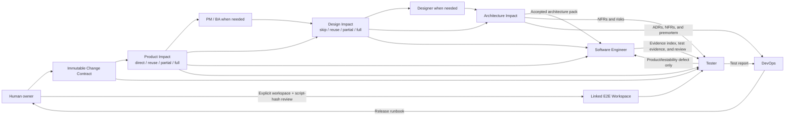

# Role Relationships

The workflow has one canonical Markdown source for each of six roles. The initializer derives one native Agent set for the selected client, so the target project never receives three duplicated sets. Every Run begins with an immutable Change Contract; roles collaborate through registered artifacts and structured impact clearances.

## Relationship map

The diagram has three kinds of handoff:

- **Product handoff** — The Change Contract and Product clearance define the user outcome, scope, rules, acceptance criteria, and applicable product evidence; PM / BA contributes only when needed.
- **Design and architecture handoff** — The Design clearance provides skip/reuse evidence or Designer output; Architect defines accepted system constraints.
- **Delivery evidence handoff** — Software Engineer, Tester, and DevOps record implementation, verification, and release evidence.

## Role matrix

| Role | Main question | Owns | Hands off to | Does not own |
|---|---|---|---|---|
| [PM / BA](pm-ba/README.md) | Is the Change Contract sufficient, reusable, locally changed, or a full product change? | Product disposition, PRD, and user stories | Designer; later consumers | Change Contract mutation, visual or technical design |
| [Designer](designer/README.md) | Can design be skipped/reused, or what experience work is affected? | Design disposition, project baseline, and task spec | Architect and Software Engineer | Product scope, APIs, architecture, production code |
| [Architect](architect/README.md) | Which system direction best fits the evidence and constraints? | Indexed architecture pack | Software Engineer, Tester, DevOps | Final option approval or risk acceptance |
| [Software Engineer](software-engineer/README.md) | How do we implement the confirmed contracts with independently reviewable evidence? | Code, tests, and seven Run-scoped engineering evidence outputs | Tester | Product, design, architecture, verification-exception, publication, or merge decisions |
| [Tester](tester/README.md) | What current, repeatable evidence shows the change meets acceptance and risk expectations? | Risk map, optional MCP exploration, linked-workspace E2E assets, standalone real-browser evidence, defects, and Run-scoped test report | Software Engineer for product/testability repair; DevOps and human release owner | Product source/tests, CI policy, requirement changes, or release approval |
| [DevOps](devops/README.md) | How can the release be repeated, observed, and reversed? | Release runbook and operational evidence | Human release owner | Product approval or final release decision |

## One role, one Agent

The repository keeps six canonical Markdown role sources. Initialization installs exactly one native set:

| Selected client | Native Agent files |
|---|---|
| GitHub Copilot | `.github/agents/<role>.agent.md` |
| Claude Code | `.claude/agents/<role>.md` |
| Codex | `.codex/agents/<role>.toml` |

The initializer never installs all three sets together. For Codex, it generates TOML from the same canonical Markdown source in memory. `ai-native.yaml` records the selected client and its native directory.

## Agent and role workflow

The two files have different jobs:

- The selected client's native Agent file under `paths.agents` defines the role identity, working rules, boundaries, output contract, and handoff.
- `.ai-sdlc/roles/<role>/workflow.md` contains a longer step-by-step procedure when that role needs one.

The role workflow is ordinary Markdown loaded explicitly by the Agent. It is not a second Agent, a duplicate role definition, or a client-native Skill. PM / BA, Designer, Architect, Software Engineer, and Tester have role packs. The Software Engineer pack has ordinary `references/*.md` for layered context, contract-driven planning, independent verification, seven-lens review, CI evidence, provenance, and replay guidance. The Tester pack has a Playwright E2E reference for the exploration/crystallization/execution boundary. DevOps keeps its shorter procedure in the Agent file.

Do not confuse a role workflow with `.ai-sdlc/workflows/default.md`: the default workflow controls the shared phase order and artifact resolution, while a role workflow explains how one role completes its own phase.

## Handoff rule

A handoff is ready when:

1. the role wrote the selected registered artifact, or the platform recorded a valid direct/skip/reuse clearance and imported any required source revisions;
2. evidence, assumptions, limits, and unresolved decisions are visible;
3. the phase gate in `ai-native.yaml` is satisfied;
4. any human-owned decision represented as resolved has real human evidence;
5. the next role resolves and reads the current artifact instead of relying on chat memory.

Chat messages may explain a handoff, but the registered files are the durable contract.

A valid `direct`, `skip`, or `reuse` disposition is also a durable handoff when it records rationale, exact source revisions, and current-Run provenance. It skips Agent generation, not evidence. Downstream roles consume the immutable Change Contract plus the active Product, Design, and Architecture clearances instead of demanding empty artifacts.

Software Engineer has a stricter delivery handoff. The Web execution owns seven Run-scoped outputs: `implementation-notes` as the evidence-pack index, `implementation-plan`, `implementation-tasks`, `engineering-session-log`, `engineering-test-evidence`, `engineering-review`, and `engineering-provenance`. Tester receives the index plus the test-evidence and review artifacts as declared inputs. Tier A or B test authoring may satisfy the normal engineering gate; Tier C or Limited requires a recorded human verification exception. The engineering review must cover all seven lenses and both adversarial passes. PR-ready provenance is evidence only; Software Engineer does not publish or merge the PR.

Tester uses Playwright MCP only as optional transient exploration. For required E2E, a human explicitly configures a separate Linked E2E Workspace; the platform freezes spec-only intent, a fresh Tier A/B Test Author writes only there, a human approves the exact manifest hash, and the platform runs standalone Playwright with a real headless Chromium. The platform never infers a sibling or legacy repository. Product source, product-repository tests, and testability interfaces remain Software Engineer-owned; only changes to those assets return through refreshed engineering evidence and Implementation reapproval. DevOps or an authorized owner configures the required CI check.

## Escalation rule

Return a missing decision to the owner who can make it:

| Missing or conflicting item | Return to |
|---|---|
| User problem, scope, business rule, or acceptance criterion | PM / BA or human product owner |
| Interface behavior, content, component, asset, or responsive rule | Designer or human design owner |
| Architecture option, trust boundary, ADR, or NFR target | Architect or human architecture/risk owner |
| Incorrect or incomplete implementation | Software Engineer |
| Missing linked-workspace E2E evidence or a test-script defect | Tester/fresh Test Author plus exact manifest-hash review |
| Product implementation, product-repository test, or testability-interface defect | Software Engineer, with refreshed engineering evidence and Implementation reapproval |
| Environment, Playwright runner, CI report, or required-check issue | DevOps or authorized operator |
| Tier C/Limited isolation or another engineering verification-gate exception | Human owner; Software Engineer records but cannot approve it |
| Environment access, deployment step, monitoring, or rollback evidence | DevOps or authorized operator |
| Final scope, architecture acceptance, risk acceptance, or release approval | Human owner |

No role should silently fill a material gap owned by another role.

## Source-of-truth order

Use these files for different questions:

1. `ai-native.yaml` — global roles, phases, gates, and artifact registry.
2. `.ai-sdlc/workflows/default.md` — shared path resolution and execution order.
3. The selected client's native Agent file under `paths.agents` — role mission, rules, boundaries, and handoff.
4. `.ai-sdlc/roles/<role>/config.yaml` — role-specific inputs and child directory when present.
5. `.ai-sdlc/roles/<role>/workflow.md` — detailed role procedure when present.
6. `.ai-sdlc/roles/<role>/references/*.md` — ordinary supporting procedures when the role workflow names them.
7. Registered output artifacts — current project evidence and decisions.

See [Configuration](../configuration/README.md) for artifact path resolution and [End-to-End Workflow](../workflow/README.md) for the phase graph.
