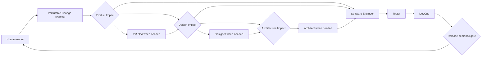

# Role Relationships and Prompt Layers

The workflow has six fixed roles and six fixed phase owners. An Agent owns only the selected analysis and artifacts inside its role boundary. A human or the platform records Product, Design, and Architecture Impact dispositions before the corresponding Agent may run; role procedures, focused references, output templates, and human-facing guides are supporting layers, not additional Agents.

Every Run begins with an immutable Change Contract. Roles hand off registered artifacts and structured clearances rather than relying on chat memory.

## Role map

A human or the platform records each evidence-backed Impact disposition before Agent execution. `direct`, `skip`, or `reuse` can omit PM / BA, Designer, or Architect entirely; `partial` or `full` invokes the role only for the selected evidence. No omitted Agent owns or retroactively changes the disposition. The phase clearance and gate still apply.

## Ownership matrix

| Role | Main question | Owns | Does not own |
|---|---|---|---|
| [PM / BA](pm-ba/README.md) | What selected product evidence must be clarified or updated within the recorded route? | Selected PRD/story evidence and product clarification | Product Impact disposition, Change Contract mutation, visual design, or technical design |
| [Designer](designer/README.md) | What selected experience evidence must be produced within the recorded route? | Selected design baseline/spec/supporting evidence and handoff | Design Impact disposition, product scope, APIs, architecture, or production code |
| [Architect](architect/README.md) | What selected architecture evidence best fits the accepted constraints? | Selected indexed architecture evidence and recommendation | Architecture Impact disposition, final option selection, architecture acceptance, or risk acceptance |
| [Software Engineer](software-engineer/README.md) | How is the confirmed contract implemented with reviewable evidence? | Product source changes, repository tests, and the engineering evidence pack | Product/design/architecture decisions, verification exceptions, merge, or release |
| [Tester](tester/README.md) | What current and repeatable evidence verifies acceptance and risk? | Risk map, independent Verification, linked E2E test assets, and `test-report` | Product source/tests, CI policy, requirement changes, or release approval |
| [DevOps](devops/README.md) | Is the release path sufficiently bound, observable, and reversible for a human decision? | `release-runbook`, expected provider/required-check contract, and evidence gaps | CI/required-check configuration, secrets, merge, deployment, rollback execution, or go/no-go |

## One Markdown layer, one responsibility

Use this order when deciding where content belongs:

| Layer | Canonical location | Single responsibility |
|---|---|---|
| Global definition | `ai-native.yaml` | Phase owners, declared inputs/outputs, gates, capabilities, and artifact registry |
| Shared workflow | `.ai-sdlc/workflows/default.md` | Cross-role order, impact routing, handoff rules, and artifact resolution |
| Canonical Agent | `templates/agents/<role>.md`, rendered under `paths.agents` | Role identity, authority boundary, safety-critical invariants, and handoff |
| Role config | `.ai-sdlc/roles/<role>/config.yaml` | Project-controlled inputs, role settings, and child output namespace |
| Role workflow | `.ai-sdlc/roles/<role>/workflow.md` | The role's only ordered execution procedure and completion checks |
| Focused reference | `.ai-sdlc/roles/<role>/references/*.md` | One reusable specialist rule set loaded only when the workflow routes to it |
| Artifact template | `.ai-sdlc/templates/*` | Output structure, required fields, and machine-readable schema |
| Human guide | `guidelines/**` | Explanation, navigation, examples, and review guidance; never a competing Agent procedure |
| Run evidence | Registered artifact paths | Current decisions, revisions, results, limitations, and provenance |

Consequences of this structure:

- Do not copy a canonical Agent into a client-specific Skill or maintain separate role bodies for Copilot, Claude Code, and Codex.
- Do not put a second step-by-step procedure in an Agent or human guide. Link to the role's `workflow.md`.
- Do not restate an artifact schema in a workflow or reference. Link to its template.
- Do not put broad role identity or authority in a focused reference.
- Do not treat a config, workflow, reference, guide, or generated client file as a second role definition.
- When two layers disagree, stop and fix the canonical owner instead of choosing the more convenient text.

## Client rendering and Web execution

The initializer renders exactly one native Agent set from the six canonical Markdown role sources:

| Selected client | Generated Agent files |
|---|---|
| GitHub Copilot | `.github/agents/<role>.agent.md` |
| Claude Code | `.claude/agents/<role>.md` |
| Codex | `.codex/agents/<role>.toml` |

The selected client controls direct IDE discovery. It does not choose the Web execution engine: real Platform jobs use the local Codex runner for all three initialized client targets.

Direct IDE and Web operation share role identity, phase ownership, artifact IDs, and output schemas. Before a direct IDE invocation, the human supplies the bounded execution brief defined in `.ai-sdlc/workflows/default.md`; registered basename paths apply because no Web task-and-Run pin exists. Only the Web platform can claim clearances, path pins, artifact-head reviews, Architecture checkpoints, mutation guards, Linked E2E bindings, manifest approvals, trusted runner events, and semantic-gate results that it actually persisted.

For required E2E, the Web platform copies the explicitly linked separate workspace to ephemeral staging, runs a fresh spec-only Test Author there, validates and promotes only allowlisted test/fixture changes to the unchanged linked root, re-hashes the complete promoted executable suite, obtains human approval of that exact baseline, and executes standalone Playwright from the linked root. Playwright MCP is optional exploration and cannot satisfy the repeatable gate.

An authorized human or repository/provider system configures CI policy, credentials, browser provisioning, retention, branch protection, and required checks. Tester supplies the test command and evidence contract. DevOps may record the expected check and missing provider evidence in the runbook but does not configure it.

See the [Platform runtime contract](../../platform/docs/runtime-contract.md) and [security model](../../platform/docs/security-model.md) for Web-specific guarantees and limitations.

## Handoff invariant

A handoff is ready only when:

1. the role wrote the selected registered outputs, or the platform recorded a valid evidence-backed disposition and imported any required current-Run heads;
2. assumptions, limitations, blockers, and unresolved decisions are explicit;
3. the phase gate in `ai-native.yaml` is satisfied;
4. every claimed human decision has durable human evidence;
5. the next role resolves and reads current artifacts rather than relying on chat memory.

Chat may explain a handoff. Registered artifacts and platform clearances are the durable contract.

## Escalation routing

| Missing or conflicting item | Return to |
|---|---|
| Outcome, scope, business rule, policy, or acceptance criterion | PM / BA or human product owner |
| Interface behavior, content, component, asset, responsive, or accessibility rule | Designer or human design owner |
| Architecture option, boundary, ADR, security constraint, or NFR target | Architect or human architecture/risk owner |
| Product implementation, repository test, or testability-interface defect | Software Engineer, followed by refreshed evidence and Implementation reapproval |
| Linked E2E script defect | Fresh staging Test Author, allowlist validation/promotion, and a new complete-baseline review |
| E2E binding, browser, environment, CI/provider, credential, or required-check issue | Authorized human/operator/provider system; Tester and DevOps record the evidence gap |
| Tier C/Limited isolation or another verification exception | Human owner; the Agent may record but cannot approve it |
| Missing or invalid runbook guidance | DevOps |
| Final scope, architecture acceptance, risk acceptance, merge, deployment, rollback, or release decision | Human owner |

No role silently fills a material gap owned by another role.

## Continue reading

- [Repository overview](../../README.md)
- [End-to-End Workflow](../workflow/README.md)
- [Configuration](../configuration/README.md)
- [Platform operator guide](../../platform/README.md)
