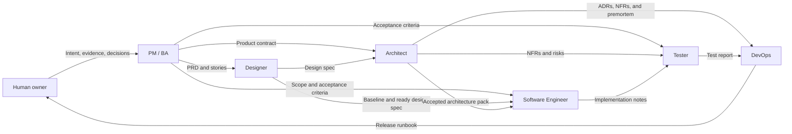

# Role Relationships

The workflow has one canonical Markdown source for each of six roles. The initializer derives one native Agent set for the selected client, so the target project never receives three duplicated sets. Roles collaborate through registered artifacts.

## Relationship map

The diagram has three kinds of handoff:

- **Product handoff** — PM / BA defines the user outcome, scope, rules, and acceptance criteria.
- **Design and architecture handoff** — Designer defines observable interface behavior; Architect defines accepted system constraints.
- **Delivery evidence handoff** — Software Engineer, Tester, and DevOps record implementation, verification, and release evidence.

## Role matrix

| Role | Main question | Owns | Hands off to | Does not own |
|---|---|---|---|---|
| [PM / BA](pm-ba/README.md) | What problem and outcome are confirmed? | PRD and user stories | Designer; later consumers | Visual or technical design |
| [Designer](designer/README.md) | How must the user experience behave? | Design baseline and design spec | Architect and Software Engineer | Product scope, APIs, architecture, production code |
| [Architect](architect/README.md) | Which system direction best fits the evidence and constraints? | Indexed architecture pack | Software Engineer, Tester, DevOps | Final option approval or risk acceptance |
| [Software Engineer](software-engineer/README.md) | How do we implement the confirmed contracts correctly? | Code, tests, implementation notes | Tester | Product, design, or architecture decisions |
| [Tester](tester/README.md) | What evidence shows the change meets acceptance and risk expectations? | Test evidence and report | DevOps and human release owner | Requirement changes or release approval |
| [DevOps](devops/README.md) | How can the release be repeated, observed, and reversed? | Release runbook and operational evidence | Human release owner | Product approval or final release decision |

## One role, one Agent

The repository keeps six canonical Markdown role sources. Initialization installs exactly one native set:

| Selected client | Native Agent files |
|---|---|
| GitHub Copilot | `.github/agents/<role>.agent.md` |
| Claude Code | `.claude/agents/<role>.md` |
| Codex | `.codex/agents/<role>.toml` |

The initializer never installs all three sets together. For Codex, it generates TOML from the same canonical Markdown source in memory. `ai-native.yaml` records the selected client and its native directory.

## Agent and role workflow

The two files have different jobs:

- The selected client's native Agent file under `paths.agents` defines the role identity, working rules, boundaries, output contract, and handoff.
- `.ai-sdlc/roles/<role>/workflow.md` contains a longer step-by-step procedure when that role needs one.

The role workflow is ordinary Markdown loaded explicitly by the Agent. It is not a second Agent, a duplicate role definition, or a client-native Skill. PM / BA, Designer, and Architect currently have one. The other three roles keep their shorter procedure in the Agent file.

Do not confuse a role workflow with `.ai-sdlc/workflows/default.md`: the default workflow controls the shared phase order and artifact resolution, while a role workflow explains how one role completes its own phase.

## Handoff rule

A handoff is ready when:

1. the role wrote the registered output artifact;
2. evidence, assumptions, limits, and unresolved decisions are visible;
3. the phase gate in `ai-native.yaml` is satisfied;
4. any human-owned decision represented as resolved has real human evidence;
5. the next role resolves and reads the current artifact instead of relying on chat memory.

Chat messages may explain a handoff, but the registered files are the durable contract.

## Escalation rule

Return a missing decision to the owner who can make it:

| Missing or conflicting item | Return to |
|---|---|
| User problem, scope, business rule, or acceptance criterion | PM / BA or human product owner |
| Interface behavior, content, component, asset, or responsive rule | Designer or human design owner |
| Architecture option, trust boundary, ADR, or NFR target | Architect or human architecture/risk owner |
| Incorrect or incomplete implementation | Software Engineer |
| Missing verification evidence or reproducible defect | Tester or Software Engineer, depending on cause |
| Environment access, deployment step, monitoring, or rollback evidence | DevOps or authorized operator |
| Final scope, architecture acceptance, risk acceptance, or release approval | Human owner |

No role should silently fill a material gap owned by another role.

## Source-of-truth order

Use these files for different questions:

1. `ai-native.yaml` — global roles, phases, gates, and artifact registry.
2. `.ai-sdlc/workflows/default.md` — shared path resolution and execution order.
3. The selected client's native Agent file under `paths.agents` — role mission, rules, boundaries, and handoff.
4. `.ai-sdlc/roles/<role>/config.yaml` — role-specific inputs and child directory when present.
5. `.ai-sdlc/roles/<role>/workflow.md` — detailed role procedure when present.
6. Registered output artifacts — current project evidence and decisions.

See [Configuration](../configuration/README.md) for artifact path resolution and [End-to-End Workflow](../workflow/README.md) for the phase graph.
