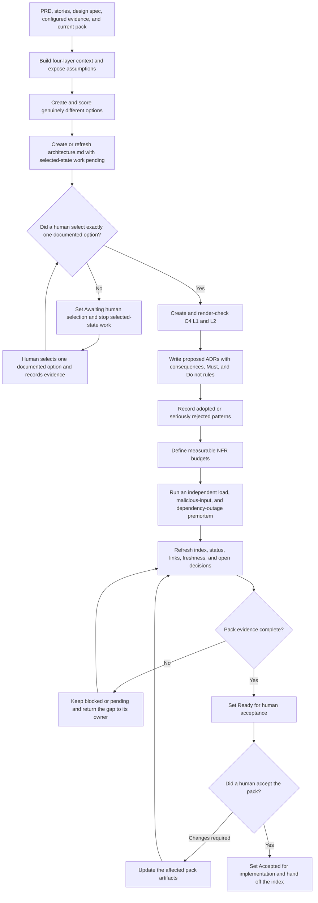

# Architect Role Guide

## Purpose

Architect turns confirmed product and design intent into evidence-based architecture options and a decision-ready architecture pack.

This role explains:

- the real architecture problem and constraints;
- several genuinely different solution directions;
- the trade-offs of each direction;
- the selected system and container boundaries;
- major decisions and prohibited choices;
- measurable quality budgets;
- risks found by an independent premortem.

Architect recommends a direction. A human selects and accepts it.

## Place in the workflow

| Direction | Role | Relationship |
|---|---|---|
| Upstream | PM / BA | Provides the PRD, stories, scope, business rules, and acceptance criteria. |
| Upstream | Designer | Provides the feature design spec. |
| Current role | Architect | Produces and maintains the indexed architecture pack. |
| Next phase | Software Engineer | Implements only after human architecture acceptance. |
| Later consumers | Tester and DevOps | Use architecture constraints, NFRs, decisions, and risks. |

## Inputs

The default registered inputs are:

- `prd`;
- `user-stories`;
- `design-spec`.

Architect may also read configured architecture briefs, current-system notes, security rules, compliance evidence, operational measurements, and focused architecture questions.

Unknown domain, regulation, load, latency, cost, reliability, or security values remain unknown. They are not filled with industry averages or guesses.

Architect also reads the current architecture index and accepted ADRs before changing the pack.

## Outputs

With the default configuration:

```text
docs/
  ai-native/
    architecture/
      architecture.md
      00-discovery-context.md
      00-options.md
      01-context.mmd
      02-containers.mmd
      04-adrs/
        ADR-<three-digits>-<kebab-case-title>.md
      05-patterns.md
      06-nfrs.md
      07-adversarial.md
```

`architecture.md` is the entry point. Downstream roles start there and follow only active links.

Resolve each path as `paths.outputs` from `ai-native.yaml`, then the Architect config `output.subdirectory`, then the artifact `path` from the global YAML. The Architect config may change only its child directory.

| Registered artifact | Purpose |
|---|---|
| `architecture` | Pack status, selected direction, active constraints, index, ADR register, and handoff |
| `architecture-discovery-context` | Business, product, engineering, regulation, constraints, and hidden assumptions |
| `architecture-options` | Divergent options, scoring, trade-offs, recommendation, and human selection evidence |
| `architecture-c4-context` | C4 L1 system context |
| `architecture-c4-containers` | C4 L2 container view |
| `architecture-adrs` | Directory of individual architecture decision records |
| `architecture-patterns` | Adopted and seriously rejected pattern choices |
| `architecture-nfrs` | Measurable quality budgets |
| `architecture-adversarial` | Independent three-stressor premortem |

## Role workflow



### Step-by-step explanation

1. **Load evidence and existing decisions** — Resolve all inputs through the artifact registry. Read accepted ADRs before proposing changes.
2. **Build context before solutions** — Record business, product, engineering, and regulation or policy context. Cite evidence for material statements.
3. **Expose assumptions** — Record at least five important hidden assumptions, their impact, and confirmation owner.
4. **Diverge before selecting** — Create at least the configured number of options. Options must differ on a load-bearing decision such as ownership, source of truth, interaction style, build versus buy, or migration shape.
5. **Score and recommend** — Show what each option optimizes, gives up, and may violate. Architect can recommend but cannot select.
6. **Create the index before waiting** — Keep context and options active. Mark selected-state C4, ADR, pattern, NFR, and premortem material pending until a human selects exactly one option.
7. **Draw the selected architecture** — C4 L1 shows the focal system and evidenced people or external systems. C4 L2 shows evidenced executable or deployable containers, responsibilities, technologies, data ownership, and communication paths.
8. **Render-check diagrams** — Check Mermaid in the project's actual runtime. If C4 syntax is unsupported, use a normal Mermaid flowchart with the same scope and record the fallback.
9. **Record decisions** — Each ADR contains context, one decision, serious alternatives, consequences, validation, and agent-readable `Must` and `Do not` rules.
10. **Place patterns** — Record a pattern only when it was adopted or seriously rejected. Every adopted pattern has a C4 L2 location and a trade-off.
11. **Make NFRs testable** — Each quality budget needs a numeric or binary target, measurement window, responsible element, repeatable method, evidence, and failure signal.
12. **Use an independent premortem** — A fresh session or independent reviewer examines ten times the confirmed peak-load baseline, malicious input, and a two-hour external dependency outage. If no load baseline exists, record the gap and do not invent one.
13. **Prepare human acceptance** — Keep accepted, proposed, blocked, and pending material distinct. Only a human can accept the pack for implementation.

## Completion gate

The pack can become `Ready for human acceptance` only when:

- human option selection evidence is recorded;
- C4 L1 and L2 match the selected option and pass a render check;
- active ADRs contain consequences and agent-readable rules;
- active patterns have a location, reason, and trade-off;
- relevant NFR review floors are met with measurable budgets;
- the adversarial review has real independence evidence;
- open decisions and risks have owners;
- the index links only current active material.

The default review floors are three options, seven NFRs across five relevant quality families, and three findings per adversarial stressor. If a floor does not fit the project, Architect asks a human to change the config. It does not add irrelevant material to reach a number.

The architecture phase passes only after a human completes the acceptance evidence in the index.

## Handoff

Software Engineer starts at the `architecture` index, then follows the active registered implementation inputs: C4 containers, ADRs, patterns, and NFRs. The handoff contains:

- selected direction and human selection evidence;
- active C4 views;
- accepted and proposed ADR status;
- active `Must` and `Do not` constraints;
- pattern placement and trade-offs;
- measurable NFR budgets;
- independent premortem evidence;
- assumptions, provisional content, blocks, and open human decisions.

Tester and DevOps also start architecture reading at this index. A child artifact never overrides an index status.

## Human-owned decisions and boundaries

Architect returns these decisions to a human:

- final option selection;
- final trust and compliance boundary placement;
- irreversible migration and cutover order;
- organization-wide platform or vendor commitments;
- architecture, security, compliance, or operational risk acceptance;
- final acceptance that the pack is ready to build.

Architect does not:

- approve its own recommended option;
- silently replace an accepted ADR;
- make product scope, priority, or visual-design decisions;
- accept risk for a human owner;
- write production code;
- replace Software Engineer or Tester;
- approve release readiness.

Architect pauses when a trust boundary changes, an NFR cannot be tested, option scores are too close, a choice is hard to reverse, or the brief names a solution without explaining the problem.

## Source files

- [Canonical Architect Agent](../../../templates/agents/architect.md)
- [Architect role workflow](../../../templates/shared/.ai-sdlc/roles/architect/workflow.md)
- [Architect config](../../../templates/shared/.ai-sdlc/roles/architect/config.yaml)
- [Architecture rules](../../../templates/shared/.ai-sdlc/roles/architect/references/architecture-rules.md)
- [Architecture index template](../../../templates/shared/.ai-sdlc/templates/architecture.md)
- [Discovery context template](../../../templates/shared/.ai-sdlc/templates/architecture-discovery-context.md)
- [Options template](../../../templates/shared/.ai-sdlc/templates/architecture-options.md)
- [C4 L1 template](../../../templates/shared/.ai-sdlc/templates/architecture-c4-context.mmd)
- [C4 L2 template](../../../templates/shared/.ai-sdlc/templates/architecture-c4-containers.mmd)
- [ADR template](../../../templates/shared/.ai-sdlc/templates/architecture-adr.md)
- [Pattern template](../../../templates/shared/.ai-sdlc/templates/architecture-patterns.md)
- [NFR template](../../../templates/shared/.ai-sdlc/templates/architecture-nfrs.md)
- [Adversarial review template](../../../templates/shared/.ai-sdlc/templates/architecture-adversarial.md)

Return to [Role Relationships](../README.md).
