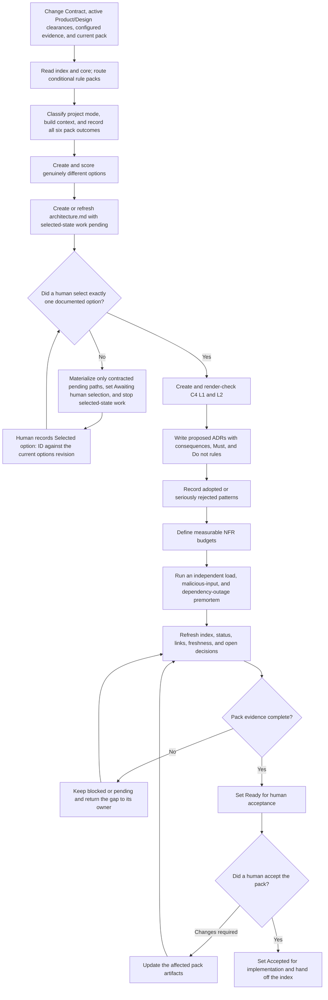

# Architect Role Guide

## Purpose

Architect turns confirmed product and design intent into evidence-based architecture options and a decision-ready architecture pack.

This role explains:

- the real architecture problem and constraints;
- several genuinely different solution directions;
- the trade-offs of each direction;
- the selected system and container boundaries;
- major decisions and prohibited choices;
- measurable quality budgets;
- risks found by an independent premortem.

Architect recommends a direction. A human selects and accepts it.

The platform deliberately separates three moments that used to look like one vague review:

1. **Answer concrete blockers** — for example, choose where browser diagnostics go and what data is forbidden. The page presents plain-language choices; saving opens one Architect update.
2. **Select the direction** — compare the current A/B/C cards and click one. This records the choice against the exact Options revision and opens one selected-state Architect update. It is not approval.
3. **Accept the completed pack** — review the C4 views, ADRs, patterns, NFRs, and premortem, then approve or request a specific change.

Do not repeatedly run Architect while a card says “需要你决定”. Answer that card first. A generic “close gaps” item is only a legacy fallback; current Architect output must expose the concrete stable decision ID and choices.

## Place in the workflow

| Direction | Role | Relationship |
|---|---|---|
| Upstream | Change Contract and Product clearance | Provide the requested outcome, applicable product evidence, and acceptance criteria. |
| Upstream | Design clearance | Provides skip/reuse evidence or the applicable task design spec. |
| Current role | Architect | Produces and maintains the indexed architecture pack. |
| Next phase | Software Engineer | Implements only after human architecture acceptance. |
| Later consumers | Tester and DevOps | Use architecture constraints, NFRs, decisions, and risks. |

## Inputs

The default registered inputs are:

- `change-contract`;
- `prd`;
- `user-stories`;
- `design-spec`.

The latter three are conditional evidence in a platform-managed Run. Product `direct` may replace PRD/stories and Design `skip` may replace a design spec. Architect consumes the structured current-Run clearances and must not demand placeholder files.

Architect may also read configured architecture briefs, current-system notes, security rules, compliance evidence, operational measurements, and focused architecture questions.

Unknown domain, regulation, load, latency, cost, reliability, or security values remain unknown. They are not filled with industry averages or guesses.

Architect also reads the current architecture index and accepted ADRs before changing the pack.

## Rulebook routing

Architect always reads the compact rulebook index and core pack. It evaluates six domain routes, records all six outcomes in Discovery, and loads the full domain pack only when its trigger is applicable or materially uncertain.

| Pack | Typical trigger | Starter policy examples |
|---|---|---|
| API | HTTP/JSON or frontend/backend contract | REST resources, response envelope, cursor pagination |
| Data | Persistent state, state-change events, or caching | Repository boundary, Outbox, data ownership, cache policy |
| Integration | Remote call, message, event, or semantic boundary | Timeout, safe retry, circuit breaker, anti-corruption layer, event-driven integration |
| Security | Identity, protected action, trust boundary, or sensitive field | Authentication propagation, authorization ownership, field classification and handling |
| Observability | Deployable runtime, request, job, consumer, or remote call | request/correlation ID, structured logging, conditional tracing |
| Frontend | Interactive client is created or changed | Evidence-first project mode; Greenfield React, Tailwind, and Redux Toolkit defaults |

Rules use four levels: `MUST`, `DEFAULT`, `WHEN`, and `FORBIDDEN`. `WHEN` means the trigger must be evaluated, not that the pattern must always be installed. Each `DEFAULT` also declares whether a documented reason is enough or an accepted ADR is mandatory; REST, the response envelope, and the frontend technology defaults require an ADR to deviate. This keeps Outbox, caching, circuit breakers, event-driven integration, tracing, and Redux out of scopes that do not need them.

Frontend defaults are Greenfield-only. For Brownfield or existing Hybrid boundaries, Architect inspects manifests, lockfiles, source, tests, runtime behavior, and accepted ADRs, then documents the patterns already in force. A framework, styling, or state-management migration is an architecture decision, not an automatic cleanup.

Rule packs are references, not registered artifacts, so they do not add Architecture phase outputs. Discovery records pack applicability on the first run; the selected-state run records every applicable rule once per affected scope in the Pattern Decisions register and links its C4, ADR, NFR, test, justified deviation, exception, or blocker evidence.

New projects set `rulebook.validation: required`. Discovery, Options, Architecture, and Pattern Decisions therefore include one canonical `ai-sdlc:architecture-rulebook:v1` JSON block each. The platform validates the checkpoint blocks before it records `Selected option: <ID>` and validates the final disposition block before approval. Missing, duplicate, unknown, blocked, cross-document-inconsistent, or Brownfield-forced rules are rejected. Older projects without this setting remain advisory until explicitly upgraded.

The final Architecture and Patterns contracts, both C4 files, the ADR directory's `00-selection.md`, NFRs, and premortem also carry the same compact selection binding (`optionId`, review ID, reviewed Options artifact ID, and timestamp). This catches stale or cross-selection files; semantic agreement with the selected option still receives human review.

All four blocks carry the SHA-256 catalog digest produced by `.ai-sdlc/roles/architect/scripts/rulebook-digest.mjs`. The digest binds the configured project mode, index, core, and every domain pack. If any of them changes after the human selection, the final gate rejects the stale digest and requires refreshed checkpoint artifacts plus a new selection.

The selected-state run reads the reviewed Discovery and Options revisions without changing them unless those outputs were explicitly selected for rerun. New evidence that changes project mode, pack applicability, or option constraints invalidates the old checkpoint: Architect blocks selected-state work, the affected bootstrap outputs are rerun and reviewed, and the human records a new selection against the new revisions.

## Architecture impact across requirements

The Architecture pack is a project baseline, not a disposable copy of every requirement. After the first complete pack is accepted, each new platform Run performs an Architecture Impact Check before deciding whether to invoke Architect:

| Route | Use when | What changes |
|---|---|---|
| Skip | A bounded Bug or technical task has no architecture boundary, API/schema, data, integration, security, NFR, deployment, or operational impact | No Architect execution and no placeholder pack; an explicit current-Run waiver records the evidence. |
| Reuse | No architecture boundary, option, rule, NFR, or decision is affected | No Codex execution; the approved pack is inherited with provenance and the rationale is recorded. |
| Partial update | The selected option remains valid and the affected outputs can be named | Only `architecture.md` plus the declared selected-state outputs; Discovery and Options remain unchanged. |
| Full re-evaluation | Scope, project mode, ownership, rule applicability, option constraints, or selection may change | Run the normal Discovery/Options checkpoint, human selection, and selected-state completion flow. |

`skip` and `reuse` are platform actions, not empty Architect runs. `skip` is restricted to Bug/technical work with evidence of no architecture impact; uncertainty requires at least reuse or full assessment. Do not create duplicate ADRs merely because a new requirement exists. Reuse an accepted ADR when its decision and scope still apply; revise or supersede it only when the decision changes. Likewise, do not rewrite `05-patterns.md` unless the new requirement changes a pattern disposition, affected scope, evidence, or exception. The platform copies the accepted baseline into the current Run so downstream gates keep current-Run provenance without regenerating identical content.

## Outputs

With the default configuration:

```text
docs/
  ai-native/
    architecture/
      architecture.md
      00-discovery-context.md
      00-options.md
      01-context.mmd
      02-containers.mmd
      04-adrs/
        00-selection.md
        ADR-<three-digits>-<kebab-case-title>.md
      05-patterns.md
      06-nfrs.md
      07-adversarial.md
```

`architecture.md` is the entry point. Downstream roles start there and follow only active links.

Resolve each path as `paths.outputs` from `ai-native.yaml`, then the Architect config `output.subdirectory`, then the artifact `path` from the global YAML. The Architect config may change only its child directory.

| Registered artifact | Purpose |
|---|---|
| `architecture` | Pack status, authoritative human option-selection evidence, selected direction, active constraints, index, ADR register, and handoff |
| `architecture-discovery-context` | Business, product, engineering, regulation, constraints, and hidden assumptions |
| `architecture-options` | Divergent candidates, scoring, trade-offs, recommendation, and the reviewed selection checkpoint |
| `architecture-c4-context` | C4 L1 system context |
| `architecture-c4-containers` | C4 L2 container view |
| `architecture-adrs` | Directory of individual architecture decision records |
| `architecture-patterns` | Adopted and seriously rejected pattern choices |
| `architecture-nfrs` | Measurable quality budgets |
| `architecture-adversarial` | Independent three-stressor premortem |

## Role workflow



### Step-by-step explanation

1. **Load evidence and existing decisions** — Resolve all inputs through the artifact registry. Read accepted ADRs before proposing changes.
2. **Route the rulebook** — Read the index and core, classify Greenfield/Brownfield/Hybrid from evidence, evaluate all six conditional pack routes, and load only Applicable or materially Blocked packs.
3. **Build context before solutions** — Record business, product, engineering, and regulation or policy context. Cite evidence for material statements and complete the Rule Pack Applicability Matrix.
4. **Expose assumptions** — Record at least five important hidden assumptions, their impact, and confirmation owner.
5. **Diverge before selecting** — Create at least the configured number of options. Options must differ on a load-bearing decision such as ownership, source of truth, interaction style, build versus buy, or migration shape.
6. **Score and recommend** — Show what each option optimizes, gives up, may violate, and which rule IDs constrain it. Architect can recommend but cannot select.
7. **Create the index before waiting** — Keep context and options active. Mark selected-state C4, ADR, pattern, NFR, and premortem material pending until a human selects exactly one option. In a platform review, the human records that choice on an independent `Selected option: <ID>` line against the current options revision. Every output selected by the active execution contract must still exist and be non-empty before the role pauses: use Mermaid-only pending notices for selected C4 paths, a non-ADR `README.md` in a selected ADR directory, and explicit Pending documents for selected patterns, NFRs, and the premortem. Never touch an unselected registered output. These scaffolds record the blocker; they are never active architecture evidence.
8. **Draw the selected architecture** — C4 L1 shows the focal system and evidenced people or external systems. C4 L2 shows evidenced executable or deployable containers, responsibilities, technologies, data ownership, and communication paths.
9. **Render-check diagrams** — Check Mermaid in the project's actual runtime. If C4 syntax is unsupported, use a normal Mermaid flowchart with the same scope and record the fallback.
10. **Record decisions** — Each ADR contains related rule IDs, context, one decision, serious alternatives, consequences, validation, and agent-readable `Must` and `Do not` rules.
11. **Place patterns and close the rule register** — Record a pattern only when it was adopted or seriously rejected. Every adopted pattern has a C4 L2 location and a trade-off; every rule × affected scope from an Applicable pack has one evidence-backed disposition.
12. **Make NFRs testable** — Each quality budget needs source rule IDs where applicable, a numeric or binary target, measurement window, responsible element, repeatable method, evidence, and failure signal.
13. **Use an independent premortem** — A fresh session or independent reviewer examines ten times the confirmed peak-load baseline, malicious input, and a two-hour external dependency outage. If no load baseline exists, record the gap and do not invent one.
14. **Prepare human acceptance** — Keep accepted, proposed, blocked, and pending material distinct. Only a human can accept the pack for implementation.

## Completion gate

The pack can become `Ready for human acceptance` only when:

- human option selection evidence is recorded;
- C4 L1 and L2 match the selected option and pass a render check;
- active ADRs contain consequences and agent-readable rules;
- active patterns have a location, reason, and trade-off;
- relevant NFR review floors are met with measurable budgets;
- the adversarial review has real independence evidence;
- open decisions and risks have owners;
- every conditional pack has an evidence-backed applicability status and every rule from an Applicable pack has one final disposition;
- no Greenfield default silently replaces a Brownfield framework or convention;
- the index links only current active material.

The default review floors are three options, seven NFRs across five relevant quality families, and three findings per adversarial stressor. They are a deliberate V1 heuristic, not a risk-adaptive industry requirement. If a floor does not fit the project, Architect asks a human to change the config. It does not add irrelevant material to reach a number. Replacing these fixed floors with a risk-tiered policy remains an explicit architecture and configuration decision.

The architecture phase passes only after a human completes the acceptance evidence in the index.

## Handoff

Software Engineer starts at the `architecture` index, then follows the active registered implementation inputs: C4 containers, ADRs, patterns, and NFRs. The handoff contains:

- selected direction and human selection evidence;
- active C4 views;
- accepted and proposed ADR status;
- active `Must` and `Do not` constraints;
- pattern placement and trade-offs;
- measurable NFR budgets;
- independent premortem evidence;
- assumptions, provisional content, blocks, and open human decisions.

Tester and DevOps also start architecture reading at this index. Release additionally binds the immutable `change-contract`, `implementation-notes`, `engineering-provenance`, and `test-report`; architecture evidence alone is never a release-ready claim. A child artifact never overrides an index status.

## Human-owned decisions and boundaries

Architect returns these decisions to a human:

- final option selection;
- final trust and compliance boundary placement;
- irreversible migration and cutover order;
- organization-wide platform or vendor commitments;
- architecture, security, compliance, or operational risk acceptance;
- final acceptance that the pack is ready to build.

Architect does not:

- approve its own recommended option;
- silently replace an accepted ADR;
- make product scope, priority, or visual-design decisions;
- accept risk for a human owner;
- write production code;
- replace Software Engineer or Tester;
- approve release readiness.

Architect pauses when a trust boundary changes, an NFR cannot be tested, option scores are too close, a choice is hard to reverse, or the brief names a solution without explaining the problem.

## Client and runtime contract

The Architect Agent is rendered from one canonical source into GitHub Copilot, Claude Code, or Codex native files. Direct IDE and Web operation share the Architecture role, registered pack, and fixed phase ownership. Web execution still uses the local Codex runner and adds persisted selection evidence, digest checks, selected-output guards, and semantic gates; a direct IDE session must preserve the same human checkpoints without claiming those Web controls ran.

## Source files

- [Canonical Architect Agent](../../../templates/agents/architect.md)
- [Architect role workflow](../../../templates/shared/.ai-sdlc/roles/architect/workflow.md)
- [Architect config](../../../templates/shared/.ai-sdlc/roles/architect/config.yaml)
- [Architecture rules](../../../templates/shared/.ai-sdlc/roles/architect/references/architecture-rules.md)
- [Core rules](../../../templates/shared/.ai-sdlc/roles/architect/references/rules/core.md)
- [API rules](../../../templates/shared/.ai-sdlc/roles/architect/references/rules/api.md)
- [Data rules](../../../templates/shared/.ai-sdlc/roles/architect/references/rules/data.md)
- [Integration rules](../../../templates/shared/.ai-sdlc/roles/architect/references/rules/integration.md)
- [Security rules](../../../templates/shared/.ai-sdlc/roles/architect/references/rules/security.md)
- [Observability rules](../../../templates/shared/.ai-sdlc/roles/architect/references/rules/observability.md)
- [Frontend rules](../../../templates/shared/.ai-sdlc/roles/architect/references/rules/frontend.md)
- [Rulebook digest script](../../../templates/shared/.ai-sdlc/roles/architect/scripts/rulebook-digest.mjs)
- [Architecture index template](../../../templates/shared/.ai-sdlc/templates/architecture.md)
- [Discovery context template](../../../templates/shared/.ai-sdlc/templates/architecture-discovery-context.md)
- [Options template](../../../templates/shared/.ai-sdlc/templates/architecture-options.md)
- [C4 L1 template](../../../templates/shared/.ai-sdlc/templates/architecture-c4-context.mmd)
- [C4 L2 template](../../../templates/shared/.ai-sdlc/templates/architecture-c4-containers.mmd)
- [ADR template](../../../templates/shared/.ai-sdlc/templates/architecture-adr.md)
- [Pattern template](../../../templates/shared/.ai-sdlc/templates/architecture-patterns.md)
- [NFR template](../../../templates/shared/.ai-sdlc/templates/architecture-nfrs.md)
- [Adversarial review template](../../../templates/shared/.ai-sdlc/templates/architecture-adversarial.md)

Return to [Role Relationships](../README.md).
