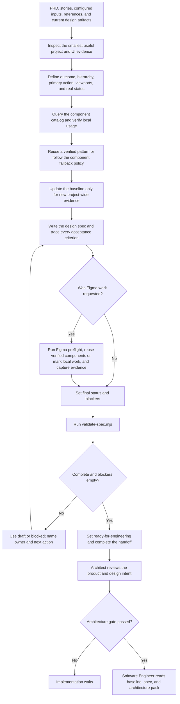

# Designer Role Guide

## Purpose

Designer turns confirmed product needs into clear interface behavior and a design handoff that Software Engineer can build and test.

This role defines:

- the user journey and primary action;
- information hierarchy;
- required screens, states, and transitions;
- responsive and accessibility behavior;
- verified components, assets, and content;
- design details the implementation must preserve.

Designer does not write production code or make product and architecture decisions.

## Place in the workflow

| Direction | Role | Relationship |
|---|---|---|
| Upstream | PM / BA | Provides the PRD, stories, business rules, and acceptance criteria. |
| Current role | Designer | Produces the design baseline and feature design spec. |
| Next phase | Architect | Reads the design spec with the product artifacts. |
| Handoff destination | Software Engineer | Builds from the baseline and ready design spec after the architecture gate passes. |

`design-spec.md` names Software Engineer as its next owner because it is the implementation-facing design contract. The default phase order still runs Architect before implementation. Software Engineer starts only when both the design gate and architecture gate pass.

## Inputs

Designer reads:

- the registered `prd` and `user-stories` artifacts;
- configured Markdown and role resources;
- the current `design-baseline` and `design-spec` artifacts;
- a small representative source slice for the affected product surface;
- verified project components and tokens;
- approved screenshots, brand references, or Figma references;
- the personal design profile.

A missing baseline is an output to create, not a reason to stop. An unconfigured component catalog is unknown evidence, not proof that a component exists.

## Outputs

Designer owns:

- `design-baseline` — verified project-wide design conventions and evidence;
- `design-spec` — the single feature-level handoff to Software Engineer.

Resolve each path as `paths.outputs` from `ai-native.yaml`, then the Designer config `output.subdirectory`, then the artifact `path` from the global YAML. The Designer config may change only its child directory.

With the default configuration:

```text
docs/
  ai-native/
    design/
      DESIGN_BASELINE.md
      design-spec.md
```

### Design baseline

The baseline records verified project-wide component and token sources, layout and responsive conventions, accessibility and content conventions, deviations, and unknowns. Feature-only details stay in the design spec.

### Design spec

The spec contains a machine-readable JSON contract plus concise Markdown. It records story and acceptance-criteria coverage, layouts, states, responsive behavior, accessibility, components, assets, content, validation evidence, assumptions, open questions, blockers, and the final engineering handoff.

## Role workflow



### Step-by-step explanation

1. **Load product and project evidence** — Read the global YAML, shared workflow, Designer config, Agent, role workflow, upstream product artifacts, existing design artifacts, and approved references.
2. **Inspect representative source** — Read only enough current source to understand the real shell, layouts, tokens, components, nearby behavior, and useful tests or stories.
3. **Define behavior first** — Establish the user outcome, hierarchy, primary action, data conditions, viewports, states, and transitions before choosing components.
4. **Verify components** — Run the component query before declaring props, events, slots, or tokens. Also inspect real local usage.
5. **Use the fallback policy** — Prefer an existing product pattern, then a verified catalog component, verified primitives, feature-local custom work, and finally shared custom work only when repeated need is proven.
6. **Maintain the baseline** — Add only verified project-wide rules. Keep feature behavior in `design-spec.md`.
7. **Write traceable design** — Give every supplied acceptance-criteria ID an observable design response.
8. **Use Figma only when relevant** — Confirm the task, target, access, components, and viewports. Record real file or node evidence and never invent a Figma change.
9. **Validate the handoff** — Set the final status and blockers, then run the included spec validator.
10. **Hand off without inventing** — Use `ready-for-engineering` only when the spec is complete and blockers are empty.
11. **Wait for architecture** — A ready design does not bypass architecture selection and acceptance.

## Completion gate

The design gate passes when:

- every in-scope story and acceptance criterion has an observable design response;
- required flows, states, and transitions are explicit;
- responsive and accessibility behavior is explicit;
- named components, assets, and content have real evidence or a visible status;
- validation evidence is recorded;
- JSON status is `ready-for-engineering`;
- `blockers` is empty.

`ready-for-engineering` means the design is complete enough to implement. It is not product, legal, accessibility, brand, or architecture approval.

## Handoff

The Software Engineer handoff must contain:

- covered story and acceptance-criteria IDs;
- build scope;
- behavior the implementation must preserve;
- responsive and accessibility constraints;
- verified components, assets, content, and references;
- details the developer must not infer;
- allowed design flexibility;
- validation evidence;
- remaining non-blocking risks.

If a missing decision, behavior, component, asset, copy item, or validation result changes what must be built, Designer uses `blocked` and names the owner, impact, and next action.

## Human-owned decisions and boundaries

Designer returns product scope, priority, unconfirmed brand direction, approval decisions, and costly or hard-to-reverse design choices to a human owner.

Designer does not:

- invent backend behavior, data, permissions, or policy;
- choose APIs, data models, or architecture;
- create engineering task breakdowns;
- write or change production code;
- claim pixel-perfect fidelity without an approved reference and rendered comparison;
- claim legal, privacy, accessibility, brand, or product approval.

A prototype or preview is non-production and is created only when explicitly requested for design validation.

## Source files

- [Canonical Designer Agent](../../../templates/agents/designer.md)
- [Designer role workflow](../../../templates/shared/.ai-sdlc/roles/designer/workflow.md)
- [Designer config](../../../templates/shared/.ai-sdlc/roles/designer/config.yaml)
- [Component policy](../../../templates/shared/.ai-sdlc/roles/designer/references/component-policy.md)
- [Design spec contract](../../../templates/shared/.ai-sdlc/roles/designer/references/spec-schema.md)
- [Figma workflow](../../../templates/shared/.ai-sdlc/roles/designer/references/figma-workflow.md)
- [Design baseline template](../../../templates/shared/.ai-sdlc/templates/design-baseline.md)
- [Design spec template](../../../templates/shared/.ai-sdlc/templates/design-spec.md)
- [Initialized Designer usage guide](../../../templates/shared/.ai-sdlc/guides/designer.md)

Return to [Role Relationships](../README.md).
