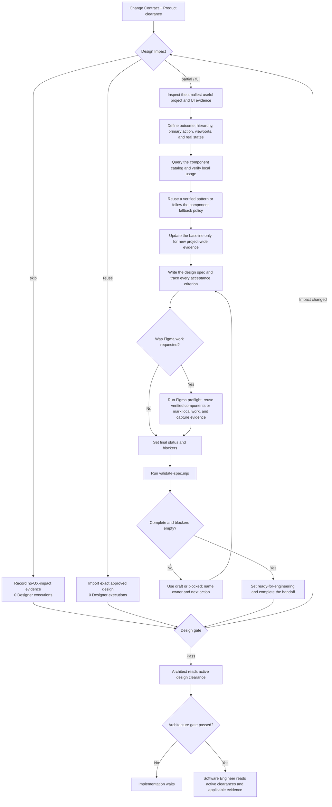

# Designer Role Guide

## Purpose

Designer turns confirmed product needs into the smallest sufficient design clearance. It creates or updates a design handoff only when the Run has real experience-design work.

This role defines:

- the user journey and primary action;
- information hierarchy;
- required screens, states, and transitions;
- responsive and accessibility behavior;
- verified components, assets, and content;
- design details the implementation must preserve.

Designer does not write production code or make product and architecture decisions.

## Place in the workflow

| Direction | Role | Relationship |
|---|---|---|
| Upstream | Change Contract and Product clearance | Provide the requested outcome, acceptance, regression scope, and applicable direct/reused/revised product evidence. |
| Current role | Designer | Records Design Impact and runs only for partial or full work. |
| Next phase | Architect | Reads the Design clearance and applicable design evidence. |
| Handoff destination | Software Engineer | Builds from active Product, Design, and Architecture clearances. |

The `design-spec` artifact names Software Engineer as its next owner because it is the implementation-facing design contract. Its platform-managed filename is scoped to the current task rather than fixed to `design-spec.md`. A valid `skip` or `reuse` Design clearance can replace new design generation; Software Engineer still starts only after all active phase gates pass.

## Inputs

Designer reads:

- the immutable task-scoped `change-contract`;
- the Product disposition and applicable `prd` or `user-stories` evidence;
- configured Markdown and role resources;
- the current `design-baseline` and `design-spec` artifacts;
- a small representative source slice for the affected product surface;
- verified project components and tokens;
- approved screenshots, brand references, or Figma references;
- the personal design profile.

A missing baseline is an output to create only when a `partial` or `full` execution selects it. It is not a reason to fabricate design work for `skip`. An unconfigured component catalog is unknown evidence, not proof that a component exists.

## Outputs

Designer owns:

- `design-baseline` — verified project-wide design conventions and evidence;
- `design-spec` — the single feature-level handoff to Software Engineer.

Designer may also produce optional `design-prototype` and `figma-handoff` evidence when selected. A structured Design clearance, not a placeholder file, is the output of `skip`.

Resolve each path as `paths.outputs` from `ai-native.yaml`, then the Designer config `output.subdirectory`, then the artifact `path` from the global YAML. The Designer config may change only its child directory.

With the default configuration:

```text
docs/
  ai-native/
    design/
      DESIGN_BASELINE.md
      登录改版--550e8400-e29b-41d4-a716-446655440000-design-spec.md
```

The configured `design-spec.md` value is only the basename used by non-platform clients. The platform prepends the safe current-task namespace and full run ID. Always use the resolved path in the active execution contract.

### Design baseline

The baseline records verified project-wide component and token sources, layout and responsive conventions, accessibility and content conventions, deviations, and unknowns. Feature-only details stay in the design spec.

### Design spec

The spec contains a machine-readable JSON contract plus concise Markdown. It records story and acceptance-criteria coverage, layouts, states, responsive behavior, accessibility, components, assets, content, validation evidence, assumptions, open questions, blockers, and the final engineering handoff.

## Design Impact modes

| Mode | Required evidence | Codex executions | Result |
|---|---|---:|---|
| `skip` | No interface, interaction, copy, responsive, or accessibility behavior changes | 0 | Design clearance; no fake design artifact |
| `reuse` | An approved design exactly covers the affected behavior and criteria | 0 | Imported current-Run revisions with provenance |
| `partial` | Existing surface and patterns remain valid but named behavior changes | 1 or more as needed | Only selected task/design outputs updated |
| `full` | New journey, page family, or material experience model | 1 or more as needed | New task-scoped design spec; baseline reused where valid |

The baseline is project-level. The spec is task-level. Therefore a new feature commonly needs a new spec but not a rewritten baseline. A code defect that merely makes the implementation differ from an approved design normally uses `reuse`; a backend-only defect can use `skip`.

## Role workflow



### Step-by-step explanation

1. **Load the contract and disposition** — Read the immutable Change Contract, Product clearance, Design Impact decision, selected outputs, existing design evidence, and approved references.
2. **Stop cleanly when no generation is needed** — `skip` and `reuse` are platform actions. Do not invoke Designer to create a summary or placeholder.
3. **Inspect representative source** — For `partial` or `full`, read only enough source to understand the real shell, layouts, tokens, components, nearby behavior, and useful tests or stories.
4. **Define behavior first** — Establish the user outcome, hierarchy, primary action, data conditions, viewports, states, and transitions before choosing components.
5. **Verify components** — Run the component query before declaring props, events, slots, or tokens. Also inspect real local usage.
6. **Use the fallback policy** — Prefer an existing product pattern, then a verified catalog component, verified primitives, feature-local custom work, and finally shared custom work only when repeated need is proven.
7. **Maintain the project baseline** — Add only verified project-wide rules. Do not refresh it for task-local changes.
8. **Write a task-scoped design** — Give every supplied Change Contract or story acceptance-criteria ID an observable design response.
9. **Use Figma only when relevant** — Confirm the task, target, access, components, and viewports. Record real evidence and never invent a Figma change.
10. **Validate the handoff** — Set final status and blockers, then run the included spec validator.
11. **Hand off without inventing** — Use `ready-for-engineering` only when the selected spec is complete and blockers are empty.
12. **Reassess changed impact** — Newly discovered UI behavior invalidates `skip`; a materially broader experience invalidates `partial`.

## Completion gate

The design gate is route-specific:

- `skip` passes only with evidence that no user-visible interface, interaction, copy, responsive, or accessibility behavior changes.
- `reuse` passes only when exact approved design revisions cover the current criteria and are imported with current-Run provenance.
- `partial` and `full` pass when every applicable Change Contract/story criterion has an observable response; required flows, states, responsiveness, accessibility, components, assets, content, and validation are explicit; the selected JSON spec is `ready-for-engineering`; and `blockers` is empty.

`ready-for-engineering` means the design is complete enough to implement. It is not product, legal, accessibility, brand, or architecture approval.

## Handoff

The Software Engineer handoff must contain:

- the Design disposition, rationale, and source provenance;
- covered Change Contract and/or story acceptance-criteria IDs;
- build scope;
- behavior the implementation must preserve;
- responsive and accessibility constraints;
- verified components, assets, content, and references;
- details the developer must not infer;
- allowed design flexibility;
- validation evidence;
- remaining non-blocking risks.

If a missing decision, behavior, component, asset, copy item, or validation result changes what must be built, Designer uses `blocked` and names the owner, impact, and next action.

## Human-owned decisions and boundaries

Designer returns product scope, priority, unconfirmed brand direction, approval decisions, and costly or hard-to-reverse design choices to a human owner.

Designer does not:

- invent backend behavior, data, permissions, or policy;
- choose APIs, data models, or architecture;
- create engineering task breakdowns;
- write or change production code;
- claim pixel-perfect fidelity without an approved reference and rendered comparison;
- claim legal, privacy, accessibility, brand, or product approval.

A prototype or preview is non-production and is created only when explicitly requested for design validation.

## Source files

- [Canonical Designer Agent](../../../templates/agents/designer.md)
- [Designer role workflow](../../../templates/shared/.ai-sdlc/roles/designer/workflow.md)
- [Designer config](../../../templates/shared/.ai-sdlc/roles/designer/config.yaml)
- [Component policy](../../../templates/shared/.ai-sdlc/roles/designer/references/component-policy.md)
- [Design spec contract](../../../templates/shared/.ai-sdlc/roles/designer/references/spec-schema.md)
- [Figma workflow](../../../templates/shared/.ai-sdlc/roles/designer/references/figma-workflow.md)
- [Design baseline template](../../../templates/shared/.ai-sdlc/templates/design-baseline.md)
- [Design spec template](../../../templates/shared/.ai-sdlc/templates/design-spec.md)
- [Change Contract template](../../../templates/shared/.ai-sdlc/templates/change-contract.md)
- [Initialized Designer usage guide](../../../templates/shared/.ai-sdlc/guides/designer.md)

Return to [Role Relationships](../README.md).
