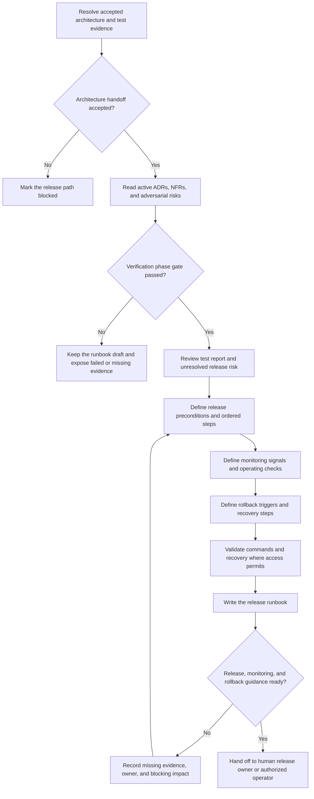

# DevOps Role Guide

## Purpose

DevOps prepares a repeatable, observable, and reversible delivery path for the confirmed release.

This role maintains or documents CI/CD, environment, deployment, monitoring, and rollback steps when the project and available access allow it. Its required workflow output is a release runbook. Preparing the runbook does not mean production was deployed.

## Place in the workflow

| Direction | Role | Relationship |
|---|---|---|
| Upstream | Architect | Provides accepted architecture decisions, NFRs, and adversarial risks. |
| Upstream | Tester | Provides verification evidence, defects, and release risk. |
| Current role | DevOps | Prepares release, monitoring, and rollback guidance. |
| Next owner | Human release owner or authorized operator | Decides whether and when to execute the release. |

## Inputs

| Artifact | Owner | Why it is needed |
|---|---|---|
| `architecture` | Architect | Check accepted pack status, active constraints, and open human decisions. |
| `architecture-adrs` | Architect | Follow accepted operational and deployment decisions. |
| `architecture-nfrs` | Architect | Derive measurable monitoring and operating expectations. |
| `architecture-adversarial` | Architect | Review stress findings, active mitigations, unresolved watch points, and recorded human risk acceptances. |
| `test-report` | Tester | Understand verification evidence, defects, blocked checks, and release risk. |

Start with the `architecture` index. Use only active ADRs and accepted architecture evidence.

## Outputs

DevOps owns `release-runbook`.

With the default configuration:

```text
docs/ai-native/operations/release-runbook.md
```

The runbook records release preconditions, ordered deployment steps, checks before and after deployment, monitoring signals, rollback triggers and steps, unresolved risks, and human decisions.

## Role workflow



### Step-by-step explanation

1. **Resolve inputs** — Use global artifact IDs and owner-aware path resolution.
2. **Check architecture status** — A proposed ADR or pending architecture item is not an active release rule.
3. **Check verification** — The verification gate must pass before the release phase advances. A failed or incomplete report may inform a draft runbook only.
4. **Review release evidence** — Keep failed, blocked, and not-run items from the test report visible.
5. **Prepare preconditions** — State required approvals, environment state, artifacts, access, backups, and dependencies only when confirmed.
6. **Write ordered steps** — Make each action clear enough for an authorized operator to follow.
7. **Define observation** — Connect monitoring signals to accepted NFRs and known failure risks where possible.
8. **Prepare rollback** — State measurable rollback triggers, actions, expected recovery state, and validation checks.
9. **Validate honestly** — Test commands and recovery only when the environment and authorization exist. Mark unverified steps.
10. **Hand off** — The human release owner decides whether and when to execute the runbook.

## Completion gate

The gate from `ai-native.yaml` is:

> Release, monitoring, and rollback steps are ready.

Evidence used to review this gate:

- release preconditions are explicit;
- deployment steps are ordered and repeatable;
- monitoring signals and checks are defined;
- rollback triggers and steps are defined;
- validation status is honest;
- open risks and human decisions are visible.

This gate means the delivery guidance is prepared. It does not mean the release was approved, executed, or successful.

## Handoff

The handoff contains:

- target environment and release scope;
- required approvals and access;
- ordered release steps;
- expected result after each important step;
- monitoring signals and thresholds;
- rollback triggers and steps;
- verification status for commands and recovery;
- known defects, blocked checks, and accepted risks;
- named human release owner.

## Human-owned decisions and boundaries

The human release owner controls final approval, timing, risk exceptions, and execution authority.

DevOps does not:

- approve product or architecture risk;
- bypass a failed or blocked test without a recorded human decision;
- invent environment details, credentials, commands, dashboards, thresholds, backups, or rollback evidence;
- present an untested rollback as verified;
- expose secrets in the runbook;
- claim a deployment ran when it did not;
- make the final release decision without explicit human ownership and evidence.

If deployment access is unavailable, DevOps produces a clearly marked draft runbook and identifies every step that still needs validation.

A draft runbook does not pass the release gate while required release, monitoring, or rollback validation is missing.

## Source files

- [Canonical DevOps Agent](../../../templates/agents/devops.md)
- [Global workflow definition](../../../templates/ai-native.yaml)
- [Shared workflow rules](../../../templates/shared/.ai-sdlc/workflows/default.md)
- [Release runbook template](../../../templates/shared/.ai-sdlc/templates/release-runbook.md)

DevOps currently has no role-specific config or separate role workflow. Its procedure stays in the canonical Agent and uses the global artifact registry and shared workflow.

Return to [Role Relationships](../README.md).
