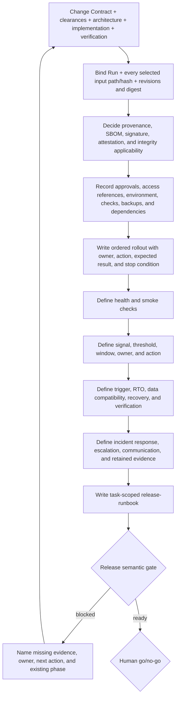

# DevOps Role Guide

## Purpose

DevOps turns the current Run's confirmed scope, implementation provenance, architecture constraints, and Verification result into an evidence-bound release runbook. Its V1 outcome is guidance that an authorized human can use for a go/no-go decision.

DevOps prepares and validates the runbook only. It does not deploy, roll out, roll back, run a production migration or smoke test, configure CI or required checks, use or edit secrets, change environments or branch policy, commit, push, create or publish a PR, merge, publish an artifact/release, accept risk, command an incident, or decide go/no-go.

## Place in the workflow

| Direction | Role or source | Relationship |
|---|---|---|
| Upstream | Change Contract and current clearances | Bind the exact Run, included scope, and applicable Product/Design/Architecture dispositions. |
| Upstream | Architect | Provides accepted index, ADRs, measurable NFRs, adversarial risks, or valid skip/reuse evidence. |
| Upstream | Software Engineer | Provides current `implementation-notes` and `engineering-provenance`, including the real source/build/release identity and limitations. |
| Upstream | Tester | Provides the current `test-report`, Verification state, defects, untested scope, command/report evidence, and residual risk. |
| Current role | DevOps | Prepares and validates the task-scoped `release-runbook`; keeps missing or contradictory evidence blocked. |
| Gate | Web Release semantic gate or direct human review | Checks the runbook contract. Passing means `Ready for human go/no-go`, not approved or executed. |
| Next owner | Human release owner or authorized operator/system | Makes go/no-go and performs separately authorized external actions. |

Release remains the sixth phase and DevOps remains its owner. Missing evidence routes to an existing owner and phase; it does not create a seventh phase or transfer another role's authority.

## Role pack

DevOps uses one canonical Agent plus two ordinary supporting files:

| File | Purpose |
|---|---|
| `templates/agents/devops.md` | Canonical role identity, working rules, evidence order, boundary, and handoff |
| `.ai-sdlc/roles/devops/config.yaml` | Registered input vocabulary, optional project-relative operations Markdown, and `ai-native/operations` child output directory |
| `.ai-sdlc/roles/devops/workflow.md` | Evidence validation, runbook procedure, failure routing, completion gate, and execution boundary |

The config and workflow are not another Agent or a client-specific Skill. They support the same canonical role rendered for GitHub Copilot, Claude Code, and Codex.

## Inputs and evidence priority

DevOps resolves paths through `ai-native.yaml`, the artifact owner's config, and the current execution contract. Its registered inputs are:

| Artifact or clearance | Owner | Release use |
|---|---|---|
| `change-contract` | Human/platform (`pm-ba` registry owner) | Immutable Run, included scope, acceptance, non-goals, regression obligations, and references |
| Architecture clearance and `architecture` | Architect/human | Accepted pack status or valid skip/reuse evidence |
| `architecture-adrs` | Architect | Active deployment, data, compatibility, security, and operational decisions |
| `architecture-nfrs` | Architect | Measurable health, monitoring, recovery, and capacity expectations |
| `architecture-adversarial` | Architect | Failure stressors, mitigations, watch points, and unresolved human risk decisions |
| `implementation-notes` | Software Engineer | Current implementation status, actual change, checks, limitations, and evidence index |
| `engineering-provenance` | Software Engineer | Source/build identity, provenance links, evidence revisions, and explicitly unperformed actions |
| `test-report` | Tester | Current Verification conclusion, defects, blocked/untested scope, evidence, and release recommendation |

When evidence conflicts, DevOps exposes the conflict and uses this order:

1. immutable Change Contract and durable human decisions for the current Run;
2. active execution contract, phase clearances, and human approvals;
3. current `test-report` and its Verification conclusion;
4. current `implementation-notes`, `engineering-provenance`, and referenced source/build/artifact metadata;
5. accepted Architecture index, active ADRs/NFRs, and adversarial evidence;
6. verified repository scripts, provider records, dashboards, environment evidence, and configured operations Markdown;
7. explicit assumptions that still have a named owner.

Chat claims, example commands, pending architecture scaffolds, stale runbooks, and a textual statement that something is configured are not current release evidence. A required unknown or unresolved placeholder keeps Release blocked.

## Output and task-scoped path

DevOps owns one registered artifact, `release-runbook`. The registry stores the basename `release-runbook.md`; the role config contributes `ai-native/operations`. A Web-managed Run adds the stable task-and-Run namespace:

```text
docs + ai-native/operations + release-runbook.md
+ current task "修复结算舍入" + run 550e8400-e29b-41d4-a716-446655440000
= docs/ai-native/operations/修复结算舍入--550e8400-e29b-41d4-a716-446655440000-release-runbook.md
```

Every rerun of that task keeps the pinned path; a different Run gets a different path. DevOps never guesses a shared `latest` path. Resolved output must remain beneath `paths.outputs`, beneath the DevOps namespace, outside project controls and native Agent files, and non-overlapping with every other artifact path.

## Role workflow



### Step-by-step

1. **Resolve scope and output** — Confirm the Run, exact release scope, target environment, selected output, and named human owner. Record it as `Human: <role/name reference>`; an Agent, model, assistant, automation, bot, or system never qualifies. Never expand the Change Contract or edit an unselected artifact.
2. **Validate upstream state** — A failed, blocked, stale, or contradictory Implementation, Verification, or applicable Architecture prerequisite permits only a Draft/Blocked runbook.
3. **Bind revision and provenance** — Copy every selected input's exact artifact ID, project-relative path, and platform-provided SHA-256 content hash, then record the exact source/product revision, build or release artifact identity, applicable trusted digest, provenance reference, and Test Report revision. Do not infer a digest from a filename.
4. **Decide supply-chain applicability** — State whether SBOM, signature, attestation, dependency inventory, and integrity checks apply. Required-but-missing evidence blocks; `Not applicable` needs a reason and source.
5. **Define preconditions** — Record approvals, environment/access references, dependencies, capacity, compatibility/maintenance constraints, backups, required checks, owner, evidence, and status. Never include secret values.
6. **Write ordered rollout** — Each planned step names the authorized owner, exact reviewed action/command and trusted context, expected result, retained evidence, and stop/continue condition. A plan is never written as execution history.
7. **Define health and observation** — Cover applicable smoke/user/operator checks. Every monitoring row has a signal, measurable threshold, window, owner, safe dashboard/query reference, and action on breach.
8. **Define rollback and recovery** — Include measurable triggers, accepted RTO source, data/schema/config compatibility, backups, ordered recovery, expected recovered state, and recovery verification. Mark untested elements honestly.
9. **Define incident handling** — Record detection, first response, rollout state, escalation/communication route, responsibility, and evidence retention.
10. **Evaluate risk and readiness** — Keep defects, untested scope, risk acceptances with durable human references, open decisions, and revalidation triggers visible. Remove every placeholder or remain blocked.

## Release semantic gate

The runbook can state `Ready for human go/no-go` only when:

- the Run, Change Contract, source/product revision, build/release identity and applicable digest, provenance, environment, and Test Report revisions agree;
- every selected upstream input has one exact artifact ID/path/content-hash row matching the platform's current approved head;
- provenance and every supply-chain control have an evidence-backed applicability conclusion;
- preconditions and ordered rollout are complete and evidence-bound;
- health/smoke and monitoring include target, threshold, window, owner, expected result, and action;
- rollback includes triggers, RTO, data compatibility, ordered recovery, expected recovered state, and verification;
- incident/escalation, risks, accepted exceptions, open decisions, and the human release owner are explicit;
- no required field contains a placeholder, unfinished marker, invented fact, unowned blocker, or unverified claim represented as complete;
- the runbook says exactly that deployment was not executed by preparing it.

The Web approval path re-resolves the current heads, verifies their workspace bytes, rejects fake/legacy runner executions, and enforces this as a semantic gate. During execution, its Release workspace policy permits only the selected standalone Markdown runbook: unlike Verification it has no runtime-evidence roots or dependency/cache/build exclusions. A direct IDE user follows the same schema and must perform an explicit human review, but cannot claim a Web semantic-gate or mutation-guard event. In both modes, readiness is guidance quality only and never deployment or release approval.

## Failure routing

| Gap | Return to |
|---|---|
| Outcome, scope, acceptance, or Change Contract conflict | Human contract owner or PM / BA through Discovery |
| Architecture rule, NFR, trust boundary, or unresolved adversarial risk | Architect through Architecture |
| Source/build revision, artifact, provenance, required SBOM generation, or implementation defect | Software Engineer through Implementation |
| Missing, stale, failed, or disputed Verification evidence | Tester through Verification; Software Engineer only when Tester classifies a product/testability defect |
| Environment, access, credential reference, CI/branch policy, provider, monitoring, backup, operator, or incident-response evidence | Separately authorized human/operator/system; DevOps records the blocker and expected contract |

## Human boundary

The handoff names the human go/no-go owner, authorized action owners, evidence locations, unresolved blockers, residual risks, and revalidation triggers. The runbook itself grants no permission.

The human or authorized external system retains go/no-go, timing, credentials, CI and branch policy, deployment, smoke execution, rollback, merge/publication, risk acceptance, and incident command. DevOps does not infer authorization from urgency, a passing Tester recommendation, or a completed runbook, and never represents a planned or externally unverified action as completed.

## Client, Web, and security boundary

The DevOps Agent is rendered from the same canonical Markdown into GitHub Copilot, Claude Code, or Codex native files. The Web new-project form can select any of those targets, but real Web phase jobs still use the local Codex runner. Direct IDE and Web operation share the Release owner, inputs, runbook template, and human boundary; only Web can supply its persisted path pin and semantic-gate event.

The current Web runner is limited to local, trusted, disposable or otherwise recoverable project state. Its API has no authentication and the Codex process is not isolated by an OS sandbox. This role does not make remote or untrusted execution safe; authentication, credential isolation, network policy, and an isolated worktree/container runner remain security-architecture blockers.

## Source files

- [Canonical DevOps Agent](../../../templates/agents/devops.md)
- [Global workflow definition](../../../templates/ai-native.yaml)
- [Shared workflow rules](../../../templates/shared/.ai-sdlc/workflows/default.md)
- [DevOps config](../../../templates/shared/.ai-sdlc/roles/devops/config.yaml)
- [DevOps workflow](../../../templates/shared/.ai-sdlc/roles/devops/workflow.md)
- [Release runbook template](../../../templates/shared/.ai-sdlc/templates/release-runbook.md)

Return to [Role Relationships](../README.md).
