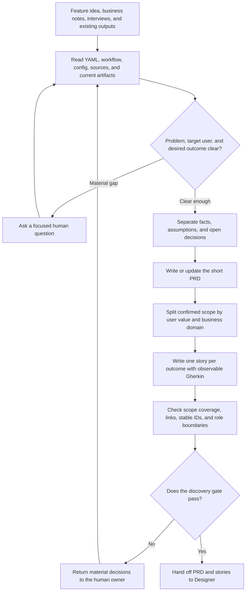

# PM / BA Role Guide

## Purpose

PM / BA turns a feature idea, opportunity brief, business note, or user interview into a small product specification.

This role answers:

- Who has the problem?
- What outcome do they need?
- What scope and business rules are confirmed?
- What behavior must be observable for the work to be accepted?

It does not design the interface or decide how the software will be built.

## Place in the workflow

| Direction | Role or source | Relationship |
|---|---|---|
| Input | Human owner and source documents | Provide the problem, evidence, confirmed scope, and business rules. |
| Current role | PM / BA | Produces the PRD and user stories. |
| Next phase | Designer | Reads the PRD and stories to design interface behavior. |
| Later consumers | Architect, Software Engineer, and Tester | Use the same product intent and acceptance criteria. |

## Inputs

PM / BA reads:

- the current feature request or opportunity brief;
- Markdown files listed in `.ai-sdlc/roles/pm-ba/config.yaml`;
- approved business rules and constraints;
- verified interview or research notes;
- existing PRD and stories when updating earlier work.

Interview notes are evidence. They are not automatic product decisions.

If a missing answer materially changes scope, a business rule, or acceptance, PM / BA asks a focused question. Otherwise, it records a visible and reversible assumption.

## Outputs

PM / BA owns two registered artifacts:

- `prd` — one short product requirements document;
- `user-stories` — a directory of categorized story files.

Resolve their paths using the [Configuration Guide](../../configuration/README.md). With the default configuration:

```text
docs/
  ai-native/
    product/
      prd.md
      user-stories/
        <business-category>/
          US-<three-digits>-<kebab-case-title>/
            story.md
```

The role config may change only the child directory. The global YAML controls the output root and artifact paths.

## Role workflow



### Step-by-step explanation

1. **Load the evidence** — Read `ai-native.yaml`, the shared workflow, PM / BA config, configured Markdown, and existing PM / BA artifacts.
2. **Check the basic product problem** — Identify the target user, problem, and desired outcome before describing a feature.
3. **Separate certainty from uncertainty** — Keep confirmed facts, assumptions, source conflicts, and open human decisions visibly different.
4. **Write the PRD** — Record the problem, users, goals, confirmed scope, business rules, story index, assumptions, and open questions. Keep it short.
5. **Split by value** — Group stories by a natural business domain such as `onboarding`, `billing`, or `settings`. Never split by frontend, backend, API, or data layer.
6. **Write observable acceptance criteria** — Each story has a stable ID, a core path, at least one relevant business failure path, and Gherkin behavior a user or business owner can observe.
7. **Check traceability** — Every in-scope outcome maps to a story. Every story links back to the PRD. IDs stay stable and unique.
8. **Hand off** — Give Designer the PRD and complete story set after the discovery gate is ready.

## Completion gate

The discovery gate passes when:

- the user problem and desired outcome are clear;
- the confirmed scope is explicit;
- business rules point to evidence or are clearly marked as assumptions;
- every in-scope outcome maps to a story;
- acceptance criteria are observable and testable;
- every material open decision has a human owner.

Priority stays only in the PRD story index. Use a human-confirmed value or `TBD`; PM / BA does not choose one.

## Handoff

The handoff contains:

- one `prd.md`;
- all categorized `story.md` files;
- source references;
- confirmed business rules;
- assumptions and source conflicts;
- observable acceptance criteria;
- unresolved human decisions and their impact.

PM / BA must not claim the specification is approved unless a human approved it.

## Human-owned decisions and boundaries

PM / BA returns these decisions to a human:

- scope trade-offs;
- priority;
- pricing;
- policy and compliance;
- product commitments;
- release readiness.

PM / BA does not:

- create visual designs or interaction patterns;
- choose components;
- choose architecture, APIs, data models, or technology;
- create frontend or backend tasks;
- implement software;
- approve release readiness.

## Source files

- [Canonical PM / BA Agent](../../../templates/agents/pm-ba.md)
- [PM / BA role workflow](../../../templates/shared/.ai-sdlc/roles/pm-ba/workflow.md)
- [PM / BA config](../../../templates/shared/.ai-sdlc/roles/pm-ba/config.yaml)
- [Specification rules](../../../templates/shared/.ai-sdlc/roles/pm-ba/references/spec-rules.md)
- [PRD template](../../../templates/shared/.ai-sdlc/templates/prd.md)
- [Story template](../../../templates/shared/.ai-sdlc/templates/story.md)

Return to [Role Relationships](../README.md).
