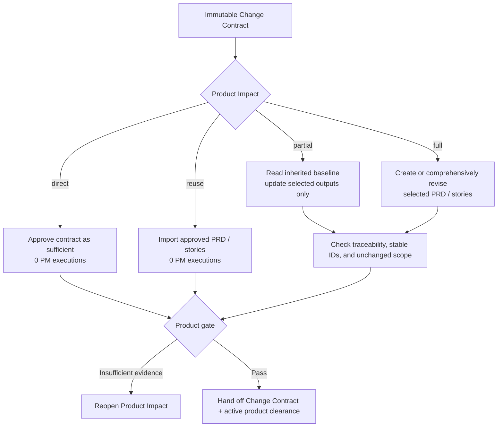

# PM / BA Role Guide

## Purpose

PM / BA turns one immutable Run Change Contract into the smallest sufficient product evidence. A new Run does not automatically create or rewrite a full PRD.

This role answers:

- Who has the problem?
- What outcome do they need?
- What scope and business rules are confirmed?
- What behavior must be observable for the work to be accepted?

It does not design the interface or decide how the software will be built.

## Place in the workflow

| Direction | Role or source | Relationship |
|---|---|---|
| Input | Human owner, `change-contract`, and source documents | Provide current/expected behavior, evidence, scope, acceptance, and regression obligations. |
| Current role | PM / BA | Records a Product disposition; runs only for partial or full product work. |
| Next phase | Designer | Reads the Change Contract plus applicable direct, reused, or revised product evidence. |
| Later consumers | Architect, Software Engineer, and Tester | Use the same active product clearance and acceptance criteria. |

## Inputs

PM / BA reads:

- the current Run's immutable, task-scoped `change-contract`;
- the current feature request or opportunity brief;
- Markdown files listed in `.ai-sdlc/roles/pm-ba/config.yaml`;
- approved business rules and constraints;
- verified interview or research notes;
- existing PRD and stories when updating earlier work.

Interview notes are evidence. They are not automatic product decisions.

If a missing answer materially changes scope, a business rule, or acceptance, PM / BA asks a focused question. Otherwise, it records a visible and reversible assumption.

## Outputs

PM / BA owns three registered artifact identities:

- `change-contract` — one immutable human artifact per Run. The platform generates its task-scoped path; PM / BA must never edit it.
- `prd` — one durable project/product requirements baseline, not one document per Run;
- `user-stories` — a durable directory of categorized story files with stable IDs.

Resolve their paths using the [Configuration Guide](../../configuration/README.md). With the default configuration:

```text
docs/
  ai-native/
    product/
      prd.md
      <task-name>--<run-id>-change-contract.md
      user-stories/
        <business-category>/
          US-<three-digits>-<kebab-case-title>/
            story.md
```

The role config may change only the child directory. The global YAML controls the output root and artifact paths.

The platform-managed task path overrides the configured `change-contract.md` basename. Old initialized projects remain valid: the platform registers this artifact as a backwards-compatible extension without rewriting their YAML.

## Product Impact modes

| Mode | Required evidence | Codex executions | Result |
|---|---|---:|---|
| `direct` | Change Contract, authoritative expected behavior, observable criteria, regression scope | 0 | Product clearance; no placeholder PRD/story |
| `reuse` | Approved PRD/story revisions cover every relevant criterion | 0 | Imported current-Run heads with provenance |
| `partial` | Baseline remains valid; named sections, stories, rules, or criteria change | 1 or more as needed | Only selected PRD/story outputs revised |
| `full` | New domain or material change to users, outcome, scope, policy, or product model | 1 or more as needed | Complete selected PRD/story contract |

Typical examples:

- a defect whose correct behavior is sufficiently defined by the Change Contract plus an authoritative test, incident, protocol, or current-behavior reference can be `direct`;
- a defect or implementation request already covered by approved PRD/story revisions can be `reuse`;
- a new feature within an existing product direction is usually `partial`, adding or revising stories without regenerating the PRD;
- a new business domain or changed product model is `full`.

## Role workflow



### Step-by-step explanation

1. **Read the immutable contract** — Load its current and expected behavior, scope, acceptance, regression obligations, and references before other product evidence.
2. **Choose the smallest truthful route** — Use `direct` or `reuse` only with complete evidence; uncertainty returns to Product Impact.
3. **Run only when needed** — `direct` and `reuse` are platform actions. `partial` and `full` run PM / BA only for selected `prd` or `user-stories` outputs.
4. **Preserve the baseline** — In `partial`, edit affected sections and stories only. Do not restyle unrelated PRD prose, renumber IDs, or rewrite unaffected stories.
5. **Split by value** — Group new stories by a natural business domain such as `onboarding`, `billing`, or `settings`, never by technical layer.
6. **Write observable acceptance criteria** — Each affected story has stable IDs and behavior a user or business owner can observe.
7. **Check traceability** — Every included contract outcome maps to direct evidence or active PRD/story criteria; regression obligations remain visible.
8. **Hand off** — Give the next phase the Change Contract, disposition, provenance, and applicable product artifacts.

## Completion gate

The discovery gate passes when:

- the immutable Change Contract exists and was not modified by PM / BA;
- the user problem or expected bug behavior and desired outcome are clear;
- the confirmed scope is explicit;
- business rules point to evidence or are clearly marked as assumptions;
- every included outcome maps to direct evidence or an applicable story;
- acceptance criteria are observable and testable;
- targeted regression obligations are explicit;
- every material open decision has a human owner.

Priority stays only in the PRD story index. Use a human-confirmed value or `TBD`; PM / BA does not choose one.

## Handoff

The handoff contains:

- the immutable Change Contract;
- the Product disposition, rationale, and provenance;
- applicable `prd.md` and categorized `story.md` revisions only when required;
- source references;
- confirmed business rules;
- assumptions and source conflicts;
- observable acceptance criteria;
- regression obligations;
- unresolved human decisions and their impact.

PM / BA must not claim the specification is approved unless a human approved it.

## Human-owned decisions and boundaries

PM / BA returns these decisions to a human:

- scope trade-offs;
- priority;
- pricing;
- policy and compliance;
- product commitments;
- release readiness.

PM / BA does not:

- create visual designs or interaction patterns;
- choose components;
- choose architecture, APIs, data models, or technology;
- create frontend or backend tasks;
- implement software;
- approve release readiness.

## Source files

- [Canonical PM / BA Agent](../../../templates/agents/pm-ba.md)
- [PM / BA role workflow](../../../templates/shared/.ai-sdlc/roles/pm-ba/workflow.md)
- [PM / BA config](../../../templates/shared/.ai-sdlc/roles/pm-ba/config.yaml)
- [Specification rules](../../../templates/shared/.ai-sdlc/roles/pm-ba/references/spec-rules.md)
- [PRD template](../../../templates/shared/.ai-sdlc/templates/prd.md)
- [Story template](../../../templates/shared/.ai-sdlc/templates/story.md)
- [Change Contract template](../../../templates/shared/.ai-sdlc/templates/change-contract.md)

Return to [Role Relationships](../README.md).
