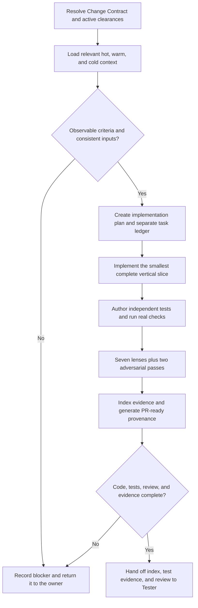

# Software Engineer Role Guide

## Purpose

Software Engineer turns the current Run's confirmed product, design, and architecture contracts into the smallest complete working change and an auditable engineering evidence pack.

This role changes real project source, configuration, and repository-conventional tests. It plans the slice, preserves traceability, obtains independently authored test evidence, runs real project checks, completes a seven-lens and adversarial review, and packages provenance for Tester. Markdown evidence explains and verifies the implementation; it never substitutes for code or passing tests.

Software Engineer does not choose product scope, invent missing design behaviour, approve architecture or risk, publish or merge a pull request, deploy, or replace Tester.

## Role pack architecture

Software Engineer follows the same one-role-one-Agent architecture as the rest of this project:

| File | Purpose |
|---|---|
| `templates/agents/software-engineer.md` | The one canonical Markdown Agent source |
| Selected native Agent under `paths.agents` | The GitHub Copilot, Claude Code, or Codex rendering generated from that canonical source |
| `.ai-sdlc/roles/software-engineer/config.yaml` | Upstream artifact vocabulary, context candidates, evidence IDs, quality floors, and output subdirectory |
| `.ai-sdlc/roles/software-engineer/workflow.md` | The detailed implementation and evidence procedure |
| `.ai-sdlc/roles/software-engineer/references/*.md` | Focused supporting procedures read when the workflow names them |

The workflow and references are ordinary Markdown. They are not a client-native Skill, a second Agent, or an alternate definition of the role. The canonical Agent owns identity, boundaries, and the handoff; the role pack supplies the longer procedure and project-controlled defaults.

The reference pack separates reusable concerns:

- `mini-cycle.md` — requirement → plan/context → code → independent tests → review → evidence;
- `spec-driven-development.md` — Change Contract authority and Greenfield/Brownfield/Hybrid rules;
- `independent-verification.md` — isolation tiers, authoring boundaries, failure classification, and waiver evidence;
- `seven-lens-review.md` — seven required lenses plus pre-mortem and edge-case-hunter;
- `ci-enforcement.md` — real repository checks and CI-equivalent evidence;
- `provenance.md` — cold-audit and PR-ready provenance contract;
- `replay-packet.md` — sanitized triage evidence for failed or disputed executions.

## Place in the workflow

| Direction | Role | Relationship |
|---|---|---|
| Upstream | Change Contract and Product clearance | Provide authoritative scope, observable acceptance, regression obligations, and applicable product evidence. |
| Upstream | Design clearance | Provides evidence-backed skip/reuse or selected ready design outputs. |
| Upstream | Architecture clearance | Provides the skipped, reused, partially updated, or fully accepted architecture contract. |
| Current role | Software Engineer | Plans, implements, tests, reviews, and records the confirmed slice. |
| Next phase | Tester | Independently verifies the change using the evidence-pack index, test evidence, and engineering review. |
| Later consumer | DevOps | Uses `implementation-notes` and `engineering-provenance`, with the Change Contract and Verification result, to bind the task-scoped release runbook. |

Software Engineer starts only after Product, Design, and Architecture have valid current-Run clearances. `direct`, `skip`, and `reuse` are legitimate structured evidence and do not require placeholder PRDs, design specs, or architecture documents.

## Inputs and evidence order

Resolve every artifact through `ai-native.yaml`, the artifact owner's config, and the active execution contract.

| Artifact or clearance | Owner | Why it is needed |
|---|---|---|
| `change-contract` | Human/platform (`pm-ba` registry owner) | Immutable specification authority for outcome, scope, criteria, regressions, and evidence references |
| Product clearance and applicable `prd` / `user-stories` | PM / BA | Approved business rules and stable acceptance-criterion IDs |
| Design clearance and applicable baseline/spec | Designer | Approved visible behaviour, states, content, responsiveness, and accessibility constraints |
| `architecture` | Architect | Pack index and acceptance status; downstream reading starts here |
| `architecture-c4-containers` | Architect | Active boundaries and communication paths |
| `architecture-adrs` | Architect | Accepted technical decisions |
| `architecture-patterns` | Architect | Required patterns and their documented locations |
| `architecture-nfrs` | Architect | Measurable quality budgets |

A child architecture artifact cannot activate a pending or unaccepted pack. When evidence conflicts, expose the conflict and use this order:

1. immutable Change Contract and recorded human decisions for the current Run;
2. approved Product, Design, and Architecture artifacts selected by the platform;
3. verified repository behaviour, tests, dependency metadata, and runtime configuration;
4. measured operational evidence and current CI rules;
5. existing project context and conventions;
6. explicit assumptions and gaps that still need an owner.

A lower source may explain implementation detail but cannot silently override a higher source.

## Layered project context

Load only context relevant to the affected slice and record the paths actually read:

| Layer | Typical sources | Use |
|---|---|---|
| Hot | nearest `AGENTS.md` or `CLAUDE.md` | Always-on repository rules, commands, boundaries, and escalation gates |
| Warm | `docs/context/stack.md`, `context/stack.md`, testing or architecture references | Verified stack, conventions, interfaces, and test practices |
| Cold | `docs/context/gap-log.md`, `context/cold/gap-log.md`, history or replay records | Unknowns, deferred risks, historical decisions, and failure context |

Do not create or overwrite project instructions merely to complete a template. A missing optional context file is not evidence; record the gap only when it creates material uncertainty.

## Contract-driven change modes

The immutable Change Contract plus active Product evidence is already the specification authority. Software Engineer does not create a parallel `spec.md`, revise acceptance wording, or turn an ambiguity into a local assumption when different answers would materially change behaviour.

### Greenfield

- Trace every confirmed criterion to one smallest complete vertical slice.
- Reuse accepted project conventions and architecture; Greenfield does not mean unconstrained.
- Define observable exit criteria and an independent-test strategy before implementation.

### Brownfield

- Begin with a preserved-behaviour statement.
- Record ADDED, MODIFIED, and REMOVED behaviour in `implementation-plan`.
- `REMOVED: None` is valid only with an audit explaining how removals were checked.
- Verify actual removal against the Change Contract, existing tests, public interfaces, error handling, compatibility, and active architecture rules.
- Never delete or weaken a test merely to make changed code pass.

### Hybrid

- Name new and existing boundaries separately.
- Apply Brownfield preservation rules to existing behaviour and Greenfield rules only inside the confirmed new boundary.
- Do not migrate an existing boundary to a preferred pattern without accepted Architecture evidence.

Product ambiguity returns to Product or the human owner; visible behaviour ambiguity returns to Design Impact; boundary, API/schema, data, integration, security, NFR, deployment, or operational ambiguity returns to Architecture Impact. Software Engineer may choose only local implementation details that remain inside every confirmed contract and project convention.

## Seven Run-scoped Web outputs

The implementation phase owns exactly seven registered evidence outputs. In platform execution, every one receives a stable path scoped to the current task and Run.

For a first-time user, the visible flow is only four steps:

1. Confirm that the Change Contract or approved User Stories contain observable acceptance criteria.
2. Click **Start implementation and write code**. This is when Codex changes source, adds tests, runs checks, and generates the evidence documents.
3. Review the implementation result and grouped quality evidence. The seven Markdown files are records from one implementation, not seven manual assignments.
4. Approve only when the implementation is complete and evidence is green; approval unlocks Tester.

| Artifact ID | Group and timing | What it does | What the human checks |
|---|---|---|---|
| `implementation-plan` | Preparation · before code | Defines scope, preserved behaviour, strategy, risks, exit criteria, and AC coverage | Scope and upstream decisions are complete and correct |
| `implementation-tasks` | Preparation · before and during code | Tracks executable tasks, dependencies, file targets, progress, and AC mappings | No work is missing, out of scope, or unfinished |
| `implementation-notes` | Implementation record · after code | Summarizes actual changes, checks, risks, limits, and links the other six artifacts | Real source was changed; `Failed` or `Blocked` means do not approve |
| `engineering-session-log` | Implementation record · during code | Records loaded context, ordered actions, decisions, rejected options, failures, and commands | Claimed commands and decisions have real evidence |
| `engineering-test-evidence` | Quality and delivery · after code | Records isolation tier, frozen intent, AC-to-test coverage, failure classification, commands, and results | Every AC has an executable passing test and the independence claim is credible |
| `engineering-review` | Quality and delivery · after tests | Runs seven lenses, pre-mortem, and edge-case-hunter review | No unresolved or security-sensitive finding remains |
| `engineering-provenance` | Quality and delivery · before Tester/PR handoff | Links specification, session, tests, review, tools, limits, and human boundaries | Links and claims are truthful; PR, merge, and release remain human-owned |

`implementation-notes` is the index; it does not collapse or replace the six companion artifacts. `implementation-plan` and `implementation-tasks` are also distinct: the plan owns strategy and boundaries, while tasks own execution state and mappings.

Source code and repository tests stay in their normal project locations and are linked from the pack. A local rerun changes only outputs selected by the active execution contract and leaves every unselected registered output byte-for-byte unchanged.

The role pack also provides an optional replay-packet template for sanitized failure triage. It is not one of the seven normal Web outputs and must not contain secrets or personal data.

## Role workflow

### Step-by-step

1. **Resolve the execution contract** — Read the global workflow, canonical role file, role config/workflow, current Change Contract, clearances, current selected outputs, and human feedback.
2. **Check implementability** — Extract stable criteria, regressions, preserved behaviour, non-goals, design behaviour, ADRs, patterns, boundaries, NFR budgets, and open decisions. Stop before code when no observable criterion exists or active sources conflict.
3. **Plan one slice** — Write strategy and exit criteria in `implementation-plan`; map atomic implementation and verification work in `implementation-tasks` before coding.
4. **Implement real code** — Follow repository conventions, preserve unrelated user changes, avoid unapproved dependencies or architecture decisions, and stop if a previously excluded impact appears.
5. **Author independent tests** — Begin from the external contract without implementation visibility, freeze test intent, then run the tests against the real implementation.
6. **Classify failures** — Record each as `implementation bug`, `test bug`, or `spec ambiguity` before changing code or tests. Return ambiguity to its owner.
7. **Run real checks** — Execute the repository's actual focused and regression tests, formatter/linter, type checks, build, and required CI-equivalent commands. Record exact commands, results, failures, and intentionally unrun checks.
8. **Review** — Record a finding or `none found` for every lens, run both adversarial methods, and link actionable findings to an owner and evidence or blocker.
9. **Package evidence** — Update all seven selected artifacts with resolvable links. Generate PR-ready provenance only; do not publish or merge a PR.
10. **Hand off** — Give Tester the working change, `implementation-notes`, `engineering-test-evidence`, and `engineering-review`. Tester makes its own Verification conclusion.

## Independent verification tiers

Independence applies to test design and authoring context. After intent is frozen, the tests run against the real implementation.

| Tier | Test-authoring context | Engineering gate |
|---|---|---|
| A | Fresh model and fresh session; authoritative requirements visible; implementation and implementation-session transcript hidden | Pass-capable |
| B | Fresh session, possibly the same model; authoritative requirements visible; implementation and implementation-session transcript hidden | Pass-capable |
| C | Same session with an instruction to ignore previously seen implementation | Blocked unless a human grants a verification-gate exception |
| Limited | Independence cannot be established or the author saw material implementation detail | Blocked unless a human grants a verification-gate exception |

A different prompt inside the implementation session is not Tier A or B. A Tier C or Limited exception must identify the human owner, durable approval reference, affected criteria and scope, why A/B was unavailable, compensating verification, accepted residual risk, and an expiry or revisit condition. In the Web, these are seven exact `Verification gate/exception ...` comment lines defined by `references/independent-verification.md`; artifact text cannot substitute for the human comment. Software Engineer may request and record the exception but cannot approve it.

Every in-scope acceptance criterion and targeted regression obligation maps to at least the configured minimum number of repository-conventional automated tests. Test IDs, names, or adjacent durable metadata cite the stable criterion ID.

### Tester E2E product feedback

Tester-owned E2E scripts now live in a human-configured Linked E2E Workspace. In the Web platform, a fresh spec-only Test Author writes there, a human approves the exact script manifest hash, and the platform runs standalone Playwright. The normal path does not require a handwritten crystallization comment or product-repository integration by Software Engineer. A direct IDE session cannot claim these platform-trusted events or equivalent Linked E2E supervision.

Return to Software Engineer only when the evidence requires product source, a product-repository test, or a reviewed product testability-interface change:

1. receive the stable AC/scenario IDs, frozen behavior, and real failing report/trace/script hashes;
2. confirm the classification is a product or testability defect rather than a linked-script bug;
3. use the normal Tier A/B procedure for any new product-repository test, without copying MCP actions/transcript, DOM dumps, or linked-script internals as the specification;
4. implement and run the authorized product checks without editing or approving the Linked E2E Workspace;
5. refresh every stale engineering artifact, including notes, test evidence, review, and provenance;
6. obtain Implementation reapproval before Tester repeats linked-workspace readiness, script review where invalidated, and standalone execution.

This preserves Software Engineer ownership of product assets and Tester ownership of the separately maintained verification harness and conclusion. The platform never infers or reuses a sibling legacy E2E repository.

## Seven-lens and adversarial review

The engineering review covers:

1. behaviour preservation;
2. hidden assumptions;
3. spec/architecture drift;
4. confirmation without evidence;
5. test independence;
6. security surface;
7. over-engineering.

It then runs both adversarial methods:

- **Pre-mortem** — Assume the change failed in production and identify plausible triggers, impact, detection, missing guards, and follow-up evidence.
- **Edge-case-hunter** — Actively challenge relevant empty, boundary, malformed, repeated, concurrent, unauthorized, partial-failure, stale, locale/time, compatibility, and recovery conditions.

Each lens contains a supported finding or the exact statement `none found`. An unresolved critical/high finding, a security-class finding awaiting decision, contract drift, or a failed required check keeps the phase blocked.

## Completion gate

The implementation gate passes only when:

- the confirmed working change exists in real source/configuration files;
- necessary automated tests exist and required project checks pass;
- every in-scope criterion and regression obligation maps to implementation and automated evidence;
- test authoring is Tier A/B, or a complete human exception and compensating evidence exists for Tier C/Limited;
- all seven lenses and both adversarial passes are complete;
- all seven selected Run-scoped outputs are non-empty, internally consistent, and linked from `implementation-notes`;
- no stale clearance, unresolved security finding, spec ambiguity, unapproved scope expansion, failed required check, or missing necessary test remains;
- provenance names the real context, decisions, commands, evidence, limitations, and non-actions.

Record every unresolved failure honestly. A polished document never converts a missing implementation, unrun test, or unapproved exception into a passing gate. Passing Implementation does not approve Verification, merge, deployment, or release.

## Tester handoff

Tester receives these declared engineering inputs from the same Run:

- `implementation-notes` — pack index, changed areas, deviations, limits, risks, and regression obligations;
- `engineering-test-evidence` — test-design isolation, criterion coverage, changed test paths, commands, failures, waivers, and results;
- `engineering-review` — seven-lens and adversarial findings with status and resolution evidence.

The handoff also points to the real source/test change and the remaining four engineering artifacts. Tester independently verifies acceptance, regressions, NFRs, and risk; it does not merely approve the Software Engineer's self-report.

After Verification, DevOps reads the same current-Run `implementation-notes` and `engineering-provenance`. These artifacts must identify the actual implementation revision, checks, provenance links, limitations, and explicitly unperformed actions so Release can detect stale or contradictory evidence. Software Engineer does not prepare the release runbook or authorize any deployment action.

## Human-owned decisions and boundaries

Software Engineer returns or escalates:

- product scope, priority, acceptance-criterion wording, or policy changes;
- missing interaction, content, responsive, accessibility, or design decisions;
- architecture selection, ADR acceptance, boundary changes, or NFR exceptions;
- security-sensitive behaviour, credential or sensitive-data handling, and material risk acceptance;
- non-test database schema changes or data migration decisions;
- Tier C/Limited isolation exceptions and every other verification-gate waiver;
- PR publication, merge, deployment, rollback execution, and release approval.

Software Engineer does not invent missing behaviour, weaken tests to get green, access production data or secrets, claim a command or external action that did not complete, approve its own evidence pack, or replace Tester. It may prepare PR provenance, but publication and merge remain human- or workflow-owned actions outside this role.

## Client and runtime contract

The Software Engineer Agent is rendered from one canonical source into GitHub Copilot, Claude Code, or Codex native files. Direct IDE and Web operation share the Implementation owner and seven-artifact evidence contract. Web jobs still use the local Codex runner and add selected-output mutation guards, persisted reviews, task-scoped paths, and semantic gates; a direct IDE session must not claim those Web controls or trusted runner events. Neither mode grants this role merge, deployment, secret, or release authority.

## Source files

- [Canonical Software Engineer Agent](../../../templates/agents/software-engineer.md)
- [Global workflow definition](../../../templates/ai-native.yaml)
- [Shared workflow rules](../../../templates/shared/.ai-sdlc/workflows/default.md)
- [Software Engineer config](../../../templates/shared/.ai-sdlc/roles/software-engineer/config.yaml)
- [Software Engineer workflow](../../../templates/shared/.ai-sdlc/roles/software-engineer/workflow.md)
- [Software Engineer references](../../../templates/shared/.ai-sdlc/roles/software-engineer/references)
- [Engineering artifact templates](../../../templates/shared/.ai-sdlc/templates)
- [Six-role prompt eval](../../../reviews/workflow-completion-v1/prompt-eval.md)
- [SDLC standards map](../../../reviews/workflow-completion-v1/sdlc-standards-map.md)

Return to [Role Relationships](../README.md).
