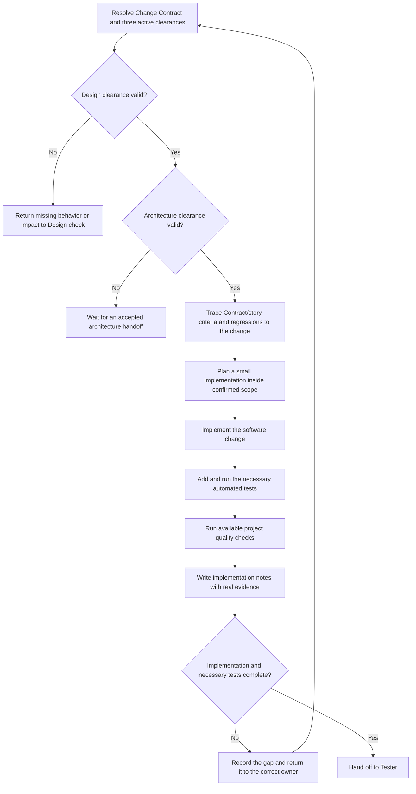

# Software Engineer Role Guide

## Purpose

Software Engineer turns confirmed product, design, and architecture decisions into a working software change.

This role implements the agreed scope, adds the necessary automated tests, runs available project checks, and records what changed. It does not choose product scope, invent missing design behavior, or approve architecture decisions.

## Place in the workflow

| Direction | Role | Relationship |
|---|---|---|
| Upstream | Change Contract and Product clearance | Provide scope, acceptance, regression obligations, and applicable product evidence. |
| Upstream | Design clearance | Provides skip/reuse evidence or selected ready design outputs. |
| Upstream | Architecture clearance | Provides the reused, partially updated, or fully accepted architecture pack. |
| Current role | Software Engineer | Implements, tests, and records the confirmed change. |
| Next phase | Tester | Verifies the implementation against acceptance criteria and risks. |

## Inputs

Resolve every artifact through `ai-native.yaml` and the shared workflow.

| Artifact | Owner | Why it is needed |
|---|---|---|
| `change-contract` | Human/platform (`pm-ba` registry owner) | Read the immutable Run scope, observable outcome, criteria, and regression obligations. |
| Product clearance and applicable `prd` / `user-stories` | PM / BA | Use direct, reused, partial, or full product evidence without demanding placeholders. |
| Design clearance and applicable baseline/spec | Designer | Apply skip/reuse evidence or selected ready behavior and conventions. |
| `architecture` | Architect | Check pack status and active constraints. |
| `architecture-c4-containers` | Architect | Understand selected container boundaries and communication paths. |
| `architecture-adrs` | Architect | Follow accepted technical decisions. |
| `architecture-patterns` | Architect | Apply active patterns at their documented locations. |
| `architecture-nfrs` | Architect | Preserve confirmed quality budgets. |

Start architecture reading at the `architecture` index. A child artifact does not make a pending or unaccepted pack active.

Do not start implementation unless Product, Design, and Architecture gates all pass. A Design `skip` or `reuse` clearance is valid without a new spec; when `partial` or `full` selects a spec, it must be `ready-for-engineering` with an empty `blockers` array. Likewise, Product `direct` does not require a fake PRD.

## Outputs

Software Engineer owns `implementation-notes`.

With the default configuration:

```text
docs/ai-native/engineering/implementation-notes.md
```

The notes record the Change Contract and clearance revisions, implemented scope, changed areas, tests and checks that actually ran, impact deviations, targeted regression obligations, known limits, and remaining risks. They do not replace source code, commits, test output, or architecture records.

## Role workflow



### Step-by-step explanation

1. **Resolve inputs** — Use registered artifact IDs and owner-aware path rules. Do not guess file locations.
2. **Check design readiness** — Read the route-specific Design clearance. A draft or blocked selected spec is not an implementation instruction; `skip` and `reuse` do not need placeholders.
3. **Check architecture acceptance** — Read the index first and follow only active, accepted decisions.
4. **Create traceability** — Connect changed behavior and tests to Change Contract and applicable story acceptance-criteria IDs.
5. **Plan the smallest complete change** — Stay within confirmed scope and preserve current project conventions.
6. **Implement** — Follow active design behavior, ADR rules, pattern placement, and NFR constraints.
7. **Test** — Add tests needed for the changed behavior and run project-supported checks.
8. **Reassess unexpected impact** — Stop if implementation reveals excluded Product, Design, or Architecture work; do not expand the change behind an approved clearance.
9. **Record evidence** — Name commands that actually ran and their results. Mark checks that did not run.
10. **Hand off** — Give Tester enough information to find the change, reproduce checks, and verify targeted regressions.

## Completion gate

The gate from `ai-native.yaml` is:

> The implementation and necessary tests are complete.

Evidence used to review this gate:

- the agreed implementation is complete;
- the necessary automated tests are complete;
- required project checks pass;
- Change Contract and applicable acceptance-criteria traceability is visible;
- implementation notes contain real validation evidence and remaining risks.

Record every unresolved failure, but a failure that prevents the implementation or necessary tests from being complete keeps the gate blocked.

Passing this gate does not approve release.

## Handoff

The Tester handoff contains:

- Change Contract and applicable story acceptance-criteria IDs covered;
- changed code areas;
- important behavior and constraints;
- tests added or changed;
- commands that actually ran and their results;
- checks that did not run and why;
- known limits, defects, and regression risks.
- targeted regression obligations and evidence.

## Human-owned decisions and boundaries

Software Engineer returns scope changes, missing design behavior, conflicting architecture decisions, NFR exceptions, and material risk acceptance to the responsible role or human owner.

Software Engineer does not:

- change confirmed product scope without approval;
- invent missing interaction behavior;
- mark a draft design ready;
- accept an architecture decision or risk;
- ignore an active ADR or NFR without escalation;
- claim tests or checks ran when they did not;
- approve release or claim deployment happened.

## Source files

- [Canonical Software Engineer Agent](../../../templates/agents/software-engineer.md)
- [Global workflow definition](../../../templates/ai-native.yaml)
- [Shared workflow rules](../../../templates/shared/.ai-sdlc/workflows/default.md)
- [Implementation notes template](../../../templates/shared/.ai-sdlc/templates/implementation-notes.md)

Software Engineer currently has no role-specific config or separate role workflow. Its procedure stays in the canonical Agent and uses the global artifact registry and shared workflow.

Return to [Role Relationships](../README.md).
