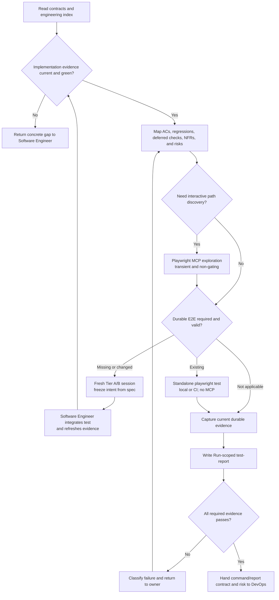

# Tester Role Guide

## Purpose

Tester turns the current Run's accepted requirements and risks into an independent, reproducible Verification conclusion. It may use Playwright MCP to explore a live browser path, but the reusable asset is a repository test and the gate evidence is a real standalone local or CI execution.

Tester does not redefine requirements, silently repair product code, weaken assertions, configure unapproved CI policy, or make the final release decision.

## What you do when Software Engineer finishes

Do not assign the seven engineering Markdown files to Tester one by one. They are one evidence pack.

1. Open `implementation-notes`. If its status is `Failed` or `Blocked`, return the named gap; do not run Tester yet.
2. Inspect the real source/test diff. Markdown is an audit record, not proof that code exists.
3. Read `engineering-test-evidence` for AC coverage, actual commands, failures, and isolation tier.
4. Read `engineering-review` for open findings, especially high/security findings. Use plan, tasks, session log, and provenance only when you need deeper traceability.
5. Approve Implementation only when code and evidence agree and the pack is current. Approval unlocks Tester; it does not publish/merge a PR or approve release.

If Tester later finds that a durable E2E script is missing or wrong, return that test-only change to Software Engineer. The script changes repository state, so the engineering pack must be refreshed and Implementation reapproved before Tester resumes.

## Place in the workflow

| Direction | Role | Relationship |
|---|---|---|
| Upstream | Change Contract and Product clearance | Provide immutable scope, acceptance, regression obligations, and applicable product evidence. |
| Upstream | Designer | Provides observable behavior and every selected runtime-only `deferred_validations` obligation. |
| Upstream | Architect | Provides the accepted index, measurable NFRs, and architecture risks. |
| Upstream | Software Engineer | Provides the runnable change, engineering-pack index, independent-test evidence, and review. |
| Current role | Tester | Maps risk, explores when useful, executes repeatable checks, records defects, and writes `test-report`. |
| Feedback | Software Engineer and upstream owners | Integrate missing test code or resolve implementation/spec/design/architecture gaps, then return current evidence. |
| Next phase | DevOps | Uses the report plus command/report contract to prepare CI, release, monitoring, and rollback. |

## Inputs

| Artifact | Owner | Why it is needed |
|---|---|---|
| `change-contract` | Human/platform (`pm-ba` registry owner) | Immutable Run criteria, non-goals, and regression obligations. |
| Product clearance and applicable `prd` / `user-stories` | PM / BA | Approved business behavior and stable story AC IDs where applicable. |
| Applicable `design-spec` | Designer | Observable behavior and every deferred runtime validation; a valid Design skip may make this not applicable. |
| `architecture` | Architect | Pack status, active constraints, risks, and open decisions. |
| `architecture-nfrs` | Architect | Measurable quality targets that apply to the change. |
| `implementation-notes` | Software Engineer | Start here: changed scope, status, risks, limits, and evidence index. |
| `engineering-test-evidence` | Software Engineer | Audit AC mappings, commands/results, failure classification, changed tests, and isolation tier. |
| `engineering-review` | Software Engineer | Carry forward unresolved review findings without treating self-review as Tester approval. |

Start architecture reading from the `architecture` index. Do not treat a child artifact as proof that the complete pack is accepted.

## One E2E lifecycle, three different jobs

| Stage | Purpose | Tool/context | Result | Gate meaning |
|---|---|---|---|---|
| 1. Exploration | Learn whether the journey is possible, observe DOM/accessibility behavior, and diagnose selector candidates | Playwright MCP in an interactive AI session | Transient session record and diagnostic evidence | A successful path is a draft, not repeatable acceptance or CI proof |
| 2. Crystallization | Express the authoritative scenario as a reviewable, repeatable test without copying exploration assumptions | Fresh Tier A/B authoring session using spec/frozen intent and public harness; repository integration stays with Software Engineer | Project-conventional test such as `tests/e2e/checkout-coupon.spec.ts`, plus refreshed engineering evidence | The file becomes an asset only after integration, real checks, and Implementation reapproval |
| 3. Execution | Prove the integrated asset runs on the current revision and preserve evidence | Standalone `playwright test` or the repository wrapper, locally and/or in CI; never MCP | Pass/fail/blocked result, report, and available trace/screenshot/video | Current, traceable runner evidence can satisfy the gate; CI required-check policy stays with DevOps/owner |

Exploration is optional. Use it when discovery is valuable; do not force an MCP session for a well-understood path. E2E itself is also risk-based: select it for critical user journeys and browser/cross-system behavior, not every criterion.

## Role workflow



## Stage 0: readiness and coverage map

Before opening a browser:

1. Resolve artifacts through `ai-native.yaml` and the active execution contract, not guessed directories.
2. Confirm the Implementation gate passed and every engineering input is from the same current revision.
3. Extract stable AC/regression/deferred/NFR/risk IDs and assign the strongest appropriate evidence level.
4. Check environment, authentication fixture, synthetic data, cleanup, and observability readiness.
5. Mark an unavailable prerequisite `blocked` with owner and release impact. Never turn “not run” into `pass`.

## Stage 1: Playwright MCP exploration

Use MCP to open the runnable non-production application, perform the user path, inspect the DOM/accessibility tree, try semantic selectors, observe dynamic states, and capture diagnostic screenshots. Record the real session/run reference and build.

Do not:

- commit MCP-generated code or copy its action transcript into a `.spec.ts` file;
- call “MCP ran through” a reusable acceptance pass;
- expose production credentials, personal data, or secrets in screenshots/traces;
- invent a browser session when the tool or environment is unavailable.

A real MCP browser run may count as supplementary evidence for a specifically declared manual or deferred UI observation when that obligation explicitly accepts browser-run/screenshot evidence. It still does not prove E2E repeatability or CI readiness.

## Stage 2: independent crystallization

When durable E2E coverage is needed:

1. Freeze AC-mapped intent before revealing the implementation: preconditions, user actions, expected outcomes, negative/recovery path, data, viewport/accessibility/NFR obligations.
2. Use a fresh Tier A/B session. Give it only the authoritative contract, approved observable behavior, frozen intent, and minimum public test harness/commands.
3. Exclude the implementation diff/session, private helpers, MCP action code, exploration transcript, copied DOM dump, and generated exploration script.
4. After intent is frozen, permit public runnable-interface and harness inspection only to adapt selectors. The expected behavior cannot change during adaptation.
5. Prefer accessible role/name, then label, then stable user-facing text, then an intentionally reviewed test contract. Avoid generated classes, deep CSS, XPath, position, and `nth()` unless a constraint is documented.
6. For a platform-managed Run, save the gap and frozen intent in the current `test-report`, choose Verification **Request changes**, and use this exact envelope:

   ```text
   E2E crystallization request: checkout-coupon
   AC: CC-AC-001
   Frozen intent: a valid coupon reduces the payable total before order confirmation.
   ```

   The marker must be the literal first line with a nonempty scenario. Add one `AC:` line per applicable ID from the current Change Contract and exactly one nonempty `Frozen intent:` line. A later-line marker, missing field, unknown AC, or superseded request is not routed. The platform injects only the parsed bounded fields and current report-head metadata into a later Software Engineer rerun as read-only diagnostic feedback; it does not pass the report body/free-form comment, add `test-report` to Implementation inputs, or authorize new scope. A later approval or ordinary change request retires the old marker.
7. Return the candidate test and mapped IDs to Software Engineer. Engineer integrates it in the project's normal test location, runs checks, refreshes all stale engineering evidence, and obtains reapproval.

Tester resumes from the refreshed revision. Tier C or Limited remains blocked unless a human records the existing scoped verification exception and compensating evidence.

## Stage 3: standalone execution and CI handoff

Discover the real command from project manifests and CI configuration. `playwright test` is the direct runner; a project script such as `npm run test:e2e` is valid when it invokes that runner. Do not install Playwright or invent a command merely because this guide mentions it.

For a platform-managed local row, use exactly `` `<one direct runner or repository test-wrapper command>` from `<exact project root>` ``. Compound shell, comments, echo/printf, inline assignments, quoting/substitution, redirection, and background/detached execution are rejected because a successful command event must prove the same runner the report classifies. Put complex setup in a reviewed repository script, document that setup separately, and let the test command finish before the runner returns.

Record:

- exact command, working directory, current commit/build, browser/project, environment, and test data;
- for a platform-managed run, the exact prompt-provided `workspace sha256:<workspaceRevisionToken>; platform execution <executionId>` binding; this is the protected pre-run worktree token, not a commit SHA;
- the exact platform-supplied pre-run Git binding: `git HEAD <full SHA>`, `git unborn <symbolic ref>`, or `git state:not-repository`; never infer non-Git from a failed post-run command;
- exit status, first failure, retries, flake classification, and final result;
- repository-relative HTML/JUnit report and available trace/screenshot/video/log locations under root `test-results/`, `playwright-report/`, or `blob-report/`, with one SHA-256 digest per local evidence file;
- remote CI check name, provider, run URL/ID, and commit SHA when CI actually ran;
- blocked/unrun reason, owner, next action, and release impact when evidence is unavailable.

CI executes the repository script without MCP. Tester specifies the command, scope, pass/fail semantics, reporter, and artifact contract. DevOps or the authorized repository owner configures secrets, browser installation/cache, retention, branch protection, and the required PR check. A local pass is not a remote CI pass.

At approval, the platform verifies the current report head belongs to the current completed real Verification execution, matches the exact local test command to a successful persisted command event, validates the working directory and evidence paths within the project root, recomputes evidence hashes and the protected-worktree token, and checks repository HEAD when Git is available. Self-declared IDs or prose do not satisfy that provenance contract.

## Failure routing

| Failure class | Return to | Required response |
|---|---|---|
| Implementation bug | Software Engineer | Fix source, refresh engineering evidence, reapprove, rerun Tester. |
| Test bug | Software Engineer for integration | Correct against cited authority; never weaken expected behavior merely to go green. |
| Spec ambiguity | PM / BA or human contract owner | Resolve the exact conflicting interpretation in authoritative evidence. |
| Design ambiguity | Designer / Design Impact | Define visible interaction, content, responsive, or accessibility behavior. |
| Architecture/NFR gap | Architect / human owner | Define the measurable target, boundary, or accepted exception. |
| Environment/CI issue | DevOps / authorized operator | Repair environment, credentials, runner, artifact retention, or required-check configuration. Local runner repair returns to Stage 3 and refreshes the report/gate; required-check repair retries CI only after Verification already passed. |

For a bug, retain pre-fix reproduction when available and show post-fix behavior plus targeted regression. Rerun the current revision after every fix.

## Output

Tester owns one registered artifact, `test-report`. In a platform-managed Run it is task/Run-scoped; in a default non-platform workflow its configured basename is:

```text
docs/ai-native/testing/test-report.md
```

The report separates exploration, crystallization, standalone execution, acceptance/regression results, deferred Design checks, failure routing, gaps, defects, residual risk, and recommendation. Exploration notes and repository scripts are linked evidence, not additional registered artifacts.

## Completion gate

Verification can pass only when:

- every applicable AC and targeted regression has appropriate current evidence;
- every selected deferred Design validation has a real passing result;
- required E2E scripts are independently authored, integrated, reviewed, and run against the current revision;
- required local/CI commands pass with traceable evidence;
- failures, blocked checks, untested scope, flakes, gaps, defects, and residual risk remain visible;
- no unresolved implementation/spec/design/architecture/environment blocker is hidden by prose;
- `test-report` states a supported recommendation without claiming human release authority.

Missing evidence keeps the gate blocked and names an owner and next action. A passing Verification gate does not approve merge or release.

## Source files

- [Canonical Tester Agent](../../../templates/agents/tester.md)
- [Global workflow definition](../../../templates/ai-native.yaml)
- [Shared workflow rules](../../../templates/shared/.ai-sdlc/workflows/default.md)
- [Tester workflow](../../../templates/shared/.ai-sdlc/roles/tester/workflow.md)
- [Playwright E2E reference](../../../templates/shared/.ai-sdlc/roles/tester/references/e2e-playwright.md)
- [Test report template](../../../templates/shared/.ai-sdlc/templates/test-report.md)

The Tester role pack is ordinary Markdown supporting the one canonical Agent. It contains no `SKILL.md`, second Agent, or client-specific duplicate.

Return to [Role Relationships](../README.md).
