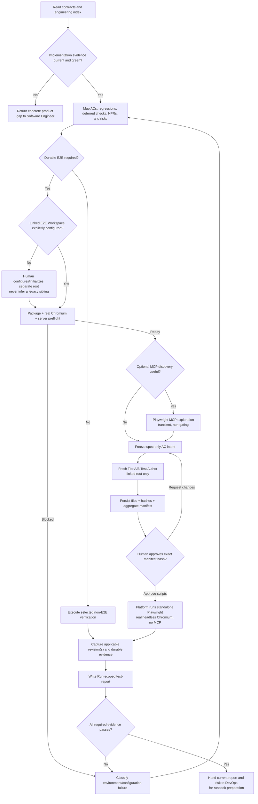

# Tester Role Guide

## Purpose

Tester turns the current Run's accepted requirements and risks into an independent, reproducible Verification conclusion. Playwright MCP may help diagnose a live path, but it is optional and non-gating. When E2E is required, a fresh spec-only Test Author maintains scripts in an explicitly linked standalone E2E workspace; a human approves the exact script hashes before the platform runs standalone Playwright with a real headless Chromium.

Tester does not redefine requirements, silently repair product code, weaken assertions, discover a legacy test repository by convention, configure unapproved CI policy, commit/push, or make the final release decision.

## What you do when Software Engineer finishes

The seven engineering Markdown files are one generated evidence pack, not seven forms or Tester assignments.

1. Open `implementation-notes`. If its status is `Failed` or `Blocked`, return the named gap; do not run Tester yet.
2. Inspect the real source/test diff. Markdown is an audit record, not proof that code exists.
3. Read `engineering-test-evidence` for AC coverage, actual commands, failures, and isolation tier.
4. Read `engineering-review` for open findings, especially high/security findings. Use plan, tasks, session log, and provenance only for deeper traceability.
5. Approve Implementation only when code and evidence agree and the pack is current. Approval unlocks Tester; it does not publish/merge a PR or approve release.

Tester then maps risk. A criterion proven most strongly by unit, integration, contract, or a declared observation need not become E2E. If E2E is required, follow the linked-workspace steps below; the platform no longer asks you to hand-write a crystallization marker.

## Place in the workflow

| Direction | Role or resource | Relationship |
|---|---|---|
| Upstream | Change Contract and Product clearance | Immutable scope, acceptance, regression obligations, and applicable product evidence. |
| Upstream | Designer | Observable behavior and every selected runtime-only `deferred_validations` obligation. |
| Upstream | Architect | Accepted index, measurable NFRs, and architecture risks. |
| Upstream | Software Engineer | Runnable product change, engineering-pack index, independent-test evidence, and review. |
| Verification resource | Linked E2E Workspace | Human-configured separate root in which the fresh Test Author maintains Tester-owned tests/fixtures. It is not another six-phase Project. |
| Current role | Tester | Maps risk, optionally explores, reviews generated-script provenance, executes repeatable checks, records defects, and writes `test-report`. |
| Feedback | Fresh Test Author | Fixes linked-workspace test bugs from cited authority, followed by a new manifest-hash review. |
| Feedback | Software Engineer/upstream roles | Resolves product source, product test, testability-interface, spec, design, or architecture gaps. |
| Next phase | DevOps | Uses the report with the Change Contract, implementation notes/provenance, and accepted architecture evidence to prepare only the task-scoped release runbook. |

## Inputs

| Artifact or platform binding | Owner | Why it is needed |
|---|---|---|
| `change-contract` | Human/platform (`pm-ba` registry owner) | Immutable Run criteria, non-goals, and regression obligations. |
| Approved `user-stories` | PM / BA | Stable AC IDs for legacy Runs without a structured Change Contract; objectives/chat do not become criteria. |
| Applicable `design-spec` | Designer | Observable behavior and every deferred runtime validation. |
| `architecture` / `architecture-nfrs` | Architect | Active constraints, measurable quality targets, risks, and open decisions. |
| `implementation-notes` | Software Engineer | Start here: changed scope, status, risks, limits, and evidence index. |
| `engineering-test-evidence` | Software Engineer | Audit AC mappings, commands/results, changed product-repository tests, and isolation. |
| `engineering-review` | Software Engineer | Carry forward unresolved findings without treating self-review as Tester approval. |
| Linked E2E Workspace binding | Human/platform | Trusted separate root, descriptor, scripts, loopback target, browser, and dual-revision contract when E2E is required. |

Start architecture reading from its index. Do not treat a child artifact as proof the complete pack is accepted.

## One E2E lifecycle, three stages and two checkpoints

| Step | Purpose | Control plane | Result | Gate meaning |
|---|---|---|---|---|
| Preflight | Prove the explicit workspace, Playwright package, browser executable, product start script, and target are ready | Platform structured checks | Individual ready/blocked states | A package version or unit/build pass is not a browser launch |
| Stage 1 · Exploration | Diagnose the journey and selector candidates when useful | Playwright MCP interactive session | Transient diagnostic record | Optional draft; MCP success cannot pass E2E/CI |
| Stage 2 · Crystallization | Express frozen authoritative behavior as durable tests without implementation/exploration bias | Fresh Tier A/B Test Author in only the linked root | Test/fixture manifest and SHA-256 | Cannot execute until a human approves the exact current manifest hash |
| Script review | Review exactly what executable test code was generated | Human + platform hash binding | Approve/request changes for exact bytes | Does not approve Verification, CI, merge, or release |
| Stage 3 · Execution | Prove approved scripts run against the bound product with a real browser | Platform-supervised standalone Playwright, fixed argv, `shell: false` | Exit, report, trace, screenshot/video/log hashes | Current traceable real-Chromium evidence can satisfy E2E obligations |

Exploration and E2E selection are both risk-based. MCP availability is distinct from standalone Chromium readiness: either, both, or neither may be available.

## Role workflow

This is one Verification subflow, not a seventh phase.

The trusted Linked E2E lifecycle above is a Web-platform capability. A direct IDE client can follow the same risk map and report schema, but it cannot claim platform workspace binding, protected-mutation snapshots, manifest-approval events, trusted command events, or an equivalent supervised E2E guarantee unless the Web platform actually produced them.

## Stage 0: configuration, readiness, and coverage map

Before authoring or opening a browser:

1. Resolve artifacts through the active execution contract, not guessed directories.
2. Confirm Implementation passed and engineering inputs are from the same current product revision.
3. Extract stable AC/regression/deferred/NFR/risk IDs and assign the strongest appropriate evidence level.
4. If E2E is required, use only the platform's human-selected Linked E2E Workspace. Do not scan by sibling location, `e2e` name, Git history, prior report, or legacy documentation.
5. Require the structured preflight to report canonical separate/non-nested roots, loopback URL, validated package-manager/test/start scripts, Playwright package/lockfile, configured Chromium executable, real headless launch-and-close probe, target readiness, evidence directories, and product-root protection.
6. Mark an unavailable prerequisite `blocked` with a concrete owner/action. Dependency/browser installation and workspace binding are explicit human setup actions.

## Stage 1: Playwright MCP exploration

Use MCP only when discovery adds value: operate the non-production app, inspect observable DOM/accessibility behavior, try semantic selectors, and capture diagnostic screenshots. Record the real session and build.

Do not commit or copy MCP-generated actions into `.spec.ts`, expose production data, invent a session, or call “MCP ran through” a reusable pass. Do not pass exploration code, transcript, DOM dump, or generated script to the Test Author. A permitted MCP screenshot may supplement a specifically declared manual/deferred observation, but it never proves repeatability or CI readiness.

## Stage 2: independent crystallization and script review

1. Freeze stable IDs, preconditions, observable actions/results, negative/recovery paths, test data, viewport/accessibility, and NFR intent.
2. Launch a fresh Tier A/B Test Author subprocess in only the linked E2E root.
3. Provide approved spec/Design/NFR evidence, frozen intent, and the minimum public E2E harness. Exclude product implementation, implementation diff/session, private helpers, MCP/exploration code or transcript, and DOM dumps.
4. Allow writes only to linked-workspace tests/fixtures. Keep product source/tests/controls, both `.git` states, `.env*`, and all non-allowlisted paths protected. The author does not install, commit, push, configure CI, or execute the new code.
5. Prefer accessible role/name, then label/text, then a reviewed product test contract. A missing stable contract returns to Software Engineer as a testability-interface gap.
6. Persist every path, stable AC/test name, content SHA-256, E2E before/after revision, and aggregate manifest hash.
7. Stop for human review. No newly generated executable test may run before the exact current aggregate hash is approved. Any product/E2E revision, binding, token, file-set, or byte change invalidates approval.

There is no normal-path handwritten `E2E crystallization request:` comment. The platform owns the state transition and supplies the exact generated files for review.

## Stage 3: standalone execution and CI handoff

After script approval, the platform constructs fixed argv from validated identifiers and spawns with `shell: false`. It supervises the product server, waits for the loopback target, launches the configured real headless Chromium through standalone Playwright from the trusted linked root, waits for completion, and cleans up every child. Agents do not start detached/background processes.

Record:

- exact test wrapper, trusted linked root, exit, first failure, retry/flake history, browser/project/version, and product-server lifecycle;
- exact platform-supplied product Git/workspace binding and Linked E2E binding plus Git/workspace before/after revision;
- exact approved script manifest hash and human review reference;
- report, trace, screenshot, video, and log paths under configured E2E evidence directories, each with SHA-256;
- remote CI check/provider/run URL or ID/current revision only if CI really ran.

Use the canonical row `` `<validated package-manager test script>` from `<exact trusted linked E2E root>` ``. Markdown cannot self-authorize another external cwd or command. `No browser is available`, a launch failure, timeout, nonzero test, server readiness problem, or cleanup failure remains non-passing with logs. A local pass is not remote CI success.

Tester owns the command/report contract. An authorized human or repository/provider system configures credentials, browser installation/cache policy, retention, branch protection, and required CI checks. DevOps may document the expected contract and evidence gap in the runbook; the Agent does not make those changes.

## Failure routing

| Failure class | Return to | Required response |
|---|---|---|
| Implementation bug | Software Engineer | Fix product source, refresh engineering evidence, reapprove, rerun Tester. |
| Product testability-interface gap | Software Engineer | Add/repair the reviewed public interface and refresh evidence. |
| Linked E2E test bug | Fresh Test Author | Correct from cited authority, produce a new manifest, obtain exact-hash review, rerun. |
| Spec ambiguity | PM / BA or human owner | Resolve the conflict in authoritative evidence. |
| Design ambiguity | Designer / Design Impact | Define visible interaction, responsive, content, or accessibility behavior. |
| Architecture/NFR gap | Architect / human owner | Define the measurable target, boundary, or accepted exception. |
| Environment/CI issue | Authorized operator/provider; DevOps records the release evidence gap when relevant | Repair binding, dependencies, Chromium, server, runner, credentials, or retention; repeat preflight/execution. |

Only changes to product source, product-repository tests, or product testability interfaces return through Implementation reapproval. Linked-workspace tests stay with Tester/Test Author.

## Output and completion gate

Tester owns one registered artifact, `test-report`. In a platform Run it is Run-scoped; in a default non-platform workflow its configured basename is `docs/ai-native/testing/test-report.md`. Linked scripts and exploration notes are supporting evidence, not additional registered artifacts.

Verification can pass only when:

- every applicable AC/regression and selected deferred Design validation has current evidence;
- required E2E scripts match the human-approved manifest;
- the real configured Chromium and standalone command passed on the bound product/E2E revisions;
- local evidence and scripts re-hash correctly and the trusted command/cwd events match;
- failures, blocked/untested scope, flakes, gaps, defects, and risk remain visible;
- `test-report` states a supported recommendation without claiming merge/release authority.

MCP success, authoring completion, script approval, unit/jsdom success, lint, or build cannot replace required E2E execution. Missing evidence keeps the gate blocked with an owner and next action.

Passing Verification does not configure CI or approve release. DevOps next prepares the current task's runbook, the Release semantic gate evaluates its evidence contract, and a human remains the go/no-go owner.

## Client and runtime contract

The Tester Agent is rendered from one canonical source into GitHub Copilot, Claude Code, or Codex native files. Direct IDE and Web operation share the Verification owner and `test-report` contract. Web execution still uses the local Codex runner and is the only mode that can supply this V1's persisted Linked E2E bindings, hash reviews, mutation guards, and trusted standalone-run events. Neither mode grants Tester CI, merge, deployment, or release authority.

## Source files

- [Canonical Tester Agent](../../../templates/agents/tester.md)
- [Global workflow definition](../../../templates/ai-native.yaml)
- [Shared workflow rules](../../../templates/shared/.ai-sdlc/workflows/default.md)
- [Tester workflow](../../../templates/shared/.ai-sdlc/roles/tester/workflow.md)
- [Playwright E2E reference](../../../templates/shared/.ai-sdlc/roles/tester/references/e2e-playwright.md)
- [Test report template](../../../templates/shared/.ai-sdlc/templates/test-report.md)

The Tester role pack is ordinary Markdown supporting the one canonical Agent. It contains no `SKILL.md`, second Agent, or client-specific duplicate.

Return to [Role Relationships](../README.md).
