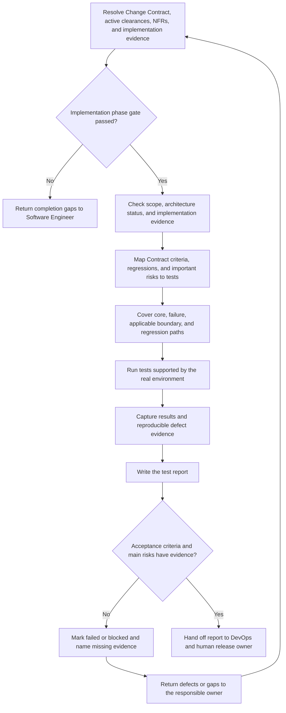

# Tester Role Guide

## Purpose

Tester checks whether the implemented change meets confirmed acceptance criteria and whether its main risks are understood.

This role designs risk-based tests, records real evidence, reports reproducible defects, and gives a release recommendation. It does not redefine requirements, silently fix failures, or make the final release decision.

## Place in the workflow

| Direction | Role | Relationship |
|---|---|---|
| Upstream | Change Contract and Product clearance | Provide immutable scope, acceptance, regression obligations, and applicable product evidence. |
| Upstream | Architect | Provides the accepted index, measurable NFRs, and architecture risks. |
| Upstream | Software Engineer | Provides implementation notes and engineering evidence. |
| Current role | Tester | Verifies behavior and risk, then writes the test report. |
| Next phase | DevOps | Uses the test report when preparing release and rollback guidance. |

## Inputs

| Artifact | Owner | Why it is needed |
|---|---|---|
| `change-contract` | Human/platform (`pm-ba` registry owner) | Use Run criteria and targeted regression obligations as the invariant test contract. |
| Product clearance and applicable `prd` / `user-stories` | PM / BA | Use direct, reused, or revised product criteria where applicable. |
| `architecture` | Architect | Check pack status, active constraints, and open risks. |
| `architecture-nfrs` | Architect | Identify measurable quality targets that apply to the change. |
| `implementation-notes` | Software Engineer | Understand what changed, what was checked, and what risk remains. |

Start architecture reading from the `architecture` index. Do not treat a child artifact as proof that the complete pack is accepted.

## Outputs

Tester owns `test-report`.

With the default configuration:

```text
docs/ai-native/testing/test-report.md
```

The report records the Change Contract revision, tested scope and environment, acceptance and regression results, passed and failed checks, blocked and not-run checks, reproducible defects, NFR evidence, regression risk, and a release recommendation.

A recommendation is not final release approval.

## Role workflow



### Step-by-step explanation

1. **Resolve inputs** — Use artifact IDs instead of assumed directories.
2. **Check readiness** — Confirm the implementation phase gate passed and the notes describe the intended change and available engineering checks.
3. **Build coverage** — Connect each applicable test to a Change Contract/story criterion, regression obligation, risk, or NFR.
4. **Include failure and regression paths** — Do not test only the happy path. For a bug, retain pre-fix reproduction evidence when available and show post-fix plus targeted regression results.
5. **Run real checks** — Record the actual environment, command, tool, and result. Mark unavailable checks as not run.
6. **Report defects** — Include steps, expected behavior, actual behavior, environment, evidence, and impact.
7. **Assess evidence** — Separate confirmed failures, untested risk, and assumptions.
8. **Reopen incorrect impact** — If observed behavior proves an excluded Product, Design, or Architecture impact, return to that Impact Check.
9. **Hand off** — Give DevOps and the human release owner a clear view of release risk.

## Completion gate

The gate from `ai-native.yaml` is:

> Acceptance criteria and major risks have verification evidence.

Evidence used to review this gate:

- applicable Change Contract and story acceptance criteria have verification evidence;
- targeted regression obligations have verification evidence;
- main product, regression, and applicable architecture quality risks have real verification evidence;
- failures, blocked checks, and not-run checks are visible;
- defects are reproducible where possible;
- the test report states a clear recommendation and its evidence.

Missing verification evidence keeps the gate blocked and must name an owner and next action.

A passing verification gate does not remove the human release decision.

`direct`, `skip`, and `reuse` may eliminate upstream Codex executions, but they never eliminate Verification for a production-code change.

## Handoff

The handoff contains:

- tested Change Contract and applicable story acceptance-criteria IDs;
- environment and test data used;
- tests that passed, failed, were blocked, or were not run;
- references to real evidence;
- reproducible defects;
- applicable NFR results;
- regression risks;
- pre-fix reproduction evidence when available and targeted regression results for a bug;
- release recommendation;
- unresolved risk owner and next action.

## Human-owned decisions and boundaries

If a requirement is unclear, Tester returns it to PM / BA or the human owner. Incorrect or incomplete implementation returns to Software Engineer. An unclear architecture quality target returns to Architect or the human owner.

Tester does not:

- rewrite acceptance criteria to make a result pass;
- invent an environment, command, result, screenshot, or defect;
- hide failed or blocked checks;
- treat “not tested” as “passed”;
- change product, design, or architecture decisions;
- claim a defect is fixed without new evidence;
- make the final go or no-go release decision.

## Source files

- [Canonical Tester Agent](../../../templates/agents/tester.md)
- [Global workflow definition](../../../templates/ai-native.yaml)
- [Shared workflow rules](../../../templates/shared/.ai-sdlc/workflows/default.md)
- [Test report template](../../../templates/shared/.ai-sdlc/templates/test-report.md)

Tester currently has no role-specific config or separate role workflow. Its procedure stays in the canonical Agent and uses the global artifact registry and shared workflow.

Return to [Role Relationships](../README.md).
