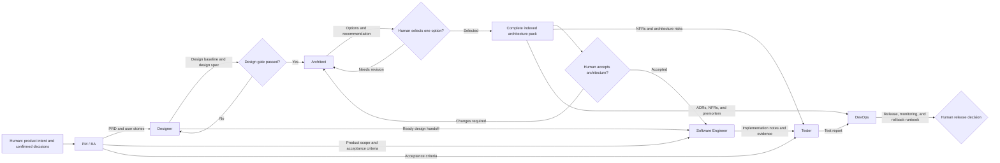
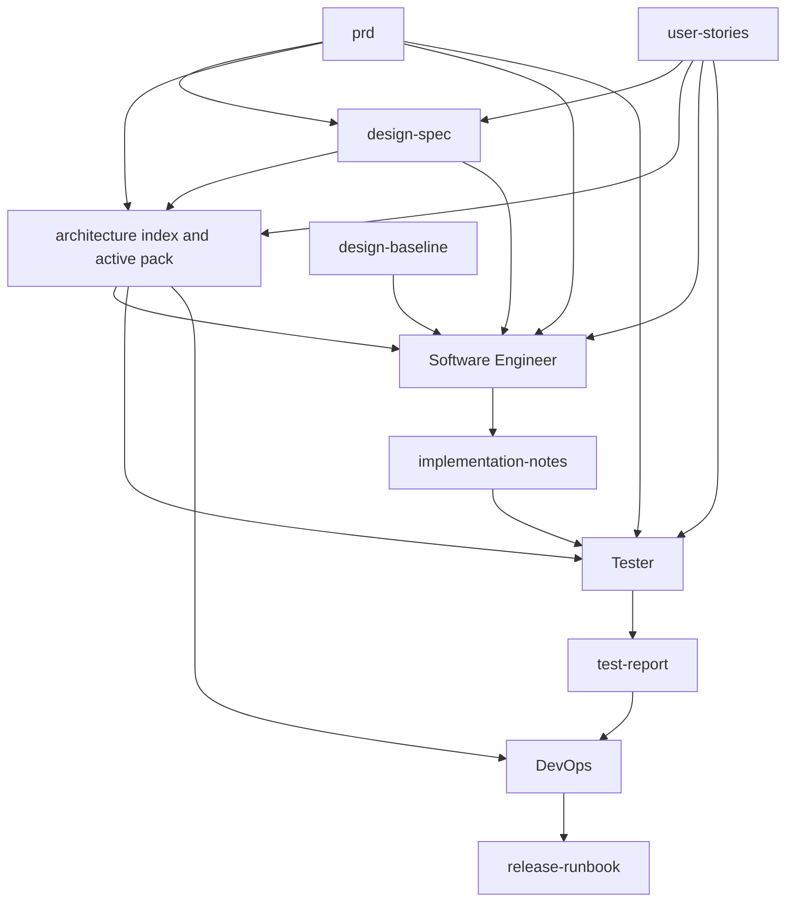

# End-to-End Workflow

The default workflow moves from product intent to release guidance through six roles. Each phase creates registered artifacts and must satisfy a gate before the next phase relies on its work.

## Complete flow

Rectangles are roles or work products. Diamonds are gates or human decisions. A failed gate loops back to the role that owns the incomplete work. It never silently advances.

## What each transition means

1. **Human intent to PM / BA** — A human supplies the opportunity, evidence, and known business decisions.
2. **PM / BA to Designer** — The PRD and stories describe the user problem, confirmed scope, business rules, and observable acceptance criteria.
3. **Designer to Architect** — The design spec describes real interface behavior and must be `ready-for-engineering` with no blockers.
4. **Architect to human selection** — The Architect presents genuinely different options and a recommendation. A human selects the direction.
5. **Architect to human acceptance** — After selection, the Architect completes C4 views, ADRs, patterns, NFR budgets, and an independent premortem. A human accepts the pack for implementation.
6. **Product, design, and architecture to Software Engineer** — These are complementary contracts: what users need, how the experience behaves, and which technical constraints are active.
7. **Software Engineer to Tester** — Implementation notes identify the changed scope, tests, checks, known limits, and risks.
8. **Tester to DevOps** — The test report records passed, failed, blocked, and untested work plus release risk.
9. **Architecture and test evidence to DevOps** — DevOps uses accepted decisions, NFRs, premortem findings, and test evidence to prepare a runbook.
10. **DevOps to human release decision** — The runbook makes release, observation, and rollback repeatable. A human still decides whether and when to release.

## Phase contract

| Phase | Owner | Inputs | Outputs | Completion gate |
|---|---|---|---|---|
| Discovery | PM / BA | Configured business Markdown | `prd`, `user-stories` | User problem, scope, business rules, and acceptance criteria are clear. |
| Design | Designer | `prd`, `user-stories` | `design-baseline`, `design-spec` | The spec is traceable, validated, `ready-for-engineering`, and has no blockers. |
| Architecture | Architect | `prd`, `user-stories`, `design-spec` | Indexed architecture pack | Human acceptance evidence is recorded after options, selected design, decisions, NFRs, and risks are complete. |
| Implementation | Software Engineer | Product, design, and architecture artifacts | `implementation-notes` | The agreed implementation and necessary tests are complete. |
| Verification | Tester | Product, architecture, NFR, and implementation artifacts | `test-report` | Acceptance criteria and main risks have real verification evidence. |
| Release | DevOps | Accepted architecture and test evidence | `release-runbook` | Release, monitoring, and rollback guidance is prepared. |

These gates are declarative contracts. The CLI does not execute a phase, inspect the documents, or approve a gate. The active Agent and human reviewer must record the evidence.

## Artifact flow

The arrows show declared consumption, not file copying. The Architecture node groups the index and its active registered child artifacts. Every role resolves each artifact through `ai-native.yaml` and the artifact owner's role config. See [Configuration](../configuration/README.md).

## Human-owned decisions

AI roles prepare evidence and recommendations. Humans retain:

- final product scope, priority, pricing, policy, and compliance decisions;
- material design decisions that change scope, safety, privacy, or accessibility;
- architecture option selection and final architecture acceptance;
- trust-boundary placement, irreversible migration, vendor lock-in, and risk acceptance;
- exceptions to failed or blocked verification;
- final release approval and timing.

An Agent should stop or mark its artifact blocked when one of these decisions changes the work materially.

## Feedback and rework

The workflow is ordered, but it is not one-way.

- A missing business rule returns to PM / BA or the human owner.
- Missing interface behavior returns to Designer.
- A rejected option or incomplete quality target returns to Architect.
- An implementation defect returns to Software Engineer.
- Missing deployment evidence returns to DevOps or the authorized operator.

When an upstream artifact changes, downstream roles should re-read it, record the new revision or date, and re-check affected gates. Do not assume an old approval covers changed content.

## Architecture index rule

All downstream architecture work starts at the registered `architecture` artifact, which resolves to `architecture.md` by default. That index says which child artifacts are active, pending, blocked, or accepted.

Child architecture artifacts listed as phase inputs give a role the exact evidence it needs. They do not override the index status and do not make pending content active.

## Next guides

- [Role Relationships](../roles/README.md)
- [PM / BA](../roles/pm-ba/README.md)
- [Designer](../roles/designer/README.md)
- [Architect](../roles/architect/README.md)
- [Software Engineer](../roles/software-engineer/README.md)
- [Tester](../roles/tester/README.md)
- [DevOps](../roles/devops/README.md)
