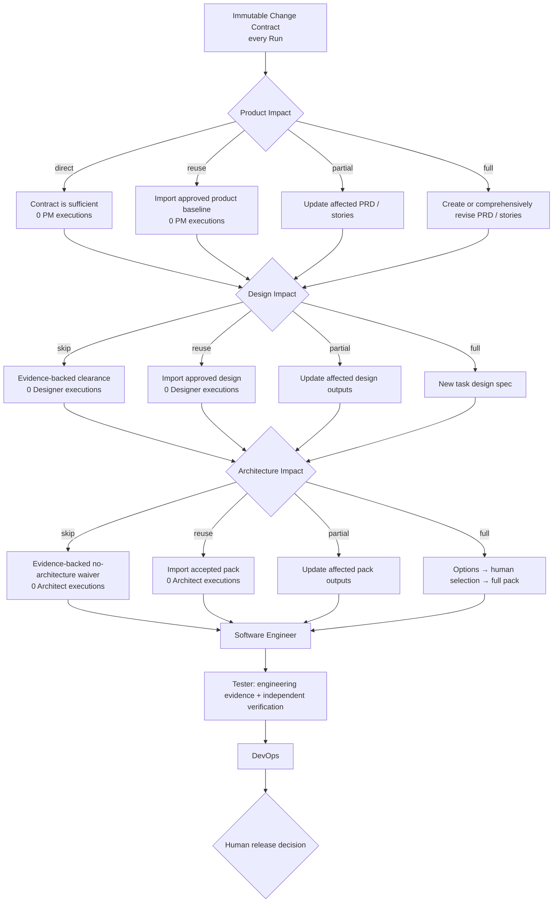
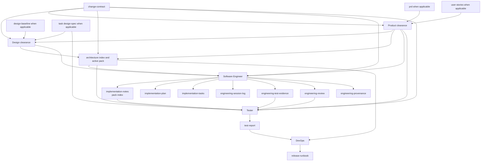

# End-to-End Workflow

The default workflow moves one immutable Run Change Contract to release guidance. The six phases remain ordered, but a role runs only when its impact disposition requires new work. Skipping an Agent execution never skips the evidence or gate.

## Complete flow



Rectangles are roles or work products. Diamonds are gates or human decisions. A failed gate loops back to the role that owns the incomplete work. It never silently advances.

## What each transition means

1. **Change Contract** — The platform creates one immutable, task-scoped human artifact for every Run. It records current and expected behavior, included and excluded scope, acceptance criteria, regression obligations, and evidence references.
2. **Product Impact** — Choose `direct`, `reuse`, `partial`, or `full`. PM / BA runs only for `partial` or `full`; a new Run does not imply a new PRD.
3. **Design Impact** — Choose `skip`, `reuse`, `partial`, or `full`. Designer runs only for `partial` or `full`; a project baseline is reused while a design spec belongs to one task.
4. **Architecture Impact** — Choose `skip`, `reuse`, `partial`, or `full`. Architect runs only for partial/full; Full retains its human selection checkpoint.
5. **Clearances to Software Engineer** — Product, design, and architecture provide complementary conditional contracts: what must change, which experience evidence applies, and which technical constraints remain active.
6. **Software Engineer to Tester** — A Run-scoped evidence pack links the plan, task ledger, implementation, independent-test evidence, seven-lens review, provenance, known limits, and risks. Tester consumes its index, test evidence, review, and the applicable design spec while independently verifying the Change Contract criteria, targeted regressions, and every post-implementation deferred design validation.
7. **Tester and Architecture to DevOps** — DevOps uses accepted decisions, NFRs, risks, the Run-scoped test report, and Tester's real command/report contract to prepare the runbook and authorized CI required check.
8. **DevOps to human release decision** — The runbook and current required checks make release, observation, and rollback repeatable. A human still decides merge and release timing.

## Phase contract

| Phase | Owner | Inputs | Outputs | Completion gate |
|---|---|---|---|---|
| Discovery | PM / BA | Human request and configured business Markdown | Immutable `change-contract`; optional current-Run `prd` and `user-stories` heads | Product disposition has sufficient scope, acceptance, source, and regression evidence. |
| Design | Designer | Change Contract plus applicable product evidence | Design clearance; optional baseline, task spec, prototype, and Figma handoff | Skip/reuse is evidence-backed, or selected design outputs are traceable, validated, ready, and unblocked. |
| Architecture | Architect | Change Contract plus applicable product/design evidence | Architecture clearance and applicable indexed pack | Skip/reuse/partial evidence is valid, or full selection and acceptance evidence is complete. |
| Implementation | Software Engineer | Change Contract plus active product, design, and architecture clearances | Seven Run-scoped outputs: `implementation-notes`, `implementation-plan`, `implementation-tasks`, `engineering-session-log`, `engineering-test-evidence`, `engineering-review`, and `engineering-provenance` | The confirmed implementation and necessary tests are complete; criterion coverage, independent-test evidence, seven-lens/adversarial review, and provenance have no unresolved blocker. |
| Verification | Tester | Change Contract, applicable `design-spec` and acceptance/NFR evidence, `implementation-notes`, `engineering-test-evidence`, and `engineering-review` | Run-scoped `test-report`; transient exploration notes and repository-test links are supporting evidence | Acceptance criteria, regression obligations, main risks, and every deferred design validation have current execution evidence; MCP exploration alone cannot satisfy repeatable E2E/CI evidence. |
| Release | DevOps | Accepted architecture, test evidence, and Tester command/report contract | `release-runbook`; authorized CI required-check configuration | Release, monitoring, rollback, and repeatable CI guidance are prepared. |

The artifact lists in `ai-native.yaml` describe the complete evidence vocabulary. In a platform-managed Run, the persisted disposition and active execution contract resolve which input alternative is required. This avoids fake PRDs or design specs while keeping old initialized project definitions compatible. The CLI itself does not inspect or approve a gate.

## After Software Engineer: the human operating sequence

The seven Markdown outputs are one evidence pack. The normal review is:

1. Read `implementation-notes` for status, actual scope, risks, and links.
2. Inspect the real source/test diff; documents do not substitute for code.
3. Read `engineering-test-evidence` and `engineering-review` for AC coverage, real commands, isolation, open findings, and adversarial results.
4. Use plan, tasks, session log, and provenance for deeper audit or recovery.
5. Return any `Failed`, `Blocked`, stale, contradicted, unrun, or unresolved result to its owner. Approve only a complete current implementation; this unlocks Tester but does not merge or release.

The root [complete workflow and node table](../../README.md#complete-workflow-and-e2e-lifecycle) shows every owner, input, output, gate, and feedback edge.

## Tester E2E evidence lifecycle

```mermaid
flowchart LR
  Intake["Approved implementation + authoritative spec"] --> Map["Risk and AC map"]
  Map --> Discover{"Interactive discovery useful?"}
  Discover -->|"yes"| Explore["E2E Stage 1 · Playwright MCP exploration<br/>transient, non-gating"]
  Discover -->|"no"| Need{"E2E disposition?"}
  Explore --> Need
  Need -->|"missing/changed"| Fresh["E2E Stage 2 · Fresh Tier A/B session<br/>freeze intent from spec"]
  Fresh --> Engineer["Software Engineer integrates *.spec.ts<br/>refreshes evidence"]
  Engineer --> Reapprove["Human reapproves Implementation"]
  Reapprove --> Execute["Execute mapped verification<br/>E2E Stage 3 uses standalone Playwright"]
  Need -->|"valid"| Execute
  Need -->|"not applicable"| Execute
  Execute --> Report["Run-scoped test-report"]
  Report --> Gate{"Verification gate"}
  Gate -->|"pass"| DevOps["DevOps required-check/runbook handoff"]
  Gate -->|"fail/blocked"| Owner["Classify and return to owning role"]
```



- **Exploration** validates feasibility and finds observable selector candidates. Its “ran through” result is a diagnostic draft, although a real browser run/screenshot may supplement a specifically declared manual/deferred observation.
- **Crystallization** starts from frozen authoritative intent in a fresh independent context. It must not copy the implementation or MCP action/transcript. A new test file changes the repository, so Software Engineer integrates it and refreshes the evidence pack before Tester resumes.
- **Execution** runs every mapped applicable check. When E2E applies, Stage 3 uses the repository's real `playwright test` command or wrapper; otherwise the selected unit, integration, contract, or declared observation evidence still has to execute. CI contains no MCP dependency. Tester records actual local/CI evidence; DevOps or an authorized owner configures the required PR check.

This is a feedback subflow across the existing Implementation and Verification boundary, not a seventh phase and not a role-ownership transfer. See the [Tester guide](../roles/tester/README.md) for selector, isolation, data, reporting, and failure-routing rules.

## Software Engineer mini-cycle and evidence gates

Software Engineer follows the project architecture rather than creating a parallel engineering system. The selected client's native Agent is generated from the one canonical Markdown source. It explicitly reads `.ai-sdlc/roles/software-engineer/workflow.md` and the ordinary Markdown references under that role pack; those files are neither client-native Skills nor duplicate Agents.

For each smallest complete vertical slice, the engineering loop is:

```text
requirement → plan/context → code → independent tests → review → evidence
```

1. **Requirement** — Treat the immutable Change Contract and active Product evidence as the specification authority. Do not create a competing `spec.md` or rewrite an acceptance criterion.
2. **Plan and context** — Load only relevant hot rules (`AGENTS.md` or `CLAUDE.md`), warm stack/testing references, and cold gap/history records. `implementation-plan` owns strategy and the vertical-slice boundary; `implementation-tasks` separately owns atomic status, repository targets, dependencies, and criterion mappings.
3. **Greenfield, Brownfield, or Hybrid** — Greenfield work still follows accepted project and architecture constraints. Brownfield work records preserved behaviour plus ADDED, MODIFIED, REMOVED, and an honest removal audit. Hybrid work applies preservation rules to existing boundaries and Greenfield rules only to the confirmed new boundary.
4. **Code** — Change the real repository source, configuration, and tests. Markdown evidence explains the change; it never substitutes for implementation. Newly discovered Product, Design, or Architecture impact invalidates that clearance and returns to its owner.
5. **Independent tests** — Design tests from the external contract without implementation visibility, freeze the intent, then run them against the real change. Tier A (fresh model and session) and Tier B (fresh session, possibly the same model) may pass the normal gate. Tier C (same session instructed to ignore prior implementation) and Limited (independence cannot be established) remain blocked unless a human records a scoped verification-gate exception and compensating evidence.
6. **Review** — Complete all seven lenses: behaviour preservation, hidden assumptions, spec/architecture drift, confirmation without evidence, test independence, security surface, and over-engineering. Then run both adversarial passes: pre-mortem and edge-case-hunter. Each lens records a finding or `none found`.
7. **Evidence** — `implementation-notes` indexes the six companion outputs. `engineering-provenance` links the entire chain and may contain PR-ready text, but Software Engineer does not publish or merge a PR, deploy, approve risk, or claim release approval.

The Web platform resolves all seven registered outputs to stable paths scoped to the current task and Run. A rerun updates only outputs selected by its execution contract; unselected registered artifacts remain unchanged.

## Product Impact Check

| Mode | Use when | Platform behavior | PM / BA outputs |
|---|---|---|---|
| `direct` | A bounded bug or technical change has an authoritative expected-behavior reference and the Change Contract is sufficient | Approve without Codex | None; never create placeholders |
| `reuse` | Approved PRD/story revisions already cover every relevant criterion | Import exact approved revisions with provenance; no Codex | Inherited current-Run heads |
| `partial` | Direction remains valid but named scope, rules, stories, or criteria change | Import baseline and unlock only affected outputs | Revisions of selected `prd` and/or `user-stories` |
| `full` | New domain or material user, outcome, scope, policy, or product-model change | Run PM / BA on the full selected product contract | Complete selected PRD/story outputs |

`change-contract` is always read-only to every Agent. If its requested outcome changes, create a new Run and Change Contract; an Agent must not silently reinterpret or revise the old one.

## Design Impact Check

| Mode | Use when | Platform behavior | Design outputs |
|---|---|---|---|
| `skip` | No interface, interaction, copy, responsive, or accessibility behavior changes | Record evidence-backed clearance; no Codex | None |
| `reuse` | Approved design describes the exact behavior, including a code defect that merely diverges from it | Import exact approved revisions with provenance; no Codex | Inherited current-Run heads |
| `partial` | Existing surface remains valid but named states or behavior change | Import baseline/spec and unlock only affected outputs | Usually task `design-spec`; baseline only for real project-wide change |
| `full` | New journey, page family, or material experience model | Run Designer for a new task contract | Task-scoped spec; project baseline reused or changed only when justified |

Unknown UI impact cannot be classified as `skip`. Any change to visible behavior, copy, interaction, responsiveness, or accessibility needs at least reuse evidence or Designer work. Prototype and Figma handoff remain optional selected evidence, never automatic requirements.

In a platform-managed run, Architecture uses two executions around its human selection checkpoint, plus a bounded blocker-resolution rerun only when the checkpoint exposes a concrete unresolved rule or dependency. First answer each concrete decision card; do not rerun Architect without an answer. The bootstrap execution then produces the index, discovery context, and options. The reviewer selects one current A/B/C card; the page records the strict `Selected option: <ID>` review line against the current options revision. The selected-state execution refreshes the index and completes the C4 views, ADRs, patterns, NFRs, and adversarial review. Selecting is not approving: the completed pack still receives a final human review. The platform rejects selection while a machine rule is blocked, rejects selected-state execution before current-revision selection evidence, and rejects final approval if an output is missing or predates the selection.

That full two-execution path is not required for every later requirement. When the project already has a complete approved Architecture pack, a new Run starts with an Architecture Impact Check:

- **Skip architecture work** only for a bounded Bug or technical task with evidence that no architecture boundary, API/schema, data, integration, security, NFR, deployment, or operational behavior changes. This records an explicit current-Run waiver and does not run Architect.
- **Reuse existing architecture** when the requirement changes no boundary, selected option, active rule, quality budget, or accepted decision. The platform imports the approved pack into the current Run with provenance, records the rationale, approves Architecture, and does not run Codex.
- **Partial update** when the selected option is still valid but named views or decisions are affected. The platform imports the pack, preserves Discovery and Options, and lets Codex update only the declared outputs; `architecture.md` is always included so the index stays truthful.
- **Full re-evaluation** when project mode, scope, ownership, rule applicability, option constraints, or the selected direction may change. This uses the normal checkpoint, human selection, and selected-state execution.

Reuse and partial update never make downstream phases read artifacts from another Run directly. The platform creates current-Run heads linked to the approved source revisions, revalidates the baseline against the current workspace and rulebook, and rejects the decision if either the upstream inputs or baseline heads changed during the check.

The same provenance principle applies to Product and Design reuse: downstream phases consume current-Run heads or structured clearances, not an ambiguous "latest" file from another feature.

## Bug fast path

When expected behavior is already authoritative and there is no genuine design or architecture change, a bug can take this route:

```text
Change Contract
→ Product direct
→ Design skip (backend-only) or reuse (implementation differs from approved UI)
→ Architecture skip (no architecture impact) or reuse (accepted pack applies)
→ Software Engineer
→ Tester targeted regression
→ Release decision
```

This skips up to three Codex role executions, not their gates. The Run still needs observable fix criteria, an expected-behavior source, reproduction evidence when available, and targeted regression evidence. Production code never bypasses Verification.

## Artifact flow



The arrows show declared consumption, not file copying. The Architecture node groups the index and its active registered child artifacts. Every role resolves each artifact through `ai-native.yaml` and the artifact owner's role config. See [Configuration](../configuration/README.md).

## Human-owned decisions

AI roles prepare evidence and recommendations. Humans retain:

- final product scope, priority, pricing, policy, and compliance decisions;
- material design decisions that change scope, safety, privacy, or accessibility;
- architecture option selection and final architecture acceptance;
- trust-boundary placement, irreversible migration, vendor lock-in, and risk acceptance;
- Tier C or Limited verification exceptions and other verification-gate waivers;
- PR publication and merge decisions;
- exceptions to failed or blocked verification;
- final release approval and timing.

An Agent should stop or mark its artifact blocked when one of these decisions changes the work materially.

In the Web platform, these stops are surfaced in the Run-level **Decisions and follow-ups** inbox instead of requiring a human to search every Markdown file. The inbox identifies the source artifact, owner, next action, and destination phase. A human answers only true decision items; role-owned work is returned to that role, and upstream dependencies navigate back to Product or Design. Saving an answer records it in review history and reopens the owning phase so the Agent must update the formal artifact. An answer in review history alone does not silently clear the gate.

## Feedback and rework

The workflow is ordered, but it is not one-way.

- A missing business rule returns to PM / BA or the human owner.
- Missing interface behavior returns to Designer.
- A rejected option or incomplete quality target returns to Architect.
- An implementation defect returns to Software Engineer.
- A missing or changed repository E2E test returns to Software Engineer for integration, real checks, engineering-evidence refresh, and Implementation reapproval before Tester executes it.
- A Playwright MCP exploration success never bypasses the standalone runner or CI evidence contract.
- Missing or invalid engineering test evidence, review findings, or provenance returns to Software Engineer; Tester still owns the independent Verification conclusion.
- Missing deployment evidence returns to DevOps or the authorized operator.

When an upstream artifact changes, downstream roles should re-read it, record the new revision or date, and re-check affected gates. Do not assume an old approval covers changed content.

## Architecture index rule

All downstream architecture work starts at the registered `architecture` artifact, which resolves to `architecture.md` by default. That index says which child artifacts are active, pending, blocked, or accepted.

Child architecture artifacts listed as phase inputs give a role the exact evidence it needs. They do not override the index status and do not make pending content active.

## Next guides

- [Role Relationships](../roles/README.md)
- [PM / BA](../roles/pm-ba/README.md)
- [Designer](../roles/designer/README.md)
- [Architect](../roles/architect/README.md)
- [Software Engineer](../roles/software-engineer/README.md)
- [Tester](../roles/tester/README.md)
- [DevOps](../roles/devops/README.md)
