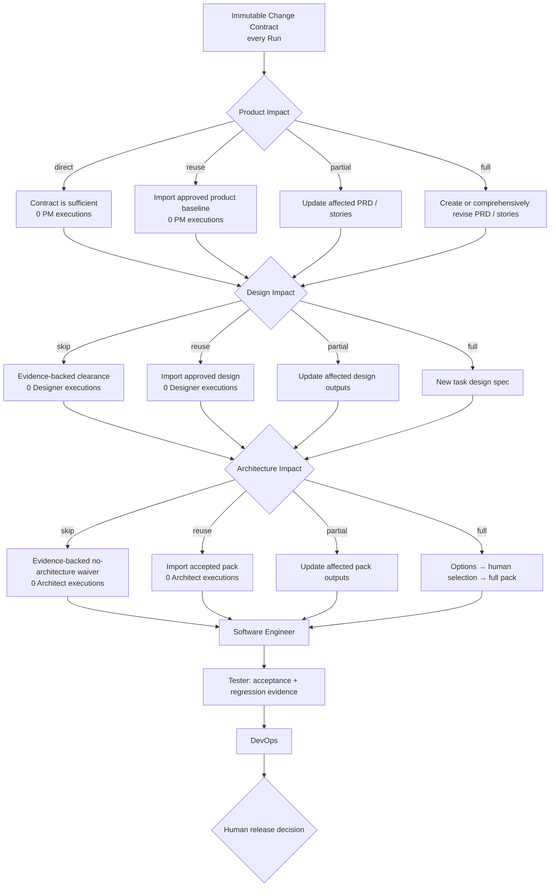
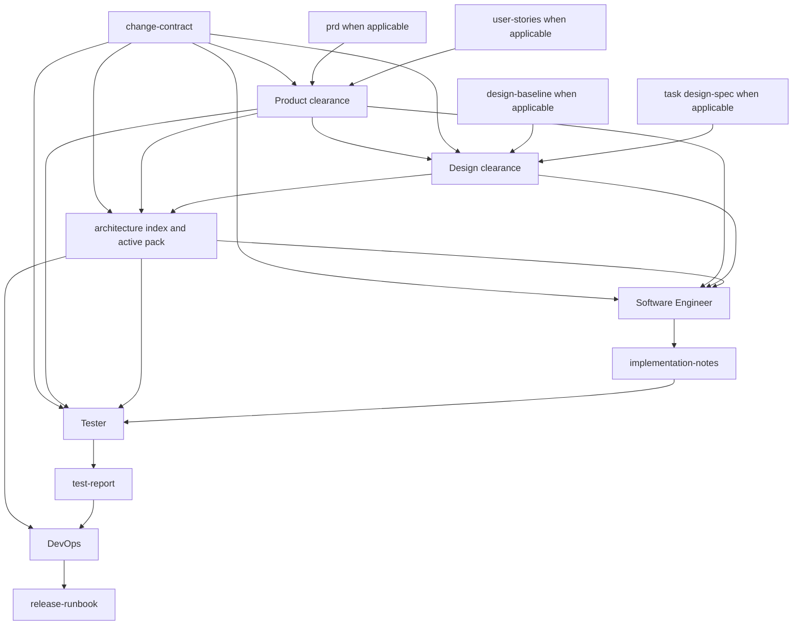

# End-to-End Workflow

The default workflow moves one immutable Run Change Contract to release guidance. The six phases remain ordered, but a role runs only when its impact disposition requires new work. Skipping an Agent execution never skips the evidence or gate.

## Complete flow



Rectangles are roles or work products. Diamonds are gates or human decisions. A failed gate loops back to the role that owns the incomplete work. It never silently advances.

## What each transition means

1. **Change Contract** — The platform creates one immutable, task-scoped human artifact for every Run. It records current and expected behavior, included and excluded scope, acceptance criteria, regression obligations, and evidence references.
2. **Product Impact** — Choose `direct`, `reuse`, `partial`, or `full`. PM / BA runs only for `partial` or `full`; a new Run does not imply a new PRD.
3. **Design Impact** — Choose `skip`, `reuse`, `partial`, or `full`. Designer runs only for `partial` or `full`; a project baseline is reused while a design spec belongs to one task.
4. **Architecture Impact** — Choose `skip`, `reuse`, `partial`, or `full`. Architect runs only for partial/full; Full retains its human selection checkpoint.
5. **Clearances to Software Engineer** — Product, design, and architecture provide complementary conditional contracts: what must change, which experience evidence applies, and which technical constraints remain active.
6. **Software Engineer to Tester** — Implementation notes identify changed scope, checks, known limits, and risks. Tester verifies Change Contract criteria and targeted regression obligations.
7. **Tester and Architecture to DevOps** — DevOps uses accepted decisions, NFRs, risks, and test evidence to prepare a runbook.
8. **DevOps to human release decision** — The runbook makes release, observation, and rollback repeatable. A human still decides whether and when to release.

## Phase contract

| Phase | Owner | Inputs | Outputs | Completion gate |
|---|---|---|---|---|
| Discovery | PM / BA | Human request and configured business Markdown | Immutable `change-contract`; optional current-Run `prd` and `user-stories` heads | Product disposition has sufficient scope, acceptance, source, and regression evidence. |
| Design | Designer | Change Contract plus applicable product evidence | Design clearance; optional baseline, task spec, prototype, and Figma handoff | Skip/reuse is evidence-backed, or selected design outputs are traceable, validated, ready, and unblocked. |
| Architecture | Architect | Change Contract plus applicable product/design evidence | Architecture clearance and applicable indexed pack | Skip/reuse/partial evidence is valid, or full selection and acceptance evidence is complete. |
| Implementation | Software Engineer | Change Contract plus active product, design, and architecture clearances | `implementation-notes` | The agreed implementation and necessary tests are complete. |
| Verification | Tester | Change Contract, applicable acceptance/NFR evidence, and implementation notes | `test-report` | Acceptance criteria, regression obligations, and main risks have real verification evidence. |
| Release | DevOps | Accepted architecture and test evidence | `release-runbook` | Release, monitoring, and rollback guidance is prepared. |

The artifact lists in `ai-native.yaml` describe the complete evidence vocabulary. In a platform-managed Run, the persisted disposition and active execution contract resolve which input alternative is required. This avoids fake PRDs or design specs while keeping old initialized project definitions compatible. The CLI itself does not inspect or approve a gate.

## Product Impact Check

| Mode | Use when | Platform behavior | PM / BA outputs |
|---|---|---|---|
| `direct` | A bounded bug or technical change has an authoritative expected-behavior reference and the Change Contract is sufficient | Approve without Codex | None; never create placeholders |
| `reuse` | Approved PRD/story revisions already cover every relevant criterion | Import exact approved revisions with provenance; no Codex | Inherited current-Run heads |
| `partial` | Direction remains valid but named scope, rules, stories, or criteria change | Import baseline and unlock only affected outputs | Revisions of selected `prd` and/or `user-stories` |
| `full` | New domain or material user, outcome, scope, policy, or product-model change | Run PM / BA on the full selected product contract | Complete selected PRD/story outputs |

`change-contract` is always read-only to every Agent. If its requested outcome changes, create a new Run and Change Contract; an Agent must not silently reinterpret or revise the old one.

## Design Impact Check

| Mode | Use when | Platform behavior | Design outputs |
|---|---|---|---|
| `skip` | No interface, interaction, copy, responsive, or accessibility behavior changes | Record evidence-backed clearance; no Codex | None |
| `reuse` | Approved design describes the exact behavior, including a code defect that merely diverges from it | Import exact approved revisions with provenance; no Codex | Inherited current-Run heads |
| `partial` | Existing surface remains valid but named states or behavior change | Import baseline/spec and unlock only affected outputs | Usually task `design-spec`; baseline only for real project-wide change |
| `full` | New journey, page family, or material experience model | Run Designer for a new task contract | Task-scoped spec; project baseline reused or changed only when justified |

Unknown UI impact cannot be classified as `skip`. Any change to visible behavior, copy, interaction, responsiveness, or accessibility needs at least reuse evidence or Designer work. Prototype and Figma handoff remain optional selected evidence, never automatic requirements.

In a platform-managed run, Architecture uses two executions around its human selection checkpoint. The first requires the index, discovery context, and options. The reviewer records a single documented choice in a `request_changes` review with an independent `Selected option: <ID>` line against the current options revision. The next execution refreshes the index and completes the C4 views, ADRs, patterns, NFRs, and adversarial review. The platform rejects selected-state execution before that evidence, and rejects final approval if an output is missing or a selected-state revision predates the selection.

That full two-execution path is not required for every later requirement. When the project already has a complete approved Architecture pack, a new Run starts with an Architecture Impact Check:

- **Skip architecture work** only for a bounded Bug or technical task with evidence that no architecture boundary, API/schema, data, integration, security, NFR, deployment, or operational behavior changes. This records an explicit current-Run waiver and does not run Architect.
- **Reuse existing architecture** when the requirement changes no boundary, selected option, active rule, quality budget, or accepted decision. The platform imports the approved pack into the current Run with provenance, records the rationale, approves Architecture, and does not run Codex.
- **Partial update** when the selected option is still valid but named views or decisions are affected. The platform imports the pack, preserves Discovery and Options, and lets Codex update only the declared outputs; `architecture.md` is always included so the index stays truthful.
- **Full re-evaluation** when project mode, scope, ownership, rule applicability, option constraints, or the selected direction may change. This uses the normal checkpoint, human selection, and selected-state execution.

Reuse and partial update never make downstream phases read artifacts from another Run directly. The platform creates current-Run heads linked to the approved source revisions, revalidates the baseline against the current workspace and rulebook, and rejects the decision if either the upstream inputs or baseline heads changed during the check.

The same provenance principle applies to Product and Design reuse: downstream phases consume current-Run heads or structured clearances, not an ambiguous "latest" file from another feature.

## Bug fast path

When expected behavior is already authoritative and there is no genuine design or architecture change, a bug can take this route:

```text
Change Contract
→ Product direct
→ Design skip (backend-only) or reuse (implementation differs from approved UI)
→ Architecture skip (no architecture impact) or reuse (accepted pack applies)
→ Software Engineer
→ Tester targeted regression
→ Release decision
```

This skips up to three Codex role executions, not their gates. The Run still needs observable fix criteria, an expected-behavior source, reproduction evidence when available, and targeted regression evidence. Production code never bypasses Verification.

## Artifact flow



The arrows show declared consumption, not file copying. The Architecture node groups the index and its active registered child artifacts. Every role resolves each artifact through `ai-native.yaml` and the artifact owner's role config. See [Configuration](../configuration/README.md).

## Human-owned decisions

AI roles prepare evidence and recommendations. Humans retain:

- final product scope, priority, pricing, policy, and compliance decisions;
- material design decisions that change scope, safety, privacy, or accessibility;
- architecture option selection and final architecture acceptance;
- trust-boundary placement, irreversible migration, vendor lock-in, and risk acceptance;
- exceptions to failed or blocked verification;
- final release approval and timing.

An Agent should stop or mark its artifact blocked when one of these decisions changes the work materially.

## Feedback and rework

The workflow is ordered, but it is not one-way.

- A missing business rule returns to PM / BA or the human owner.
- Missing interface behavior returns to Designer.
- A rejected option or incomplete quality target returns to Architect.
- An implementation defect returns to Software Engineer.
- Missing deployment evidence returns to DevOps or the authorized operator.

When an upstream artifact changes, downstream roles should re-read it, record the new revision or date, and re-check affected gates. Do not assume an old approval covers changed content.

## Architecture index rule

All downstream architecture work starts at the registered `architecture` artifact, which resolves to `architecture.md` by default. That index says which child artifacts are active, pending, blocked, or accepted.

Child architecture artifacts listed as phase inputs give a role the exact evidence it needs. They do not override the index status and do not make pending content active.

## Next guides

- [Role Relationships](../roles/README.md)
- [PM / BA](../roles/pm-ba/README.md)
- [Designer](../roles/designer/README.md)
- [Architect](../roles/architect/README.md)
- [Software Engineer](../roles/software-engineer/README.md)
- [Tester](../roles/tester/README.md)
- [DevOps](../roles/devops/README.md)
