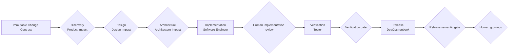

# End-to-End Workflow

This guide is the human-facing summary of the fixed six-phase workflow, impact routing, cross-role handoffs, human gates, and feedback routing. Their canonical definitions live in `ai-native.yaml` and `.ai-sdlc/workflows/default.md`; each role's ordered procedure belongs only in its canonical `workflow.md` and is linked below.

## Six-phase flow

Every Run begins with one immutable Change Contract:

The six phases and their owners are fixed in V1. Product, Design, and Architecture may omit an Agent execution when current evidence supports a smaller route. They never omit the phase clearance or gate.

The Change Contract records current and expected behavior, included and excluded scope, acceptance criteria, regression obligations, non-goals, and evidence references. An Agent cannot edit it. A changed outcome requires a new Run.

## Impact routing

### Product Impact

| Mode | Use when | Result |
|---|---|---|
| `direct` | The Change Contract plus authoritative expected behavior already provides sufficient observable acceptance and regression evidence | Product clearance; no PM / BA execution or placeholder |
| `reuse` | Approved PRD/story revisions cover all relevant criteria | Current-Run imported heads with provenance; no PM / BA execution |
| `partial` | Product direction remains valid but named sections, stories, rules, or criteria change | PM / BA updates only selected outputs |
| `full` | Users, outcome, scope, policy, domain, or product model changes materially | PM / BA creates or comprehensively revises selected outputs |

### Design Impact

| Mode | Use when | Result |
|---|---|---|
| `skip` | Evidence shows no interface, interaction, copy, responsive, or accessibility impact | Design clearance; no Designer execution or placeholder |
| `reuse` | Exact approved design revisions already cover the affected behavior | Current-Run imported heads with provenance; no Designer execution |
| `partial` | Existing surfaces and patterns remain valid but named behavior or states change | Designer updates only selected outputs |
| `full` | A new journey, page family, or material experience model is required | Designer produces the selected task design contract |

Unknown user-visible impact cannot be called `skip`. Runtime-only checks with already defined observable behavior and pass criteria belong in the design spec's Tester-owned deferred-validation ledger.

### Architecture Impact

| Mode | Use when | Result |
|---|---|---|
| `skip` | A bounded bug/technical task has evidenced no boundary, API/schema, data, integration, security, NFR, deployment, or operational impact | Architecture clearance; no Architect execution or placeholder |
| `reuse` | The accepted pack remains fully applicable | Current-Run inherited pack with provenance; no Architect execution |
| `partial` | The selected direction remains valid and affected outputs can be named | Architect refreshes the index and selected affected outputs |
| `full` | Direction, ownership, project mode, rule applicability, constraints, or quality targets may change | Architecture options, human selection, selected-state pack, and separate human acceptance |

A valid disposition must cite current evidence and provenance. If later work reveals omitted impact, reopen the owning Impact Check and invalidate affected downstream approvals.

## Phase and handoff contract

| Phase | Owner | Current inputs | Output or clearance | Gate and next handoff |
|---|---|---|---|---|
| Discovery | PM / BA | Human request, immutable Change Contract, configured business evidence | Product clearance; selected PRD/story revisions only when needed | Scope, sources, observable acceptance, regressions, and human decisions are sufficient for Design |
| Design | Designer | Change Contract, Product clearance, applicable product/design evidence | Design clearance; selected baseline/spec/prototype/Figma evidence only when needed | Required behavior and deferred validations are explicit for Architecture and Implementation |
| Architecture | Architect | Change Contract, Product/Design clearances, current pack, configured evidence and rules | Architecture clearance and applicable indexed pack | Direction is valid for the route; a full pack has human selection and acceptance before Implementation |
| Implementation | Software Engineer | Change Contract plus current Product, Design, and Architecture clearances | Real source/test change and seven-artifact engineering evidence pack | Human verifies the real diff, tests, review, and provenance before unlocking Tester |
| Verification | Tester | Approved implementation, acceptance/regression/design/NFR evidence, risk, and conditional Linked E2E binding | Run-scoped `test-report` and supporting execution evidence | Current applicable evidence passes, or the failure returns to its owner |
| Release | DevOps | Change Contract, accepted Architecture evidence, implementation notes/provenance, and test report | Run-scoped `release-runbook` only | Semantic readiness prepares a named human go/no-go; it never executes release |

The seven Implementation artifacts are `implementation-notes`, `implementation-plan`, `implementation-tasks`, `engineering-session-log`, `engineering-test-evidence`, `engineering-review`, and `engineering-provenance`. They form one evidence pack and do not replace the real source diff or tests.

When Verification requires durable E2E, the Platform contract uses ephemeral staging authoring, validates and promotes only allowlisted test/fixture changes to an explicitly linked separate root, re-hashes the complete promoted executable suite, obtains human approval of that exact baseline, and runs standalone Playwright from the linked root. The [Tester guide](../roles/tester/README.md) owns the human review details.

DevOps may record the expected required-check contract and missing provider evidence. An authorized human or repository/provider system configures CI policy, credentials, branch protection, and required checks.

## Handoff invariants

Every handoff must satisfy all of these conditions:

1. selected outputs exist, or a valid evidence-backed disposition and any imported heads are recorded;
2. artifact paths were resolved by artifact ID and owner rather than guessed;
3. assumptions, limitations, blockers, risks, and unresolved decisions are visible;
4. every claimed human decision has durable human evidence;
5. the phase gate evaluates current heads, not stale revisions;
6. the next role reads the current artifacts rather than relying on chat memory.

The Platform may persist clearances, path pins, reviews, and trusted runner events. A direct IDE session may follow the same artifact contract but cannot claim Web events that did not occur.

## Human-owned decisions

Agents investigate, implement, verify, and prepare recommendations. Humans retain:

- final product scope, priority, pricing, policy, and compliance decisions;
- material design decisions affecting scope, safety, privacy, brand, or accessibility;
- architecture option selection and final Architecture acceptance;
- trust-boundary placement, irreversible migration, vendor commitment, and risk acceptance;
- Tier C/Limited test-isolation exceptions and other verification waivers;
- CI policy, credentials, branch protection, provider authorization, and required-check configuration;
- commit, push, PR publication, merge, deployment, rollback, and publication;
- exceptions to failed or blocked Verification;
- final release go/no-go and timing.

An Agent stops or marks its artifact blocked when a missing human decision would materially change the work.

## Feedback and rework

| Evidence gap or failure | Return to |
|---|---|
| Outcome, scope, business rule, policy, or acceptance ambiguity | Product Impact / PM / BA or human contract owner |
| Interface, content, responsive, or accessibility ambiguity | Design Impact / Designer |
| Boundary, API/schema, data, integration, security, NFR, deployment, or operational ambiguity | Architecture Impact / Architect or human risk owner |
| Product implementation, repository test, or public testability-interface defect | Software Engineer, followed by evidence refresh and Implementation reapproval |
| Linked E2E script defect | Fresh staging Test Author, allowlist validation/promotion, complete-baseline review, and rerun |
| E2E binding, browser, environment, CI/provider, credential, or retention issue | Authorized operator/provider system; Tester and DevOps record the evidence gap |
| Missing or contradictory engineering evidence | Software Engineer |
| Missing or invalid Verification conclusion | Tester |
| Missing runbook guidance | DevOps |
| External release evidence or authorization gap | Named authorized human/operator/system; Release remains blocked |

An upstream change invalidates only affected downstream work, but every affected consumer must reread the new current head and revalidate its gate. No role silently fills a gap owned by another role.

## Role procedures

| Role | Human overview | Canonical ordered procedure |
|---|---|---|
| PM / BA | [PM / BA guide](../roles/pm-ba/README.md) | [PM / BA workflow](../../templates/shared/.ai-sdlc/roles/pm-ba/workflow.md) |
| Designer | [Designer guide](../roles/designer/README.md) | [Designer workflow](../../templates/shared/.ai-sdlc/roles/designer/workflow.md) |
| Architect | [Architect guide](../roles/architect/README.md) | [Architect workflow](../../templates/shared/.ai-sdlc/roles/architect/workflow.md) |
| Software Engineer | [Software Engineer guide](../roles/software-engineer/README.md) | [Software Engineer workflow](../../templates/shared/.ai-sdlc/roles/software-engineer/workflow.md) |
| Tester | [Tester guide](../roles/tester/README.md) | [Tester workflow](../../templates/shared/.ai-sdlc/roles/tester/workflow.md) |
| DevOps | [DevOps guide](../roles/devops/README.md) | [DevOps workflow](../../templates/shared/.ai-sdlc/roles/devops/workflow.md) |

## Related documentation

- [Repository overview](../../README.md)
- [Role ownership and Prompt layers](../roles/README.md)
- [Configuration and artifact paths](../configuration/README.md)
- [Platform runtime contract](../../platform/docs/runtime-contract.md)
- [Platform security model](../../platform/docs/security-model.md)
