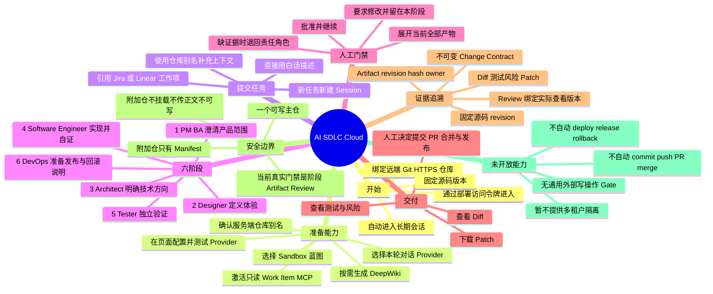
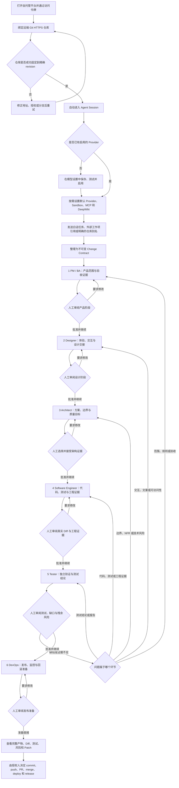

# AI SDLC Cloud 业务流程

这份文档面向产品、业务、项目负责人和审阅人，说明一项需求怎样从“聊天里的一句话”走到“可审核、可下载的代码补丁”。这里讲的是 Cloud Platform 的默认主路径；可选的项目初始化器不是使用 Cloud 的前提。

## 产品定位

AI SDLC Cloud 是一个可自托管的、以对话为入口的软件交付协作工具。用户绑定远端 Git 仓库后，可以直接描述目标，也可以引用 Jira、Linear 等外部工作项。平台把任务整理成一份不可变的任务约定，再按固定顺序组织 PM / BA、Designer、Architect、Software Engineer、Tester、DevOps 六个角色工作。

它的核心价值不是“替人做完并上线”，而是把需求、设计、技术决策、实现、测试和发布准备串成一条看得见、可以逐阶段审阅和返工的证据链。最终交付是 Diff、测试与风险说明、完整产物和可下载 Patch；提交、推送、创建 PR、合并、部署和发布仍由人或另一个明确授权的系统完成。

当前产品适合同一信任域内的自托管团队，是单租户 MVP，不是面向互不信任客户的多租户 SaaS。

## 一张思维导图

## 从首次进入到最终交付

返工按问题归属回到 PM / BA、Designer、Architect、Software Engineer 或 Tester，不是所有返工都要从头重跑。只有受上游变更影响的下游产物和批准需要刷新。

## 1. 用户首次使用

首次使用可以按下面的顺序理解：

1. 运维者先完成平台部署、访问令牌、Git 凭据 Profile、Worker 和可选 MCP Adapter 配置；对话 Provider 不再要求写入服务器 `.env`。
2. 用户在浏览器中输入部署级访问令牌。它是当前单租户部署的访问门禁，不是个人账号或组织身份。
3. 用户点击“绑定仓库”，填写远端 Git HTTPS 地址。公共仓库不需要授权；私有仓库只能选择服务端已经配置好的 Credential Profile。
4. 用户可选填分支、Tag 或 Commit；不填时使用远端默认分支。
5. 平台校验并拉取仓库，把源码固定到一个精确 Git revision，生成不消耗模型额度的 Repository Manifest，然后直接打开一个长期 Agent Session。
6. 仓库就绪后，如尚无可用模型，用户从页头或输入框旁进入“模型设置”。OpenAI 固定官方地址，只填 model 和 API Key；其他槽位再填 endpoint。点击一次“保存、测试并启用”，成功后无需重启 API。
7. 用户可继续调整仓库能力，也可以直接发消息。只有明确需要工作时，平台才懒启动该 Session 的 Sandbox。

远端仓库不需要预先安装 `CLAUDE.md`、`AGENTS.md`、`.codex` 或 `ai-native.yaml`。六角色、流程和产物模板由平台在仓库外的固定 Control Pack 提供。

## 2. 远端仓库绑定与版本规则

绑定的不是一个会不断漂移的“最新仓库”，而是一次可追踪的源码快照：

- 只接受符合平台策略的 Git HTTPS 地址；地址中不能夹带账号、查询参数或锚点。
- Git Token 不进入浏览器。浏览器只提交 Credential Profile 的标识，服务端在拉取时短时使用实际凭据。
- 平台记录仓库 URL、解析后的 ref 和完整 revision。对话、DeepWiki、Sandbox 和 Run 都能说明自己基于哪个版本。
- 绑定时会确定性生成 Repository Manifest，用来记录语言、入口、文档、测试、构建和关键路径线索；不会自动调用模型生成 DeepWiki。
- 点击“同步仓库”会产生新的当前快照。已经存在的 Session 和 Run 继续使用各自固定的旧 revision，不会悄悄切到新代码。
- 想基于同步后的版本开始另一项工作，应新建 Agent Session。

绑定只把仓库带入平台的受管工作区，不会向远端推送代码，也不会创建 PR。

## 3. 仓库能力设置

“仓库能力设置”集中管理开始工作前最常用的选项：

| 设置 | 业务含义 | 重要边界 |
|---|---|---|
| Repo alias | 在对话中用 `@别名` 指向仓库 | 别名不是分支名，实际源码仍由服务端固定 revision |
| 默认 Provider | 选择默认负责聊天、任务规划、只读工具选择和 DeepWiki 的模型服务 | 用户仍可在输入框为下一条消息切换 Provider，历史不会清空 |
| Sandbox 蓝图 | 选择执行代码任务时使用的固定运行环境说明 | 首次写代码时才启动；Session 固定源码版本和蓝图版本 |
| 已安装 MCP | 激活管理员已经安装并授权的外部工作项读取能力 | 当前只开放只读 Work Item MCP，不开放任意外部写操作 |
| DeepWiki | 为当前源码 revision 生成人可读的项目知识 | 必须手工触发，会消耗所选 Provider 额度；同步后旧版本会标记为 stale |

Provider 能聊天不等于能启动工作。要让 Agent 调用只读 MCP、创建 Run 或在批准后自动继续，所选 Provider 必须真实支持原生 tool calling。只支持文本的 Provider 仍可用于普通问答或 DeepWiki。

Provider Profile 是实例级能力，不要求每个仓库重复保存密钥。全局“模型设置”固定显示 OpenAI、LM Studio、Ollama 和 Custom 四张卡；可以编辑、检查、启用或停用。Secret 输入框不会回填，公开页面只显示“是否已保存”和脱敏后的 Host。配置存在 API 专属加密 Vault，不进入仓库、对话、DeepWiki、Sandbox 或阶段 Worker。

## 4. 消息和任务从哪里来

所有任务都从同一个聊天框进入，不要求用户先判断属于哪种流程：

| 来源 | 用户怎么说 | 平台怎么处理 |
|---|---|---|
| 手工描述 | “修复重复下单，并补充回归测试” | 直接把文字、仓库证据和必要追问整理进 Change Contract |
| Jira / Linear 等工作项 | “处理 Linear ENG-123” | 当前 Provider 从本项目已激活的只读 MCP 读取标准化字段，再和用户文字合并 |
| 仓库上下文 | “在 `@backend` 实现，参考 `@shared-contracts`” | 主仓库进入可写 Sandbox；明确提到的附加仓库只提供受限 Manifest 线索 |
| 延续当前工作 | “继续当前 Run” | 沿用本 Session 的 Sandbox、Run 和已批准产物 |
| 另一项工作 | 新建 Agent Session 后再描述 | 建立独立任务边界，避免两项工作混进同一个可写工作区 |

如果 MCP 没有安装、未激活、授权失效或读取失败，平台会清楚报错，不会编造外部工作项；用户可以改用手工描述继续。

### `@repo` 到底表示什么

每个已绑定项目都有一个服务端管理的 Repo alias，例如 `@backend`。它让用户在自然语言里明确“这句话说的是哪个仓库”，不是给 Agent 更高权限。

一个 Session 只有一个可写主仓库。消息中明确提到的额外 `@repo`：

- 各自固定到精确 revision；
- 每轮最多引用 4 个；
- 只把经过校验、受大小限制的 Repository Manifest 路径线索交给 Planner 和六角色；
- 不把附加仓库挂载到 Worker，不发送整仓正文，也不给写权限；
- 会被写入不可变 Change Contract，使后续角色看到同一份跨仓上下文。

需要新增或替换一个 Run 的仓库上下文时，应新建 Agent Session。输入 `involve Architect` 或 `involve Tester` 只表示希望该角色重点关注，不会改变固定顺序，也不会跳过任何阶段门禁。

## 5. 六角色怎样完整串联

每个 Run 都从同一份不可变 Change Contract 开始。它记录当前与预期行为、包含和排除范围、验收条件、回归义务、非目标和证据引用。角色不能修改这份约定；如果目标发生变化，应创建新的 Run。

六个阶段的顺序和归属固定。Product、Design、Architecture 可以根据证据选择更小的路线，例如直接放行、复用、部分更新或完整更新；这可能省略一次角色执行，但不能省略该阶段的证据、人工决定或门禁。

| 阶段与角色 | 业务问题 | 主要产物 |
|---|---|---|
| 任务基础 | “这次到底要改变什么，什么不做，怎样算完成？” | 不可变 `change-contract` |
| 1. Discovery — PM / BA | “用户、业务规则、范围和验收是否说清楚了？” | Product clearance；按所选路线更新 `prd`、`user-stories`，不需要时不制造占位文档 |
| 2. Design — Designer | “用户会看到什么、怎样操作、各种状态怎样表现？” | Design clearance；按需提供 `design-baseline`、`design-spec`、原型和 Figma 交接说明 |
| 3. Architecture — Architect | “系统边界、方案取舍、质量目标和技术风险是否可接受？” | Architecture clearance；按需提供架构索引、方案比较、C4 图、ADR、模式、NFR 和对抗性审查 |
| 4. Implementation — Software Engineer | “实际代码是否以最小完整改动实现了约定？” | 真实源码/测试 Diff，以及实施说明、计划、任务、过程日志、独立测试证据、七视角工程审查和 provenance 共七份证据 |
| 5. Verification — Tester | “验收、回归、设计延后检查、NFR 和主要风险是否有独立证据？” | Run 级 `test-report`，包含覆盖、执行证据、失败、缺口、缺陷、风险和建议 |
| 6. Release — DevOps | “如果由人发布，步骤、观察、停止和回滚条件是否清楚？” | Run 级 `release-runbook`，包含前置条件、发布顺序、健康检查、监控、回滚和事件升级说明 |

详细的阶段输入、路由和归属以[端到端六阶段合同](../../../guidelines/workflow/README.md)为准。

## 6. 人工审阅和返工

每个角色交付后，对话会进入“等待决定”：

1. 审阅人先展开并成功读取该阶段全部当前产物。产物为空、读取失败或不是当前产物头时，平台不会允许批准。
2. 选择“批准并继续”，当前产物头和审阅决定会被保存，下一角色只消费已批准的上游证据。
3. 选择“要求修改”时必须写清具体意见；Run 留在当前阶段，角色根据意见产生新的产物 revision，旧版本保留为历史而不是被悄悄覆盖。
4. 如果后续发现上游范围、设计、架构或实现有问题，问题会退回真正的责任角色。受影响的下游批准失效，相关角色读取新产物后再验证；不相关的工作不必机械重做。
5. 阶段显示 Blocked 表示缺少决定、证据、环境或权限。正确做法是补齐责任方信息并重试，而不是用聊天里的口头承诺绕过门禁。

人始终保留产品范围与政策、重大设计选择、架构方案与风险接受、验证例外、CI 与分支保护、提交与 PR、合并、部署、回滚以及最终 go / no-go 的决定权。“批准阶段产物”只批准这批证据，不等于授权任何外部副作用。

## 7. 最终交付是什么

六阶段完成后，用户可以在对话里看到产物摘要、Diff、测试结果和风险，在高级审计入口查看完整 Artifact、Review、Patch 与 Run 日志。

一次 Cloud 交付的核心内容包括：

- 基于固定源码 revision 的 Changeset / Diff；
- 当前代码和测试改动；
- 六阶段的当前产物、人工审阅和版本关系；
- 独立测试结论、未测试范围、缺陷和残余风险；
- 发布、监控、回滚和事件升级说明；
- 可下载、可在团队现有 Git 流程中再次审核和应用的 Patch。

“Ready for human go / no-go”只表示证据和操作说明准备好了，不代表代码已提交、PR 已创建、变更已合并或软件已发布。

## 8. 异常与恢复

平台优先保持版本一致和避免重复执行。常见情况可以这样处理：

| 情况 | 平台行为 | 恢复方式 |
|---|---|---|
| 仓库绑定或同步失败 | 不发布未完成的源码快照，也不能基于未知版本开始工作 | 检查 HTTPS 地址、允许的 Origin、Credential Profile、ref 和网络后重试 |
| 同步后旧 Session 仍显示旧代码 | 这是版本固定的预期行为，不是缓存错误 | 继续旧 Run 就保留旧 revision；要用新代码则新建 Session |
| Provider 未配置、不可达或模型不可用 | 明确区分配置、认证、网络、模型和协议问题 | 在页面“模型设置”中修改并重新检查，或切换到已启用 Provider；无需改 `.env` 或重启 API |
| Provider 只能文本对话 | 可以问答或生成 DeepWiki，但不会伪造工具调用来启动工作 | 切换到真实支持 tool calling 的 Provider，再发起或继续工作 |
| MCP 读取失败 | 不猜测 Jira / Linear 内容，不启动一个依据不明的任务 | 修复管理员 Adapter / 授权，或把任务内容手工写进聊天框 |
| Sandbox 或阶段执行失败 | 记录失败事件，不自动越过当前阶段 | 运维者修复 Worker 镜像、执行信任、容量或环境后重试；恢复仍使用 Session 固定 revision |
| API 重启时有消息、工具或 DeepWiki 正在运行 | 未完成操作会标记失败，不自动重放，避免重复副作用 | 检查事件后明确重试原操作 |
| 当前产物为空或读取失败 | 审阅按钮保持受限，不把“看不到”当成“已看过” | 重试读取；仍失败时进入高级审计检查产物和 Run 日志 |
| Tester 发现缺陷或证据缺口 | Verification 保持失败或 Blocked，并按归属退回 | 修复责任方内容，刷新工程证据和受影响批准，再重新验证 |
| DeepWiki 在仓库同步后变为 stale | 历史内容保留，但不会冒充当前版本知识 | 为新 revision 手工重新生成；旧 Session 仍可追溯旧版本 |
| 真实阶段并发已满 | 当前 MVP 不排耐久队列，直接拒绝新增执行 | 等正在运行的阶段完成后再重试 |

平台可以从 Session 固定的历史快照重建 Sandbox；恢复不会偷偷拿项目当前最新 revision 替代原任务版本。

## 9. 当前明确不做什么

为避免把“辅助交付”误解成“全自动上线”，当前边界如下：

- 不提供多租户用户、组织、RBAC、计费和强租户隔离；
- 不自动 commit、push、创建 PR、merge、配置分支保护、deploy、release 或执行生产 rollback；
- 不把 Git Token、对话 Provider 密钥、平台令牌、数据库凭据或 Docker socket 交给 Worker；浏览器只在保存时提交新 Provider Secret，之后永远不会从 API 取回它；
- 不开放通用外部写操作或带副作用 MCP，当前 Work Item MCP 只读；
- 不让额外 `@repo` 变成第二个可写仓库，也不把附加仓整仓正文塞进 Prompt；
- 不因 `involve` 指令改动六阶段顺序、跳过上游角色或绕过人工门禁；
- 不在绑定仓库时自动花模型额度生成 DeepWiki，也不宣称提供完整语义图谱或无限上下文；
- 不替远端仓库自动创作一整套新的浏览器 E2E 基础设施；Cloud Tester 只运行仓库中已经存在且可在 Worker 执行的测试，缺少验收必需证据时会明确 Blocked；
- 不把 Fake / Demo 执行当作真实 Agent、测试或发布证据；
- 不提供耐久任务队列、暂停/取消和多 API 实例协同；
- 不在平台模板升级时静默改写旧 Project、Session 或 Run。

## 相关文档

- [Cloud Platform 部署与配置](../../README.md)
- [项目技术设计与架构图](../technical-design/README.md)
- [端到端六阶段合同](../../../guidelines/workflow/README.md)
- [六角色与 Prompt 分层](../../../guidelines/roles/README.md)
- [运行时合同](../runtime-contract.md)
- [安全模型](../security-model.md)
- [仓库总览](../../../README.md)
