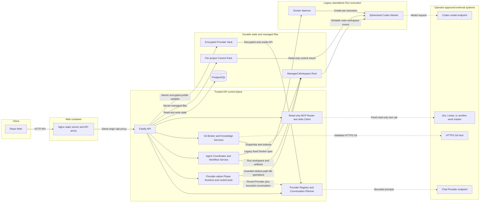
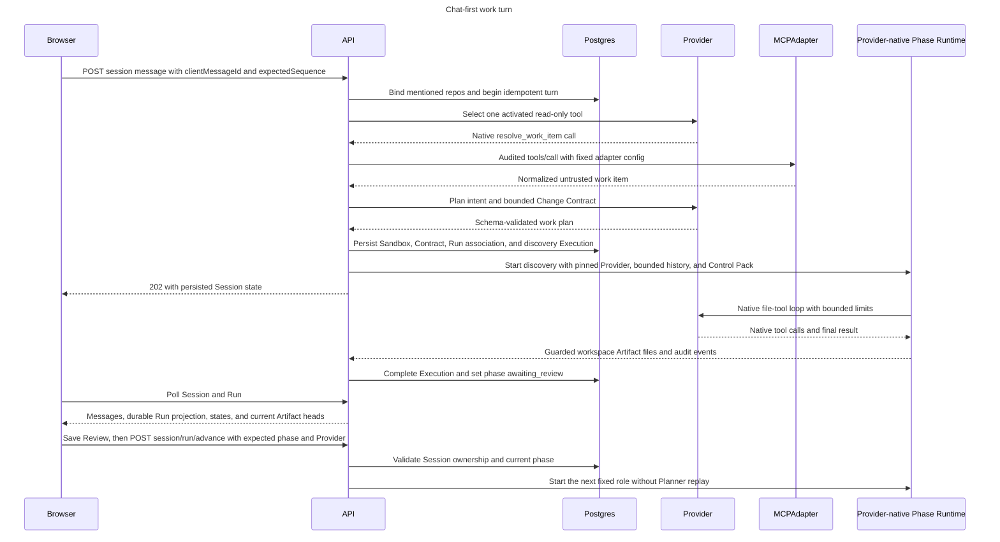
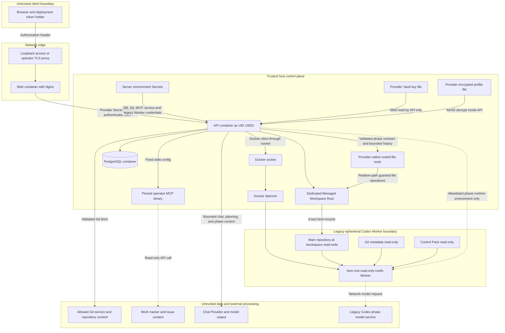

# AI SDLC Cloud Platform 技术设计

本文描述当前仓库已经实现的 Chat-first Cloud MVP，重点覆盖远程 Git 项目的主路径。它是实现说明，不是未来架构蓝图，也不构成生产多租户安全承诺。`legacy-local` API 仍为兼容而保留，但其 Host runner、Desktop Figma 和独立 E2E 能力不属于本文的 Cloud 主路径。

面向产品和审阅人的白话流程见[业务流程与思维导图](../business-flow/README.md)。运维步骤见 [Cloud 运行指南](../../README.md)，更完整的威胁假设见 [安全模型](../security-model.md)，阶段执行约束见 [运行时合同](../runtime-contract.md)。

## 1. 设计目标与不变量

当前实现用以下不变量约束“对话驱动的软件交付”：

1. 浏览器在普通运行时只提交仓库 URL、消息、幂等 ID、预期序号和可选 Provider；唯一例外是持有部署令牌的管理员可在独立模型设置接口一次性提交 Provider endpoint 和新 Secret。API 不会回传 Secret，仓库路径、Worker 镜像、命令、挂载和权威对话历史仍由服务端决定。
2. 每个 Agent Session 最多一个可写主仓库，并固定一个完整 Git revision。附加 `@repo` 只提供固定 revision 的有界 Manifest 摘要，不提供源码正文或写权限。
3. 对话 Provider 负责问答、意图规划、只读 MCP 选择和手工 DeepWiki；在 Chat-first Run 中，同一轮选择且通过原生 tool-call 探针的 Provider 还通过 Provider-native Runtime 执行六阶段。能聊天仍不等于能执行代码；不具备原生工具调用的配置不能进入阶段执行。
4. Run 固定 `baseRevision`、Control Pack `definitionVersion`、Change Contract 和 Workspace。项目同步不会静默改变已有 Session、Ask Thread 或 Run。
5. 阶段顺序和 owner 固定为 PM/BA、Designer、Architect、Software Engineer、Tester、DevOps。下游只消费当前、已批准、owner 正确的 Artifact head。
6. Artifact 审核绑定审核者实际看到的 revision/hash。过期页面不能批准更新后的产物。
7. Chat-first Provider-native 阶段只获得仓库相对路径的有界文件工具，不获得任意 Shell、命令、网络工具或 Figma；它复用 Workspace/Artifact 保护、回滚和采集规则。兼容的独立远程 Run/Codex 路径仍只走管理员预检并固定到 image ID 的 Docker Worker，配置缺失时 fail closed，不回退到 Host 执行。
8. 最终交付边界是可审阅的 Artifact、Diff、测试证据和二进制 Patch。平台本身不 push、不创建 PR、不合并、不部署、不发布。

## 2. 系统架构

### 2.1 组件职责

| 组件 | 当前职责 | 明确不负责 |
|---|---|---|
| React Web | 仓库绑定、持久会话、Provider 配置与选择、中央 Run 全状态反馈、Artifact 展开审阅、确定性继续和高级 Run 审计 | 读取已保存 Secret，决定仓库路径、Worker 镜像、MCP 命令、权威历史或阶段权限 |
| Nginx Web container | 提供静态 Web，并把 `/api/` 反向代理到 API | TLS 证书自动管理；远程部署需另置 TLS 终止层 |
| Fastify API | Bearer 校验、精确 CORS、DTO 校验、服务编排、公开错误脱敏和 Cloud 资源访问检查 | 多用户身份、RBAC、租户隔离 |
| PostgreSQL | 保存 Project、Session、消息/事件、工具审计、Workspace、Run、Execution、Artifact revision、Review、DeepWiki 和 Changeset 元数据 | 保存 Git、Provider 或 MCP Secret |
| Encrypted Provider Vault | 保存四个实例级 Provider 槽位、启停状态、检查结果，以及 AEAD 加密后的 endpoint / API Key；支持单实例 CAS 与原子文件替换 | 多租户 Secret、多个 Custom、跨 API 副本一致性或企业 KMS |
| Cloud Project Service / Git Broker | 校验 URL/ref/DNS，使用短时 AskPass 凭据拉取，固定 revision，物化 Project Snapshot、Session Sandbox 和 Run Workspace | 把 Git 凭据传给浏览器、Prompt 或 Worker |
| Knowledge Services | 生成并复验确定性 DeepWiki Lite；为 Ask、Planner 和兼容 Codex 阶段执行提供 revision-bound 线索 | 将索引当作完整语义 Wiki，或证明未索引内容不存在；Provider-native 阶段当前依靠 Change Contract、输入 manifest 与 rooted 仓库读取 |
| Provider Registry / Planner | 统一 OpenAI Responses、OpenAI Chat、Ollama Chat 协议；固定一次请求的 Provider 快照，完成问答、工作意图识别、Change Contract 规划和原生 tool call 解析 | 把普通模型文本解析成可执行工具调用，或把 Secret 放进 Workspace/工具参数 |
| MCP Router / stdio Client | 让模型从项目已激活的只读 Work Item Adapter 中选择一个，先审计再执行并按显式 mapping 归一化结果 | 浏览器自定义 command/argv/tool/Secret，或通用外部写入 |
| Agent Coordinator / Workflow Service | 固定角色顺序，选择已批准 Artifact，创建异步 Execution，校验阶段门禁并推进状态 | 自动替人批准，或因 `involve` 跳过上游 owner |
| Provider-native Phase Runtime | 继承当前会话 Provider 与服务端有界历史；只接受原生 tool calls；以 rooted tool host 列出、读取、搜索、建目录、写文件和应用补丁；记录模型与工具事件 | 任意 Shell/命令、网络工具、Desktop Figma、外部副作用；本版生产接线也不暴露 `run_check` |
| Codex Terminal Runner guards | 两条阶段路径共同复用未选产物/Control/敏感文件保护、选中输出回滚、Verification/Release Workspace 约束和 Artifact 采集 | 把 Provider Secret 注入 Workspace，或把文件工具变成命令执行器 |
| Docker Codex Worker（兼容路径） | 为旧的独立远程 Run/Codex API 组装固定 Docker spec、分层 Prompt、JSONL 事件和阶段输出 | 为远程项目回退到 Host；获取附加仓源码、Docker socket、Git Token、数据库凭据或平台 Access Token；为 Release 执行部署 |

实现组合入口是 [API app](../../apps/api/src/app.ts)，Web 路由和 Agent 工作台分别位于 [App.tsx](../../apps/web/src/App.tsx) 与 [agent-workspace-page.tsx](../../apps/web/src/pages/agent-workspace-page.tsx)。公开 DTO 和输入边界由 [contracts](../../packages/contracts/src/index.ts) 的 Zod schema 共享。

## 3. Chat-first 请求流

下面是“消息明确引用一个外部工作项，并启动新 Run”的成功路径。没有外部工作项时会省略 MCP 两步；普通问答则走 Ask 检索并在创建 Sandbox 之前结束。

### 3.1 消息接收与并发

- `clientMessageId` 与请求 fingerprint 提供幂等性；相同 ID 携带不同内容会冲突。
- `expectedSequence` 是乐观并发控制。服务端先检查幂等 replay，再校验序号和 `turn_state`。
- Agent 创建新 Run 时，会在同一数据库事务里写入 Run、六阶段、Change Contract、Workspace / Sandbox busy 状态和 `agent_session_runs` 关联。Session 明细把关联表投影成带 `workflowRunId`、触发消息和触发回合 Provider 的 `runs`；Run 明细同时返回服务端解析的 Session execution origin，避免项目 Run 列表或被删改的 URL 把同一 Run 误显示为 standalone。每次阶段 Execution 另行记录实际 Provider/model。Web 以关联表投影作为 Run 身份真相，`sdlc.run-created` Event 只作为旧响应兼容与展示回退。相同消息重试不会重放 Provider、MCP 或创建第二个 Run。
- 单进程内按 Session 串行化消息，数据库事务对 Session 行加锁。它不是跨进程分布式锁，因此 Cloud 只支持一个 API 实例。
- 浏览器不能提交历史数组作为权威上下文；服务端从 PostgreSQL 取最近的受限历史。每条 assistant 消息保存实际 Provider 和模型。
- 审核后的继续不再伪造成一条用户消息。`POST /api/agent-sessions/:sessionId/runs/:runId/advance` 校验 Run 属于该 Session、`expectedPhaseId` 仍是当前或刚批准阶段，并固定本次 `providerId`；随后 Coordinator 直接推进现有 Run，不重新调用 Planner。

### 3.2 意图分支

| Planner 结果 | 行为 |
|---|---|
| `chat` | Ask Service 在主仓固定 revision 上做有界检索和引用校验；不创建 Sandbox 或 Run |
| `work` 且关键输入不足 | 只问一个会实质改变结果的澄清问题；不启动执行 |
| `work` 且 Provider 没有声明原生 tool calling | 保留消息并提示切换 Provider；不把普通文本冒充工具调用 |
| 新工作且 Session 已有 Run | 拒绝把另一项工作混入同一个可写 Sandbox，要求新建 Session |
| 明确“继续当前 Run” | 复用同一 Sandbox、Run 和已固定上下文，只启动当前可执行角色 |

`Agent Sandbox` 是 Session 级、固定 revision 的持久受管 Workspace 记录，不是常驻容器。Chat-first 阶段由 API 内 Provider-native Runtime 在这个 Workspace 上执行受限文件工具；旧的独立远程 Run/Codex 路径才为每个阶段临时启动 Worker。两条路径结束后 Workspace 都继续保留，供下阶段、审阅与 Patch 使用。

相关实现： [AgentSessionService](../../apps/api/src/services/agent/agent-session-service.ts)、[ConversationPlanner](../../apps/api/src/services/agent/conversation-planner.ts)、[AgentSdlcCoordinator](../../apps/api/src/services/agent/agent-sdlc-coordinator.ts) 和 [WorkflowService](../../apps/api/src/services/workflow-service.ts)。

## 4. 数据与状态模型

数据库 schema 由应用启动时增量建立，定义见 [schema.ts](../../apps/api/src/db/schema.ts)，事务和状态转换见 [store.ts](../../apps/api/src/db/store.ts)。主要聚合如下。

| 聚合 | 关键表 | 关键约束 |
|---|---|---|
| Project / Repository | `projects`, `project_agent_settings`, `managed_workspaces`, `knowledge_snapshots` | 远程仓必须是 HTTPS；活动 snapshot 唯一；revision 为完整 SHA-1/SHA-256；Control Pack 版本独立于仓库 |
| Conversation | `agent_sessions`, `agent_session_repositories`, `agent_messages`, `agent_events` | 每 Session 最多一个 `write` 仓；消息/事件 sequence 唯一；用户消息有幂等键和 fingerprint；“删除”只把 idle 且没有 active Run 的 Session 归档，不级联删除审计记录 |
| Tool / Gate | `agent_tool_calls`, `agent_human_gates` | 工具参数和输出只留 SHA-256/安全摘要；Human Gate 表结构为受限能力预留，当前 Cloud 主链真正生效的人工门禁是 Artifact Review，通用外部副作用 Gate 尚未接入生产链路 |
| Sandbox / Run linkage | `agent_sandboxes`, `agent_session_runs`, `workflow_runs` | Sandbox、Run、主仓 revision 一致；一个 Workspace 不被多个 Run 复用；Session DTO 直接投影持久关联，事件不是 Run 身份真相 |
| SDLC | `phase_runs`, `executions`, `artifacts`, `reviews`, `tickets`, `execution_events` | 固定六阶段；每个 Artifact key 只有一个未 supersede 的 head；Review 固定实际 head IDs |
| Delivery | `run_changesets` | Patch 固定 base revision、文件清单、字节数和 SHA-256；Patch 正文作为 `bytea` 保存 |
| LLM knowledge | `deepwiki_generations`, 兼容用 `ask_threads` / `ask_messages` | Provider、模型、revision、manifest、引用和 token usage 可追踪；同步后旧生成标记 stale |

### 4.1 主要状态转换

| 对象 | 主路径 | 失败/恢复语义 |
|---|---|---|
| Repository | `importing/syncing -> ready`，内部 operation 为 `queued -> running`，并经过 validating/fetching/resolving/materializing/indexing/publishing | 失败进入 `failed`，保留安全错误；未完成的仓库 operation 可在重启后重新调度 |
| Agent turn | `idle -> running -> idle` | 本轮失败时消息标记 failed，写入 `turn.failed`，短暂进入 interrupted 后恢复 idle |
| Sandbox | `starting -> ready -> busy` | 启动中断标记 failed；ready/busy Workspace 仍需 revision 和 DB 引用一致 |
| Execution / Phase | `ready -> running -> awaiting_review -> approved` | Runner 失败使 Execution 和 Phase 进入 failed；`request_changes` 使当前阶段进入 changes_requested，并使受影响下游失效 |
| Artifact | `pending -> approved` 或 `changes_requested`；新 revision 把旧 head 置为 superseded | revision 以 parent ID 串联；stale reviewer 因 head ID 不同而被拒绝 |
| Run | `active -> completed` | 只有最后一个阶段批准后完成；失败阶段保留在同一 Run 中供修复后继续 |
| DeepWiki generation | `queued -> scanning -> generating -> validating -> ready` | HTTP 只负责可靠入队，后台任务不继承浏览器取消信号；格式无效时最多自动整理一次；失败保留安全错误和上一份 published 结果；发布前再次核对 revision，仓库变化后结果只能 stale/failed，不自动重跑 |

三个贯穿全链的绑定值是：源码 `revision`、Control Pack `definitionVersion`、内容 `manifestHash/contentHash`。只要其中一项与当前持久记录或物理 Workspace 不一致，Ask、阶段输入选择或审批都会拒绝继续。

## 5. 一个可写主仓与有界附加仓 Manifest

### 5.1 主仓

- 仓库绑定完成后，Session 的主仓绑定到活动 Project Snapshot 的 exact revision，数据库唯一索引保证只有一个 `access_mode = write`。
- 第一个工作回合从该 Snapshot 物化一个 Session Sandbox。新 Run 直接引用这个 Sandbox Workspace，不再克隆第二份可写目录。
- Chat-first rooted tools 只以这一份主仓 Workspace 为根，并排除 `.git`、Secret 与控制路径；兼容 Codex Worker 也只挂载该主仓，且把 `.git` 与仓库外 Control Pack 只读挂载。
- 项目后来同步到新 revision 时，已有 Session 和 Run 仍使用旧 revision。旧 Snapshot 被删除或损坏时 fail closed，而不是静默切换。

### 5.2 附加 `@repo`

消息中出现服务端已登记的 `@alias` 时，平台仅在 Session 空闲且目标仓库/知识 Snapshot ready 时增加只读绑定：

- 一个 Session 最多绑定 16 个仓库，包括主仓；每轮最多解析 4 个被明确提及的只读仓。
- 每个只读上下文只含 `repoAlias`、`sourceRevision`、`manifestHash` 和最多 6,000 字符的 `summary`；一轮 summary 总计最多 24,000 字符。
- summary 只包含文件数、总字节、语言统计，以及 entry/docs/tests/build/key-path 的计数和有界相对路径。每类最多 12 条路径，单路径最多 512 字符。
- DTO 不含 Project ID、仓库 URL、Workspace 路径、绝对路径、凭据或文件正文；摘要再次做疑似 Secret 脱敏。
- 这些摘要被写入不可变 Change Contract，所有角色读取同一份参考。附加仓不会暴露给 Provider-native 文件工具，也不会挂载进兼容 Worker；它们不能获得 Shell、Git、网络或写权限。
- 继续已有 Run 时，显式提及的附加仓必须与 Contract 中的 alias、revision、manifest hash 和 summary 完全一致；否则要求新建 Session。

边界实现见 [read-only-repository-context.ts](../../apps/api/src/services/agent/read-only-repository-context.ts)，Contract schema 见 [contracts](../../packages/contracts/src/index.ts)，运行时 Prompt 的强制说明见 [codex-runner.ts](../../apps/api/src/services/codex-runner.ts)。

## 6. Provider-native 主路径与 Codex 兼容路径

| 层 | 可选实现 | 当前输入 | 当前权限 | 产出 |
|---|---|---|---|---|
| Chat / Planning Provider | OpenAI、LM Studio、Ollama、Custom | 受限历史、主仓检索片段、只读 Manifest、归一化 Work Item | 无 Shell；无直接文件写入；仅可返回服务端验证的结构化结果或原生 tool call | 问答、意图计划、Change Contract 草案、MCP 选择、手工 DeepWiki |
| Chat-first Phase Runtime | `ProviderNativeAgentRuntime` + `ProviderPhaseExecutor` + rooted tool host | 当前会话所选 Provider、服务端有界历史、当前阶段合同、Change Contract、已批准上游 Artifact manifest、主仓 Workspace | 原生 tool call；仓库相对路径的 list/read/search/create-directory/write/apply-patch；分阶段调用数、时间、模型输出和工具输出上限 | 源码/产物更新、实际 Provider/model、受限工具事件、可采集 Artifact |
| Shared workspace guards | `CodexTerminalRunner.runProviderNative` 的无进程保护层 | 当前和未选 Artifact、Control Pack、`.git`、敏感路径、Verification/Release revision token | 未选输出/控制文件保护、所选输出失败回滚、输出更新与 Artifact 完整性检查 | 与旧 Run 一致的 Artifact revision、Review 和 Changeset 输入 |
| Legacy standalone Run | Docker 内固定版本 Codex CLI | 当前阶段 Prompt、Change Contract、DeepWiki 线索、已批准上游 Artifact、主仓 Workspace | 主仓 Workspace 可写；Control Pack 和 `.git` 只读；固定资源/环境/挂载 | 兼容的源码/测试修改、当前角色 Artifact、JSONL 执行事件 |

Provider Registry 的 endpoint、protocol、model 和 API key 来自 API 专属加密 Vault。持有部署级 Bearer Token 的管理员在 Web 四张固定卡中保存配置；Secret 输入框不回填，公开 DTO 只返回是否已保存、脱敏 Host、模型、版本、启停和最近检查。配置写入采用 optimistic version，更新会让旧检查失效并先停用；只有当前版本的 JSON 检查和可选原生 tool-call 探针都通过后才能启用。保存后 Registry 在线替换，不需要重启 API，也不会 fallback 到另一个 Provider。

LM Studio 固定映射为 OpenAI-compatible Chat Completions：API 调用 `POST /v1/chat/completions`，JSON 产物通过 `response_format.json_schema` 约束并继续在服务端校验。`openai/gpt-oss-20b` 可以作为模型 ID 使用，但能否通过检查仍取决于当前 LM Studio 版本、推理运行时和实际加载的模型；设计不把“模型支持”推断成“所有 LM Studio 版本都兼容”。检查失败时运维者先确认模型已加载并升级 LM Studio/推理运行时，仍失败则换用支持结构化 JSON 的模型，再从同一页面重试；协议由平台固定处理。

早期 Vault 把 LM Studio 固定为 OpenAI Responses。启动时的一次性增量迁移只把该槽的协议改为 Chat Completions，保留 endpoint、model、credential 和 tool-calling 选择，同时清除旧检查、设为停用并递增 record/config version。这样旧的 Responses 检查不能被拿来启用新协议；管理员只需在 Web 重新检查并启用，不需要重填 Secret。已经是 Chat Completions 的记录不会重复迁移。

每个 Ask、DeepWiki、Agent Turn 或阶段推进在开始时取得不可变 Provider 实例快照。在途请求可以按已固定的 endpoint / Secret 完成；同名配置编辑或停用只影响后续新请求，避免同一轮把历史发送到两个信任边界。Provider Secret 只在 Registry 发起模型请求时使用，不进入阶段 instruction、消息记录、Workspace 或工具参数。

Chat-first Provider-native 路径不调用 Codex CLI，也不走 Codex model catalog、`AI_SDLC_REAL_EXECUTION_TRUSTED_REPOSITORIES` 或 Docker Worker preflight。它在最高信任的 API 进程内操作服务端已经物化的 Session Workspace，所以这不是容器级代码隔离：安全边界来自 realpath/symlink 检查、敏感目录排除、写入范围、内容大小、工具次数/时间/输出上限和共享 Artifact guards。非 Implementation 阶段只能写本阶段选中的注册输出；Implementation 可写主仓实现范围，但未选 Artifact、Control Pack 和敏感文件继续受保护。

Provider-native 文件工具不暴露 Shell、任意命令、网络工具或进程环境。Rooted tool host 的 `run_check` 合同只允许模型选择 Blueprint 预先批准的 `checkId`，不能提交 argv/env；本版 Chat-first 生产接线没有注入 check Runner，因此阶段模型看不到 `run_check`，需要命令或测试证据时必须写明 Pending / Blocked。Desktop Figma、Codex 专用 E2E author/run 动作同样 fail closed。

旧的独立远程 Run/Codex 路径继续使用启动时验证过的 Worker image ID。Docker spec 固定非 root UID:GID、只读 rootfs、`cap-drop ALL`、`no-new-privileges`、CPU/内存/PID/超时限制、bounded tmpfs 和精确 bind mounts；真实远程仓库仍必须出现在执行信任 allowlist。Worker 环境只可能转发独立 Codex runtime key、显式代理和少量 locale/terminal 变量，不接收聊天 Provider Vault 凭据、Git Credential、MCP Secret、`DATABASE_URL`、Access Token 或 Docker client 配置。默认 Worker 网络仍是普通 Docker `bridge`，不是 egress 隔离。

相关实现： [Provider 配置服务](../../apps/api/src/services/llm/provider-configuration-service.ts)、[加密 Vault](../../apps/api/src/services/llm/provider-configuration-vault.ts)、[Provider Registry](../../apps/api/src/services/llm/provider-registry.ts)、[Provider-native runtime](../../apps/api/src/services/agent/provider-native-agent-runtime.ts)、[Provider 阶段桥](../../apps/api/src/services/agent/provider-phase-executor.ts)、[Rooted tools](../../apps/api/src/services/agent/rooted-agent-tool-host.ts)、[Codex runner guards](../../apps/api/src/services/codex-runner.ts)、[Worker Dockerfile](../../docker/worker.Dockerfile) 和 [Cloud startup preflight](../../apps/api/src/services/cloud-startup-preflight.ts)。

## 7. MCP 与 DeepWiki

### 7.1 Work Item MCP

当前 Cloud MVP 的 MCP 是小而封闭的只读桥接层：

1. 管理员通过环境配置最多 20 个 Adapter，固定其绝对 command、argv、tool name、reference 参数、fixed arguments、字段 mapping 和 Secret 环境引用。
2. Project 只能激活已安装、已配置的 Adapter ID。浏览器看不到或覆盖上述运行参数。
3. 支持 tool calling 的 Provider 最多选择一个 `resolve_work_item`；普通 assistant 文本不会被解析为工具调用。服务端还会校验所选工单编号或完整 URL 必须原样出现在当前用户消息中，拒绝模型虚构或截短另一个引用。
4. API 先创建 `agent_tool_calls` 审计行并进入 running，再启动 `shell:false` 的 stdio child，完成 MCP initialize 和固定的 `tools/call`。
5. 时间、stdout/stderr、单条协议消息和并发都有上限；stderr 不落日志、不返回浏览器。请求结束时等待进程树退出后才释放并发名额。
6. 返回值按管理员 mapping 归一化并保存 source fingerprint，随后作为不可信需求证据进入 Planner/Contract。它不能改变 Control Pack、角色、Worker 或审核权限。

实现见 [mcp-tool-router.ts](../../apps/api/src/services/agent/mcp-tool-router.ts)、[work-item-mcp-registry.ts](../../apps/api/src/services/work-item/work-item-mcp-registry.ts) 和 [mcp-stdio-client.ts](../../apps/api/src/services/work-item/mcp-stdio-client.ts)。Adapter 代码与 API 处在同一个主机信任域，必须由运维者审核并固定版本；应用级参数限制不能把恶意 Adapter 变成可信程序。

### 7.2 DeepWiki Lite 与 LLM DeepWiki

| 能力 | 触发 | 数据来源 | 结果与边界 |
|---|---|---|---|
| DeepWiki Lite | 每次成功导入新 revision 时自动执行 | 固定 Git tree/object，不扫描任意工作区文件 | 确定性 manifest、语言/路径信号和逐文件 hash；排除依赖/构建目录、敏感文件、symlink、binary 和超限内容 |
| LLM DeepWiki | 用户手工触发，服务端异步执行 | Lite map 加上按 Provider 限额选择的源码 excerpt，并排除 lock、source map、SVG 等低价值材料 | 保存 revision、Provider、模型、manifest、引用和 usage；引用必须匹配服务端短 source ID；失败不覆盖上一份 published 结果；同步后标记 stale |
| Project Ask | 每个只读问题 | 固定 revision 上的有界 retrieval | 返回验证过的 path/line/hash 引用、未知项和实际 Provider；没有执行工具 |

`ProjectKnowledgeResolver` 不会因为数据库行写着 ready 就信任索引。它重新解析持久 JSON，确认 Project/revision/workspace/manifest 一致，并对物理 Git snapshot 做 revision 绑定或重建索引比较。实现见 [deepwiki-lite.ts](../../apps/api/src/services/deepwiki-lite.ts)、[project-knowledge.ts](../../apps/api/src/services/project-knowledge.ts) 和 [deepwiki-generation-service.ts](../../apps/api/src/services/agent/deepwiki-generation-service.ts)。

## 8. 六角色 Artifact handoff

阶段与 Artifact 注册表的 canonical 来源是 [templates/ai-native.yaml](../../../templates/ai-native.yaml)；加载器还会验证固定顺序、owner、输入只能来自更早阶段、输出 owner、路径边界和旧项目兼容 backfill。

| 顺序 | Phase / owner | 主要交付 | 给下游的约束 |
|---:|---|---|---|
| 1 | Discovery / PM-BA | 不可变 Change Contract、PRD、User Stories | 需求范围、验收条件、回归范围和风险 |
| 2 | Design / Designer | Design baseline/spec、可选 prototype 与 Figma handoff | 交互状态、可访问性、工程交接和 deferred validation |
| 3 | Architecture / Architect | Discovery context、Options、C4、ADR、Patterns、NFR、Adversarial pack 和索引 | 人工选型、系统边界、质量预算和风险 |
| 4 | Implementation / Software Engineer | 主仓源码/测试修改，加实施计划、任务、session log、独立测试证据、七视角 review 和 provenance | 可复验实现与验收追踪；源码变更体现在 Workspace/Changeset 中 |
| 5 | Verification / Tester | `test-report` | 独立验收与回归证据、缺陷和发布建议 |
| 6 | Release / DevOps | `release-runbook` | 发布前置、监控、回滚和人工 go/no-go 信息；不执行发布 |

Handoff 规则：

- 新 Run 创建六个 `phase_runs`：Discovery 为 ready，其余为 pending。固定顺序见 [default workflow](../../../templates/shared/.ai-sdlc/workflows/default.md)。
- `involve Architect` 等文本只记录关注角色，不改变调度。Impact disposition 可以在有证据时 direct/skip/reuse/partial，从而省略一次 Agent execution，但不会删除阶段、改变 owner 或跳过门禁。
- Coordinator 找到第一个未 approved 的阶段，核对定义 owner，并只选择更早、已 approved、当前 head 的必需 Artifact IDs。
- Execution 完成后，新 Artifact revision 为 pending，阶段进入 awaiting_review。任何旧 head 同 key 被标记 superseded。
- Review 必须提交页面看到的完整 current head ID 集合；approve 将这些 heads 标为 approved 并把下一阶段从 pending 置为 ready；request_changes 保留意见并重置受影响下游。
- Session Web 从持久化 `runs` 投影定位 Run，在对话中央显示所有阶段状态；`awaiting_review` 到达时滚动并通过 live region 宣告，产物必须逐项成功读取才计为已查看。右侧角色栏只做补充，不再承担唯一状态反馈。
- approve 保存成功后，Web 使用 Session-scoped advance API 直接启动下一固定角色；若当前 Provider 未启用或不支持工具调用，Review 仍可保存，Run 停在可继续状态并提示切换 Provider。推进接口通过预期阶段避免旧页面重复或越级启动。
- Implementation、Verification、Architecture 和 Release 还有各自的证据/新鲜度 validator；Artifact 文件与数据库 snapshot 不一致时拒绝继续。
- Release 最终批准只把 Run 标成 completed，不授予 deploy/release 权限。

## 9. Sandbox、Provider-native Runtime、Worker 与 Secret 信任边界

### 9.1 边界结论

- **API 是最高信任控制面。** 它持有数据库权限、Git Broker 凭据、Provider/MCP Secret，并在 Compose 中持有 Docker socket。Chat-first Provider-native 文件工具也在该进程的信任域内运行；API 被攻破具有 Host 级影响，应运行在专用主机或 VM。
- **Managed Root 同时装载可信控制文件和不可信仓库数据。** 路径由服务端生成并做 realpath/symlink/owner 边界检查，但仍需独立、可恢复、带 OS/存储层硬配额的 filesystem。
- **Provider-native Runtime 不是代码沙箱。** 模型只能调用 rooted 文件工具，不能传递 Shell/argv/env 或使用网络工具；阶段和 Artifact guards 限制写入。但文件操作发生在可信 API 进程内，不提供恶意代码的容器隔离，也不应被描述成已经运行过测试命令。
- **兼容 Codex Worker 是纵深防御，不是 hostile multi-tenant sandbox。** 它没有 Docker socket、Git Token、DB 凭据或平台 Token，但有一个可写仓库、独立模型凭据和默认网络出口。容器逃逸、网络滥用和写满 Host 配额不在 MVP 保证内。
- **仓库、Issue、Artifact 和模型返回都是不可信数据。** 它们不能修改 Control Pack、镜像、工具权限、Secret 边界或人工 gate。
- **MCP Adapter 是运维信任扩展。** 虽然 command/argv/env/protocol 受限，Adapter 仍以 API 容器内的 OS 身份运行，必须审核源码、版本与校验值。
- **远程访问必须加 TLS。** Bearer Token 持有者权限相同；Compose 默认仅把 Web 绑定到 `127.0.0.1`，远程部署应在前面终止 TLS 并配置精确 HTTPS Origin。
- **Provider Vault 是单机静态加密，不是企业 KMS。** 主密钥与密文分文件、权限收紧并做原子替换；两者必须成对备份。它防止只拿到密文的偶然泄露，但挡不住同时取得两文件的 Host root、被攻破的 API 进程或恶意模型 endpoint。

## 10. 失败恢复与幂等性

| 失败点 | 当前处理 | 恢复方式 |
|---|---|---|
| 重复/乱序消息 | `clientMessageId + fingerprint` replay；序号不同返回 conflict | 客户端刷新 Session 后重试；不会重复启动已完成 turn |
| Provider/MCP/Planner 失败 | 记录安全失败事件，用户消息标记 failed，Session 回到 idle | 修正 Provider/Adapter 后发送新消息；不会自动重放外部调用 |
| Provider-native 阶段超时、工具失败或产物不完整 | Execution/Phase 标记 failed；所选阶段输出回滚，未选 Artifact/Control 保护保持生效 | 在会话中央状态卡查看失败；修正 Provider/范围后使用确定性 advance 在同一 Run 重试，不能伪造测试或产物完成 |
| 审核后推进请求过期或 Provider 不可执行 | Review 已保存；Run 保持下一阶段 ready/当前阶段可重试，旧 `expectedPhaseId` 返回 409 | 刷新状态，选择已启用且支持工具调用的 Provider，再从同一状态卡继续；不重跑 Planner |
| Provider Vault 缺文件、认证失败、损坏或遗留中断临时文件 | API 启动 fail closed，不生成空配置覆盖旧状态 | 运维者检查并成对恢复 key/ciphertext；不能靠页面绕过或静默重建 |
| Provider 页面配置冲突或检查失败 | 旧 version 返回 409；草稿保存后保持停用；后续请求不 fallback | 刷新配置，在原卡片修正并重新“保存、测试并启用” |
| 旧 LM Studio Responses 配置迁移 | 启动时保留地址、模型、凭据和工具设置，改为 Chat Completions；旧检查失效并安全停用 | 确认模型已加载，在原卡片重新检查并启用；若 JSON 检查仍失败，升级 LM Studio 和推理运行时后重试 |
| Git import/sync 中断 | 未采用 Workspace 标记失败并清理，Project 保存安全错误 | 服务启动会重新调度仍处于未完成状态的 repository operation |
| 兼容 Codex Worker 超时或非零退出 | TERM 后 KILL，尝试强制删除精确容器；Execution/Phase 标记 failed | 修正配置/代码后在同一 Run 重试当前阶段 |
| 兼容 Codex Worker 容器无法确认清理 | Workspace 在当前 API 进程内 quarantine，不再并发使用 | 下次启动 preflight 先删除同 deployment 的遗留 Worker，再开放服务 |
| 阶段执行中 API 重启 | schema migration 把 queued/running Execution 与 Phase 标为 failed | 人工重新启动阶段；不伪造完成 |
| Chat runtime 重启 | running 消息/工具标 failed，pending gate 取消，starting Sandbox 标 failed，Session 恢复 idle；DeepWiki 先保留仍可能由另一实例持有的新任务，状态轮询会在 10 分钟安全窗口后把遗留任务标为 failed | 用户显式重试；外部工具和模型调用不自动重放，也不会让 DeepWiki 永久停在运行中 |
| Artifact 生成失败 | 已选 Artifact 输出路径由事务式保护恢复；未选 Artifact 和控制文件受保护 | 修正后重跑；一般产品源码修改没有全局自动回滚保证 |
| revision/index/hash 不一致 | Ask、Run 或审批 fail closed | 重新同步/新建 Session/重建证据，不能静默换 revision |

Changeset 在请求时用临时 Git index 和隔离 object 目录，以 Run 的 `baseRevision` 生成完整 binary patch，不修改真实 index/object database。实现见 [run-changeset.ts](../../apps/api/src/services/run-changeset.ts)。成功 Run Workspace 会保留以支持 Artifact、审计和 Patch；当前没有自动 retention，运维 prune 只删除无引用的候选 Workspace。

## 11. 部署拓扑

Cloud Compose 定义见 [docker-compose.cloud.yml](../../docker-compose.cloud.yml)：

| 单元 | 网络/端口 | 持久化与挂载 | 说明 |
|---|---|---|---|
| `web` | Host 默认 `127.0.0.1:8080`；容器监听 8080 | 只包含构建后的静态资源 | Nginx 把 `/api` 代理到 `api:4100` |
| `api` | Compose 内 expose 4100 | 同路径挂载 Host Managed Root、Docker socket、只读 MCP bin root | 非 root `10001:10001`；启动先做 Workspace/Docker/image preflight 和 DB migration |
| `postgres` | 仅 Compose 内 5432 | named volume `postgres-data` | API 的权威状态存储 |
| `worker-image` | 仅 build profile，不是常驻服务 | 无 | 构建带 `com.ai-sdlc.worker=true` 的固定 Codex 镜像 |
| 动态 Worker | 仅兼容独立 Run/Codex 路径由 API 通过 Host Docker daemon 按 Execution 创建 | 主仓 Workspace rw、`.git` ro、Control Pack ro、ephemeral tmpfs | `--rm` 临时容器；失败时显式清理，启动时回收遗留容器 |

Host Docker daemon 解析 bind mount 的 source，因此 API 容器必须以相同绝对路径看见 `AI_SDLC_HOST_WORKSPACE_ROOT`。启动 preflight 会验证该目录可创建/读回/删除 sentinel、Docker Server Version 可读、Worker image label 正确，并把可变 tag 解析为不可变 image ID。

## 12. 已知 MVP 限制

- 单租户、自托管、部署级 Bearer Token；没有用户、组织、RBAC、计费、审计主体隔离或 Token 轮换 UI。
- 只支持单 API 实例。Session lock、真实阶段并发上限和后台任务都在进程内；没有 durable queue、暂停/取消协议或安全横向扩展。
- Provider Vault 只有四个实例级槽位和一个 Custom；没有 per-user Secret、企业 KMS、跨副本一致性、多个 Custom，也没有完整 DNS rebinding 防护。恶意网络环境仍需部署级 egress policy。
- Provider-native 文件工具运行在可信 API 进程内，不是 container/microVM；没有任意 Shell 或网络工具，但也不构成 hostile code 隔离。兼容 Codex Docker Worker 同样不是 microVM；当前没有统一 egress policy、每 Run 硬磁盘配额、短期凭据代理或自动 Secret 扫描。
- 一个 Session/Run 只能写一个主仓；没有多仓写入、跨仓事务、附加仓任意源码检索或跨仓语义聚合。
- MCP 只开放管理员安装的只读 Work Item Adapter；没有浏览器任意安装、通用外部写/删除或可恢复 Human Gate 执行框架。
- Chat-first 六阶段已接入 Provider-native Runtime，但当前不支持 Desktop Figma、Codex 专用 Linked E2E author/run，也没有向生产阶段注入 Blueprint check Runner；需要命令执行证据时必须 Pending / Blocked。旧独立 Run/Codex API 仍保留，不会被自动迁移。
- LLM DeepWiki 需要手工触发；Lite/LLM 两层都受大小和检索预算限制，不是完整 Wiki、向量数据库或全仓知识图谱。
- 成功 Run Workspace 不自动删除；应用层 repository byte limit 在 materialization 后验收，不能代替 Host filesystem 的硬容量配额。
- Chat-first Provider-native Verification 当前只能检查导入仓库中已有的测试源码和证据，不能执行命令；兼容 Codex 路径也只能运行仓库已有且符合 Worker 合同的测试/浏览器套件。远程项目不支持 Desktop Figma 写入或 legacy-local 的独立 Linked E2E authoring。
- 平台只生成/下载 Patch，不自动 push、raise PR、merge、deploy 或 release；这些动作必须在平台外由人或另一个明确授权的流程完成。
- `legacy-local` 兼容路径仍可能使用 Host runner，安全边界与远程 Cloud 主路径不同，不能把本文件的 Worker 隔离声明套用到它。

## 13. 关键实现索引

| 主题 | 实现 |
|---|---|
| API 组合、路由、公开错误和恢复启动 | [app.ts](../../apps/api/src/app.ts), [server.ts](../../apps/api/src/server.ts) |
| 数据模型与事务 | [schema.ts](../../apps/api/src/db/schema.ts), [store.ts](../../apps/api/src/db/store.ts) |
| Git、Workspace、Control Pack | [cloud-project-service.ts](../../apps/api/src/services/cloud-project-service.ts), [git-broker.ts](../../apps/api/src/services/git-broker.ts), [definition-loader.ts](../../apps/api/src/services/definition-loader.ts) |
| Chat-first orchestration | [agent-session-service.ts](../../apps/api/src/services/agent/agent-session-service.ts), [conversation-planner.ts](../../apps/api/src/services/agent/conversation-planner.ts), [agent-sdlc-coordinator.ts](../../apps/api/src/services/agent/agent-sdlc-coordinator.ts) |
| Provider 配置与 Ask | [provider-configuration-service.ts](../../apps/api/src/services/llm/provider-configuration-service.ts), [provider-configuration-vault.ts](../../apps/api/src/services/llm/provider-configuration-vault.ts), [provider-registry.ts](../../apps/api/src/services/llm/provider-registry.ts), [ask-service.ts](../../apps/api/src/services/ask/ask-service.ts) |
| MCP | [mcp-tool-router.ts](../../apps/api/src/services/agent/mcp-tool-router.ts), [work-item-mcp-registry.ts](../../apps/api/src/services/work-item/work-item-mcp-registry.ts) |
| Knowledge | [deepwiki-lite.ts](../../apps/api/src/services/deepwiki-lite.ts), [project-knowledge.ts](../../apps/api/src/services/project-knowledge.ts), [deepwiki-generation-service.ts](../../apps/api/src/services/agent/deepwiki-generation-service.ts) |
| Workflow、Provider-native、Worker、Patch | [workflow-service.ts](../../apps/api/src/services/workflow-service.ts), [provider-phase-executor.ts](../../apps/api/src/services/agent/provider-phase-executor.ts), [provider-native-agent-runtime.ts](../../apps/api/src/services/agent/provider-native-agent-runtime.ts), [rooted-agent-tool-host.ts](../../apps/api/src/services/agent/rooted-agent-tool-host.ts), [codex-runner.ts](../../apps/api/src/services/codex-runner.ts), [run-changeset.ts](../../apps/api/src/services/run-changeset.ts) |
| Cloud 部署与安全 | [docker-compose.cloud.yml](../../docker-compose.cloud.yml), [worker.Dockerfile](../../docker/worker.Dockerfile), [security-model.md](../security-model.md) |
