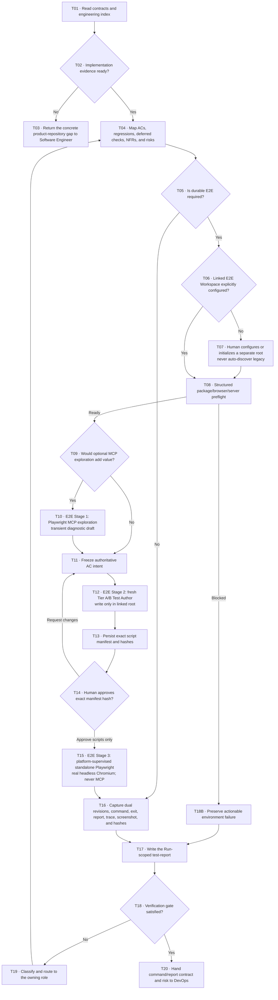

# Tester workflow

Turn the current Run's authoritative acceptance contract into an independent Verification conclusion. Playwright MCP is an optional exploration instrument. When risk requires durable E2E, a fresh spec-only Test Author writes into one explicitly configured Linked E2E Workspace, a human approves the exact generated script hashes, and the platform launches standalone Playwright with a real headless Chromium.

## Evidence and ownership boundary

Verification keeps one registered output: `test-report`. The linked test scripts remain ordinary files in the separately maintained E2E workspace and are bound from the report by path, scenario ID, manifest, revision, and SHA-256; they are not external artifact paths added to `ai-native.yaml`. Exploration notes are transient working memory, not another registered artifact.

Tester owns risk mapping, optional exploration, the linked E2E test assets, execution evidence, defect classification, and the Verification recommendation. Software Engineer owns product source, product-repository tests, and product testability interfaces. DevOps or an authorized repository owner configures and enforces the required CI check and owns CI policy, credentials, browser provisioning policy, and artifact retention. Humans own linked-workspace configuration, generated-script approval, exceptions, merge, and release.

The linked E2E workspace is an explicit platform binding, not a second six-phase Project. It must be a separate, non-nested allowed root. Never infer it from a sibling folder, a directory named `e2e`, repository history, an old report, or legacy documentation. A Run without E2E obligations may use stronger applicable non-E2E evidence without this binding; a Run that requires E2E stops at the configuration action until a human binds or initializes one.

## Workflow

These are internal Verification stages and checkpoints, not new global phases. Script approval authorizes execution of those exact bytes only; it is not Verification approval and does not unlock Release.

## Intake and coverage mapping

1. Resolve every input by artifact ID and the active execution contract. Do not guess paths.
2. Start at `implementation-notes`, then audit `engineering-test-evidence` and `engineering-review`. Follow the index only as needed; the seven files are one engineering evidence pack, not seven Tester assignments.
3. Confirm the implementation is runnable, every selected deferred validation remains visible, and no engineering blocker or high/security finding is open.
4. Build one coverage map across Change Contract AC IDs, targeted regressions, deferred Design IDs, measurable NFRs, and material risks. A legacy Run without a structured Change Contract may use only stable AC IDs from the approved selected `user-stories`; never derive authority from the objective, implementation notes, or chat.
5. Select E2E only where a critical user journey, real browser boundary, layout/accessibility behavior, or cross-system behavior needs it. Do not turn every criterion into a slow browser test.

## Linked E2E Workspace and preflight

The normal successful E2E path begins from a human-selected binding supplied by the platform. Do not write an `E2E crystallization request:` review marker and do not search the filesystem for a likely test repository.

Before authoring or execution, require a structured preflight that separately reports:

- the pinned Linked E2E Workspace identity, canonical allowed absolute path, non-nested relationship to the product root, descriptor hash, and E2E Git/workspace revision;
- a loopback-only base URL and validated package-manager, authoring, test, and product start-script identifiers;
- the linked workspace's Playwright package and lockfile state;
- the configured Chromium executable plus a real headless launch-and-close probe, not merely `playwright --version`;
- product start-script availability, port/target readiness, and cleanup capability;
- writable test/fixture allowlist, report/trace/screenshot locations, protected Git/environment paths, and product-root read-only status.

Missing dependencies, browser binaries, start scripts, target readiness, or safe configuration produce an actionable `blocked` environment state. Installation or binding is an explicit human setup action. A passing unit test, build, package-version check, MCP connection, or prose statement cannot satisfy this preflight.

`playwright --version` proves only that a CLI/package responds; it does not prove that the configured browser executable can launch.

## E2E Stage 1: optional exploration

Use Playwright MCP only when interactive discovery adds value.

- Input: the authoritative behavior contract, a runnable non-production environment, and synthetic or approved test data.
- Process: navigate, click, type, observe the DOM/accessibility tree, capture diagnostic screenshots, and diagnose behavior or selector candidates.
- Output: one transient exploration record with a real session reference, environment, path attempted, and observations.
- Boundary: do not commit generated exploration code, paste the action transcript into a script, or pass the exploration transcript, DOM dump, or generated actions to the Test Author.

“The MCP path ran successfully” is not repeatable acceptance or CI evidence and cannot pass Verification by itself. A real MCP screenshot may supplement a specifically declared manual/deferred observation when that contract permits it; it never proves that a reusable script or autonomous browser run exists. If MCP is unavailable, skip optional exploration or mark a genuinely required observation `blocked`; never invent a session.

## E2E Stage 2: isolated crystallization and script review

1. Deterministically freeze the intent for each selected AC/regression scenario: stable ID, preconditions, user-observable actions, assertions, negative/recovery path, synthetic data boundary, and any viewport/accessibility/NFR obligation.
2. Start a fresh Tier A or Tier B Test Author subprocess in only the Linked E2E Workspace. A new prompt inside the Tester, exploration, or implementation process is not a fresh author.
3. Provide only the approved Change Contract, approved observable Design/NFR behavior, frozen intent, and the minimum public E2E harness/command contract. For a legacy Run, use only stable AC IDs from the approved selected `user-stories` artifact.
4. Do not provide or expose the product implementation, implementation diff, implementation transcript, private helpers, exploration code, MCP action transcript, exploration transcript, copied DOM dump, or an exploration-generated script.
5. Permit writes only to the platform allowlist for linked-workspace tests and fixtures. Product source, product-repository tests, workflow controls, `.git`, `.env*`, and all paths outside the linked root remain protected. The author does not install dependencies, commit, push, configure CI, or run newly generated executable code.
6. Name tests or adjacent durable metadata with stable AC/scenario IDs. Follow [references/e2e-playwright.md](references/e2e-playwright.md) for selectors and data boundaries. If the approved public contract lacks a stable observable selector, route a testability-interface request to Software Engineer instead of inspecting private DOM structure or weakening the expected result.
7. Persist the exact generated/changed-file manifest with each repository-relative path, content SHA-256, mapped AC/test name, E2E before/after revision token, and aggregate manifest hash.
8. Stop for a distinct human script review. Newly generated executable files cannot run until a human approves the exact current manifest hash. Any file, manifest, product revision, E2E revision, workspace token, or binding change invalidates approval and returns to authoring/review.

Script review says only “these exact test bytes may execute.” It does not approve their results, Verification, CI policy, PR, merge, risk, or release. Tier C or Limited authoring remains blocked unless a human grants the existing bounded verification exception with compensating evidence.

## E2E Stage 3: platform-supervised real-browser execution

After current script approval, the platform—not the Agent and not MCP—uses validated package-manager/script identifiers to build fixed argv and spawn with `shell: false`.

- The platform supervises the product server as a foreground child, waits for the configured loopback target, launches the linked project's standalone `playwright test` wrapper from the trusted E2E root, waits for every process, and cleans up the server/browser. Agents must not create detached/background processes.
- The selected real headless Chromium must pass the launch probe and actually launch for the persisted test command. `No browser is available`, missing executable, launch failure, launch timeout, test timeout, test failure, server readiness failure, or cleanup failure is non-passing with real logs.
- A passing local E2E row requires the real configured Chromium to launch and the persisted standalone command to finish with exit code 0. Any other exit remains non-passing.
- Record the exact command and trusted Linked E2E Workspace cwd, exit code, first failure, retry/flake history, browser/project/version, target/build, and synthetic test data.
- Retain configured report, trace, screenshot, video, and log files under the linked workspace's approved evidence directories. Record a SHA-256 for every local evidence file.
- Record both immutable bindings: the product Git/workspace revision and the Linked E2E binding plus suite Git/workspace before/after revision. Re-hash every approved script and declared evidence file at approval time.
- A canonical local row uses `` `<one validated package-manager test script>` from `<exact trusted linked E2E root>` ``. Markdown cannot authorize another cwd or an invented command; the command must match the platform's successful trusted execution event.
- CI runs the same autonomous wrapper without MCP. A local pass is not a remote CI pass; Tester must not claim a remote CI pass or success without a current durable provider run URL/ID and revision.

## Failure routing

Classify before changing anything:

| Classification | Owner and next action |
|---|---|
| `implementation bug` | Return reproducible evidence to Software Engineer; fix product source, refresh engineering evidence, reapprove Implementation, and rerun Tester. |
| `testability-interface gap` | Software Engineer adds or repairs the reviewed public selector/interface; refresh engineering evidence before rerun. |
| `test bug` | Return to the fresh Test Author in the linked workspace with the cited authority; regenerate, review the new manifest hash, then rerun. Never weaken expected behavior merely to pass. |
| `spec ambiguity` | Return the exact conflict to PM / BA or the human contract owner. |
| `design ambiguity` | Reopen Design Impact when visible interaction, responsive, content, or accessibility behavior is undefined. |
| `architecture/NFR gap` | Return the measurable quality or boundary ambiguity to Architect or the human decision owner. |
| `environment/CI issue` | DevOps/authorized operator repairs dependency, browser, server, credentials, runner, or CI. Repeat preflight and Stage 3; do not regenerate a passing claim. |

Only product source, product-repository test, or product testability-interface changes return through Software Engineer and Implementation reapproval. Linked-workspace script generation and test-bug repair stay in the isolated author/hash-review loop.

## Test report and completion gate

Start from `.ai-sdlc/templates/test-report.md`. The report must separate:

- E2E disposition, explicit linked-workspace binding, and structured readiness;
- optional MCP exploration and its non-gating status;
- spec-only authoring isolation, frozen intent, generated file manifest, hashes, and human script approval;
- product and E2E dual revisions;
- platform-supervised real Chromium execution with exact command/cwd, exit, server lifecycle, and durable evidence hashes;
- AC, regression, deferred Design, NFR, failure, gap, defect, and risk results;
- one evidence-backed recommendation that does not claim final release authority.

Verification passes only when every in-scope criterion and targeted regression has appropriate current evidence, every selected deferred validation passes, all required scripts match the approved manifest, the real configured browser and standalone command succeeded on the bound revisions, and no unresolved blocker or unaccepted material risk remains. MCP success, authoring success, script approval, unit/jsdom success, build success, an unrun command, or prose without matching machine provenance cannot become an E2E pass.
