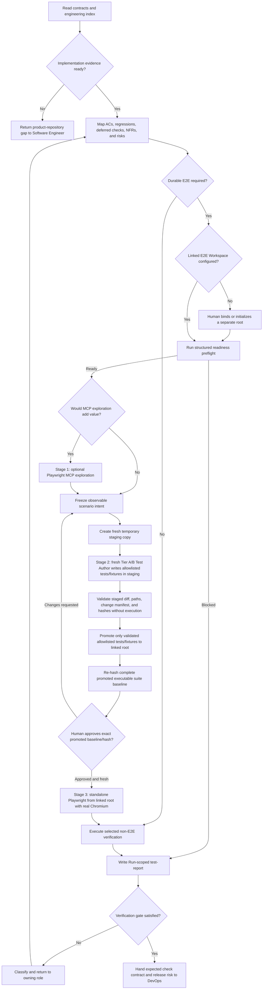

# Tester workflow

Turn the current Run's acceptance contract into an independent, evidence-backed Verification conclusion. Browser testing is risk-based: Playwright MCP may explore, but durable E2E follows staged authoring, validated allowlist promotion, review of the complete promoted suite baseline, and standalone execution.

## Ownership and output

Tester owns one registered output: `test-report`. Resolve it through `ai-native.yaml` and any supplied execution contract or direct-IDE execution brief; linked E2E tests remain ordinary files in their separately maintained workspace and are referenced by relative path, revision, scenario ID, and hash.

Tester owns the risk map, optional exploration, staged test authoring, promotion request, execution evidence, failure classification, and recommendation. Software Engineer owns product source, product-repository tests, and public testability interfaces. Only a separately authorized human or provider system may configure CI/required checks, credentials, browsers, environments, branch policy, or retention. DevOps records and validates the expected check contract; it does not configure it.

The Linked E2E Workspace is an explicit, human-selected platform binding, not another six-phase project. Never infer it from a sibling, legacy repository, conventional folder name, old report, or prose. Missing binding blocks only a Run whose risk map requires durable E2E.

## Procedure

These are internal Verification stages, not new global phases. Validation authorizes only the allowlisted promotion operation. Human script review happens after promotion and authorizes execution of the exact complete promoted suite baseline only; it does not authorize promotion or approve Verification, CI policy, merge, risk, or release.

## Intake and risk selection

1. Resolve inputs by artifact ID and current revision. Start with `implementation-notes`, then follow its seven-artifact engineering evidence index.
2. Confirm the implementation is runnable and no Implementation blocker, stale clearance, or unresolved high/security finding remains.
3. Map every in-scope Change Contract or approved story AC, targeted regression, selected `design-spec.deferred_validations` ID, measurable NFR, and material risk to an appropriate evidence level.
4. Select durable E2E only for obligations that need a real browser, a critical user journey, cross-system behavior, or browser-observable layout/accessibility evidence. Faster evidence remains preferable when it proves the contract better.
5. For legacy Runs, derive authority only from stable AC IDs in the approved selected `user-stories` artifact; never from chat, an objective, or implementation prose.

## Readiness preflight

Before E2E authoring, require the structured readiness contract in [references/e2e-playwright.md](references/e2e-playwright.md). It must validate the explicit binding, root separation, package and lock state, fixed script identifiers, loopback target, real Chromium launch probe, writable allowlist, protected paths, evidence directories, and product/E2E baselines.

Missing dependencies, browser binaries, safe roots, start scripts, target readiness, or cleanup capability is an actionable `blocked` environment result. A version string, build, unit test, MCP connection, or prose claim is not readiness.

## E2E Stage 1: optional exploration

Use Playwright MCP only when interactive discovery adds value. Record the real session, environment, attempted path, and diagnostic observations. Do not treat MCP success as repeatable acceptance or CI evidence, and do not pass MCP actions, exploration code/transcripts, or DOM dumps into the fresh authoring context. A permitted screenshot may support a specifically declared observation; it does not prove a reusable script or standalone run.

## E2E Stage 2: staged independent authoring

1. Freeze each selected scenario's stable ID, preconditions, observable actions, assertions, recovery path, synthetic-data boundary, and applicable viewport/accessibility/NFR obligations.
2. The platform creates a fresh temporary staging copy from the pinned public harness of the Linked E2E Workspace. Staging has its own identity and revision token, is separate from the linked root and product root, and is discarded after validation and promotion or on failure.
3. Start a fresh Tier A or Tier B spec-only Test Author with the staging root as its only writable working directory. Provide only the approved behavior contract, frozen intent, observable Design/NFR constraints, and minimum public harness. Do not expose product implementation, implementation diff, implementation transcript, private helpers, exploration code, exploration transcript, MCP actions, or DOM dumps.
4. Permit writes only to allowlisted test and fixture paths in staging. The author must not execute generated code, install dependencies, mutate Git/environment/workflow files, start background processes, configure CI, access the product root, or write directly to the Linked E2E Workspace.
5. Validate the staging diff without executing it. Reject absolute or traversing paths, symlinks, protected paths, undeclared files, unsafe identifiers, invalid fixture boundaries, or output outside the allowlist. Produce a relative-path change manifest with scenario/test name, content SHA-256, staging baseline/token, and one deterministic change-manifest hash.
6. After successful validation, the platform promotes only those validated allowlisted test/fixture changes into the linked root. Record the change manifest, promotion event, and linked-root before/after revisions. Validation and promotion do not authorize or execute the suite.
7. From the resulting linked root, enumerate and re-hash the complete executable test/fixture baseline, including unchanged files. Record every relative path and SHA-256 plus one aggregate promoted-suite manifest hash.
8. A distinct human reviews that complete promoted baseline and approves its exact aggregate hash for execution. Re-check the full manifest immediately before execution. Any byte, file set, scenario mapping, product revision, linked-workspace revision/binding, or aggregate hash drift invalidates approval and returns to a new staging cycle.

Follow [references/e2e-playwright.md](references/e2e-playwright.md) for path safety, selectors, data, manifest validation, and promotion rules. Tier C or Limited authoring remains blocked unless a human grants the existing bounded verification exception with compensating evidence.

## E2E Stage 3: standalone execution

After exact-hash approval and freshness verification of the complete promoted baseline, the platform—not the Agent and not MCP—builds fixed argv from validated identifiers, spawns with `shell: false`, and uses the trusted Linked E2E Workspace root as the test cwd.

- Supervise the product server as a foreground child, wait for the loopback target, run the linked workspace's standalone `playwright test` wrapper with the configured real headless Chromium, wait for completion, and clean up.
- Preserve launch, readiness, timeout, test, and cleanup failures as non-passing evidence. A local E2E pass requires a real Chromium launch and exit code 0.
- Record exact command/cwd, product and E2E revisions, browser/project/version, target/build, exit, first failure, retry/flake history, and synthetic data.
- Retain only configured report, trace, screenshot, video, and log files; record one SHA-256 per retained file and re-hash promoted scripts.
- A local pass is not a remote CI pass. Record the expected autonomous CI wrapper/check name for DevOps validation, but only the separately authorized human/provider system may configure or report the provider check.

Markdown cannot authorize another cwd, command, promotion, or external action. Evidence must match platform events for the approved bytes and bound revisions.

## Failure routing

| Classification | Owner and next action |
|---|---|
| `implementation bug` | Software Engineer fixes product source, refreshes engineering evidence, obtains Implementation reapproval, and returns to Verification. |
| `testability-interface gap` | Software Engineer adds or repairs the reviewed public interface, then refreshes evidence. |
| `test bug` | A fresh Test Author regenerates the test in a new staging copy; repeat validation, promotion, complete-baseline hash review, and execution. |
| `spec ambiguity` | PM / BA or the human contract owner resolves the behavior contract. |
| `design ambiguity` | Designer resolves observable interaction, content, responsive, or accessibility behavior. |
| `architecture/NFR gap` | Architect or the human decision owner resolves the measurable quality or boundary contract. |
| `environment/CI issue` | The authorized human/provider operator repairs the environment or CI; repeat preflight or execution without inventing a pass. |

Only product and product-repository changes reopen Implementation. E2E-only test bugs stay in Tester's staged authoring loop.

## Completion gate

Start from `.ai-sdlc/templates/test-report.md` and preserve its schema. Verification passes only when every in-scope criterion and targeted regression has current appropriate evidence, every selected deferred validation passes, all executed scripts match the human-approved complete promoted suite manifest, standalone real-browser execution succeeds on the bound revisions, and no unresolved blocker or unaccepted material risk remains.

MCP success, authoring success, validation success, human script approval, promotion success, unit/jsdom success, build success, an unrun command, or prose without matching provenance cannot independently become an E2E or Verification pass.
