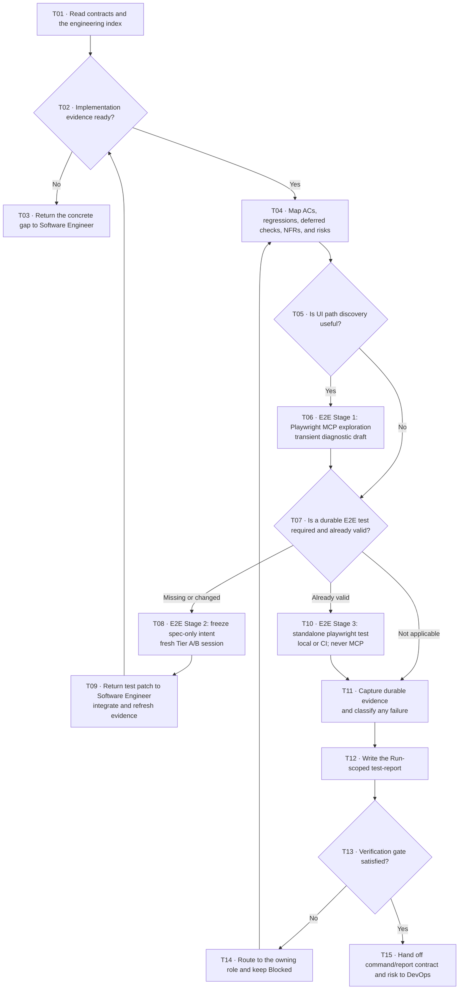

# Tester workflow

Turn the current Run's authoritative acceptance contract into an independent Verification conclusion. Playwright MCP is an exploration instrument for the AI; repository tests and standalone runner results are the repeatable assets.

## Evidence boundary

The Verification phase has one registered output: `test-report`. Playwright exploration notes are transient working memory, not an additional artifact. Repository E2E files remain normal test source and are linked from the report rather than registered in `ai-native.yaml`.

Tester owns risk mapping, exploration, execution, defect evidence, and the Verification recommendation. Software Engineer owns repository integration of new or changed source/test files and refreshes the seven engineering evidence artifacts. DevOps or an authorized repository owner owns CI policy, secrets, and required-check configuration. A human owns exceptions, merge, and release.

## Workflow



## Intake and mapping

1. Resolve every input by artifact ID and the active execution contract. Do not guess paths.
2. Start at `implementation-notes`, then audit `engineering-test-evidence` and `engineering-review`. Follow the index only as needed; the seven files are one engineering evidence pack, not seven Tester assignments.
3. Confirm that the implementation is runnable, every selected deferred validation remains visible, and no engineering blocker or high/security finding is open.
4. Build one coverage map across Change Contract/story AC IDs, targeted regressions, deferred Design IDs, measurable NFRs, and material risks. Select E2E only where a user journey, browser boundary, or cross-system behavior needs it; do not turn every criterion into a slow browser test.

The user's Phase 1/2/3 terminology is represented below as E2E Stage 1/2/3 so it cannot be mistaken for an additional global delivery phase.

## E2E Stage 1: Exploration

Use Playwright MCP directly only when interactive discovery adds value.

- Input: the authoritative behavior contract, a runnable non-production environment, and synthetic or approved test data.
- Process: navigate, click, type, observe the DOM/accessibility tree, capture diagnostic screenshots, and iterate until the intended path is understood or a real blocker is found.
- Output: a one-off/transient exploration record containing the session reference, environment, path attempted, observations, and selector candidates. Do not commit generated exploration code or paste the action transcript into a repository test.
- Evidence rule: “the MCP path ran successfully” is not repeatable acceptance evidence and cannot pass the Verification or CI gate by itself. A real MCP browser run or screenshot may still satisfy a specifically declared manual/deferred observation when its contract permits that evidence type; it never proves that a reusable E2E script or CI check exists.

If Playwright MCP is unavailable and exploration is required, record `blocked`; never invent a session. If the path is already understood, skip exploration and proceed from the specification.

## E2E Stage 2: Crystallization

Crystallization creates the durable repository test without inheriting the exploration session's confirmation bias.

1. Freeze the AC/acceptance intent for the exact scenario IDs that require E2E: preconditions, user-observable actions, assertions, negative path, and data boundary.
2. Start a fresh independent Tier A or Tier B test-authoring session. Provide only authoritative specification inputs such as the immutable Change Contract, applicable approved product/design/NFR behavior, the frozen intent, and the public test harness/commands needed to create a runnable test.
3. The session must not receive the implementation diff, implementation transcript, implementation-session transcript, private helpers, exploration code, Playwright MCP action code, exploration transcript, DOM dump, or a generated exploration script. A new prompt inside the exploration or implementation session is not fresh isolation.
4. After intent is frozen, the independent author may inspect the public runnable interface and project test harness to adapt selectors. Follow [references/e2e-playwright.md](references/e2e-playwright.md); adaptation must not weaken or change the frozen expectation.
5. The expected durable result is a repository-conventional file such as `tests/e2e/checkout-coupon.spec.ts`, with stable AC/scenario IDs in the test name or adjacent metadata.
6. In a platform-managed Run, save the frozen intent and gap in the current `test-report`, choose Verification “request changes”, and use this exact review-comment envelope (one `AC:` line per applicable current Change Contract ID):

   ```text
   E2E crystallization request: checkout-coupon
   AC: CC-AC-001
   Frozen intent: a valid coupon reduces the payable total before order confirmation.
   ```

   The marker must be the literal first line; scenario, AC, and Frozen intent must be nonempty, and every AC must resolve against the current Change Contract. A marker on a later line, a missing field, or an unknown AC is ignored. Only those parsed bounded fields and report-head metadata route as read-only feedback to a later Implementation rerun; the report body and free-form comment do not cross the boundary, the request does not create scope, and `test-report` never becomes an upstream selected artifact.
7. Any new or changed repository E2E test makes the prior engineering evidence stale and requires a refresh. Return it to Software Engineer. Software Engineer integrates it, runs the real checks, refreshes at least `implementation-notes`, `engineering-test-evidence`, `engineering-review`, and `engineering-provenance` plus any other stale pack member, and obtains Implementation reapproval before Tester resumes.
8. Tester resumes only from the refreshed engineering revision. A candidate patch or `.spec.ts` path is not yet passing evidence.

If Tier A/B is impossible, record the actual lower tier and keep the normal gate blocked unless a human grants the existing bounded verification exception. Tester cannot approve its own exception.

## E2E Stage 3: Execution

Run the integrated test with the project's real standalone runner. E2E Stage 3 never uses MCP.

- Discover the actual command from project manifests and CI configuration. Typical direct form: `playwright test`; a repository script such as `npm run test:e2e` is equally valid when it invokes the real runner.
- Run against the exact changed revision and declared environment. Record the command, working directory, exit status, retry/flake behavior, and report path.
- In a platform-managed run, copy the prompt-provided binding exactly as `workspace sha256:<workspaceRevisionToken>; platform execution <executionId>`. The token covers protected tracked and untracked workspace content/topology, including a supported project-root `.git` directory, while excluding the selected report, root `test-results/`, `playwright-report/`, `blob-report/`, and the platform-documented dependency/cache/build trees; it is not a commit SHA. Linked worktrees whose Git/common directory is external and project roots nested below a parent repository are blocked before execution because their control state lies outside the restorable root.
- Preserve the platform's pre-run Git binding exactly: `git HEAD <full SHA>`, `git unborn <symbolic ref>`, or `git state:not-repository`. Do not infer non-Git from a failed post-run command; Git disappearance, corruption, or HEAD movement blocks approval.
- Put exactly one direct runner or repository test-wrapper command and the exact project-root working directory in the execution row, using the canonical form `` `<command>` from `<project root>` ``. Do not use a compound shell, comment, echo/printf, inline assignment, quoting/substitution, redirection, or background/detached execution. Put complex setup in a reviewed repository script and describe setup separately; the test command must finish before the runner returns. Keep local durable evidence in one of the root runtime directories and record one `sha256:<64 hex>` digest per file. Approval classifies and hashes that same canonical command, matches it to a persisted successful `command_execution`, checks the current report head was written by that completed Verification execution, validates repository HEAD when Git is available, and recomputes the workspace/evidence digests.
- Prefer durable CI evidence for the shared gate. Record the check name, provider, run URL/ID, commit SHA, and retained report/trace/screenshot/video paths. A local pass is not a remote CI pass.
- Do not invoke MCP in CI. CI must run the script autonomously, headlessly, and reproducibly.
- Do not hide a first-run failure with retries. Classify and explain flakiness; quarantine or an unavailable environment remains visible risk rather than `pass`.
- Tester defines the command/report/evidence contract. DevOps or the authorized repository owner configures and enforces the required CI check, branch protection, credentials, browser installation/cache, and artifact retention.
- Tester must not claim a remote CI pass without a durable run reference or URL for the current revision.

## Failure routing

Classify before changing anything:

| Classification | Owner and next action |
|---|---|
| `implementation bug` | Return reproducible evidence to Software Engineer; refresh implementation and engineering evidence, then rerun Tester. |
| `test bug` | Return the AC-cited test patch to Software Engineer for repository integration and evidence refresh; never weaken the expected behavior merely to pass. |
| `spec ambiguity` | Return the exact conflicting behavior to PM / BA or the human contract owner. |
| `design ambiguity` | Reopen Design Impact when visible interaction, responsive, content, or accessibility behavior is undefined. |
| `architecture/NFR gap` | Return measurable quality or boundary ambiguity to Architect or the human decision owner. |
| `environment/CI issue` | DevOps/authorized operator repairs it. A local environment or runner repair returns to E2E Stage 3, refreshes `test-report`, and re-enters the Verification gate; a required-check configuration repair retries that check only after Verification already passed. |

## Test report and completion gate

Start from `.ai-sdlc/templates/test-report.md`. The report must distinguish:

- exploration status and its non-gating nature;
- crystallization isolation, frozen intent, excluded context, repository script path, and refreshed engineering revision;
- standalone local and/or CI execution with exact durable evidence;
- AC, regression, deferred Design, NFR, defect, gap, and risk results;
- one evidence-backed recommendation that does not claim final release authority.

Verification passes only when every in-scope criterion and targeted regression has appropriate real evidence, every selected deferred validation passes, required checks executed successfully on the relevant revision, and no unresolved blocker or unaccepted material risk remains. Exploration success alone, a candidate script that was never integrated, stale engineering evidence, an unrun command, or a missing CI reference cannot be converted into `pass` by prose.
